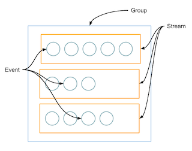
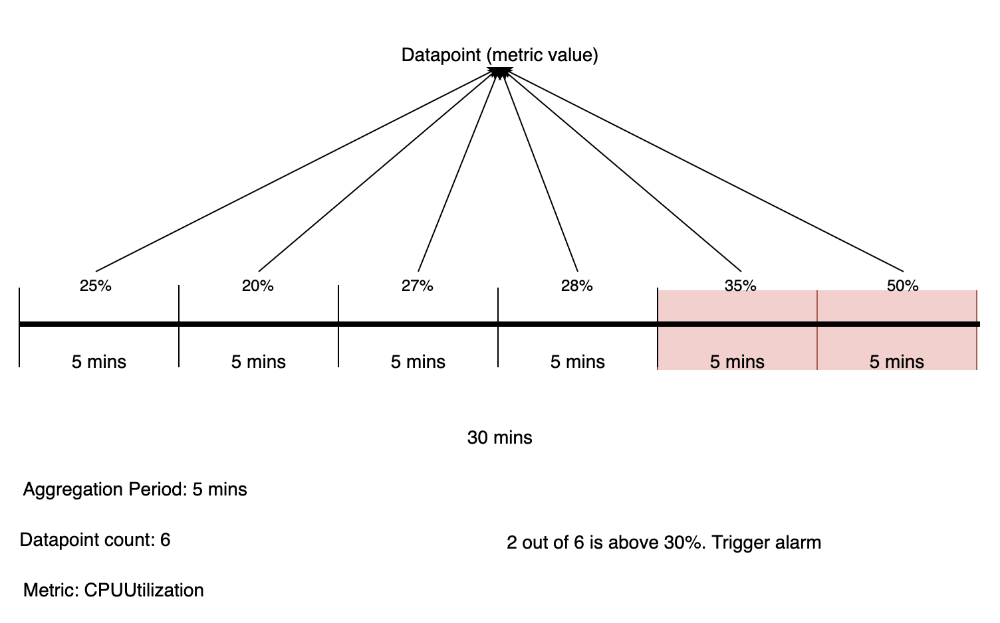

## CloudWatch

- [Concepts Explanation](#concepts-explanation)
- [Logging](#logging)
- [Datapoint](#datapoint)
- [Event](#event)
- [Alarm](#alarm)
- [Subscription Filter](#subscription-filter)
- [Notes](#notes)

### Concepts Explanation

Alarm when average(Statistics) CPUUtilization(Metric) is over 70%(Threshold) in the period of 30 minutes(Period/Aggregation Period) with 2 DataPoints out of 3 evaluation period (>70% happens 2 times out of 90 mins - 3x30 mins).

### Logging



### Event

aka EventBridge Event, allows you to react in response to aws events being emitted by AWS services/3rd party services. i.e Add an event message to SQS (target) when a log group (source) is created.

[Create custom event pattern](https://aws.amazon.com/premiumsupport/knowledge-center/cloudwatch-create-custom-event-pattern/)

### Datapoint

Represents the value for a metric for a given metric aggregation period. i.e if you use one min as an aggregation period for instance CPU utilization (metric), then there will be one datapoint. And its value can be something like 25%

This feature allows to create a CloudWatch alarm that alerts you when M out of N datapoints of a metric are above your predefined threshold, such as three out of five times in any given five minutes interval or two out of six times in a thirty minutes interval. When any M out of N datapoints are below your threshold in an interval, the alarm will be in OK state. Please note that the M datapoints out of N datapoints in an interval can be of any order and does not need to be consecutive. Consequently, you can now get alerted even when the spikes in your metrics are intermittent over an interval.



### Alarm

Define the number of `datapoints` within the `evaluation period` that must be breaching to cause the alarm to go to `ALARM` state.

`Period` aka `Aggregation Period` defines the smallest unit of each time period.

i.e Given Period being 6 hours, Evaluation Period being 8 and Datapoints being 7, it means when alarm threshold has been hit 7 times during 8 * 6 hours, the alarm state will be changed to `IN ALARM`.

Likewise, given Period being 1 minute, Evaluation Period being 3 and Datapoints being 3, it means when alarm threshold has been reached in 3 consecutive periods during 3 * 1 minutes, the alarm state will be changed to `IN ALARM`.

`Statistics` are metric data aggregations over specified periods of time. i.e `Average` CPUUtilization value on an instance over a certain period OR average CPUUtilization for a ASG is 50% - i.e ASG with two instances where one instance is at 60 percent CPU and the other is at 40 percent CPU. On average, they are at 50 percent.

```
aws cloudwatch get-metric-statistics \
  --namespace AWS/EC2 \
  --metric-name CPUUtilization \
  --dimensions Name=InstanceId,Value=i-0f5413ccdc642caca \
  --statistics Average \
  --start-time 2020-11-8T23:00:00 \
  --end-time 2020-11-10T23:00:00 \
  --period 14400

{
    "Label": "CPUUtilization",
    "Datapoints": [
        {
            "Timestamp": "2020-11-10T11:00:00+00:00",
            "Average": 44.755102040816325,
            "Unit": "Percent"
        },
        {
            "Timestamp": "2020-11-09T19:00:00+00:00",
            "Average": 49.15833333333333,
            "Unit": "Percent"
        },
        {
            "Timestamp": "2020-11-10T07:00:00+00:00",
            "Average": 26.691666666666666,
            "Unit": "Percent"
        },
        {
            "Timestamp": "2020-11-09T15:00:00+00:00",
            "Average": 54.38157894736842,
            "Unit": "Percent"
        },
        {
            "Timestamp": "2020-11-10T03:00:00+00:00",
            "Average": 24.708333333333332,
            "Unit": "Percent"
        },
        {
            "Timestamp": "2020-11-09T23:00:00+00:00",
            "Average": 33.645833333333336,
            "Unit": "Percent"
        }
    ]
}
```

A practical example below: Alarm is based on average (can also be min/max, see [statistics](https://docs.aws.amazon.com/AmazonCloudWatch/latest/monitoring/cloudwatch_concepts.html#Statistic)) CPUUtilisation with a threshold > 45% for 3 data points out of 3 evaluation periods and a period of 300 seconds.

Aggregated metrics
```md
05:25:00: data: {Avg=61.123}
05:30:00: data: {Avg=57.847}
05:35:00: data: {Avg=60.503}
05:40:00: data: {Avg=55.473}
05:45:00: data: {Avg=41.685}
05:50:00: data: {Avg=58.390}
05:55:00: data: {Avg=57.846}
06:00:00: data: {Avg=61.123}
```

Alarm status
```md
05:35 ALARM
05:40 ALARM
05:45 ALARM to OK
05:50 OK
05:55 OK
06:00 OK to ALARM
```

When evaluating `06:00` period, CW will look at two previous records `05:55:00: data: {Avg=57.846}` and `05:50:00: data: {Avg=58.390}`. Both of them breaches the threshold as well as `06:00` itself. So it satisfies the condition that 3 consecutive data points breaches the threshold.

### Subscription Filter

With filter pattern, it can control what log events will be sent across to subscriber service like lambda. Below serverless example shows how we can configure log events to be the trigger for subscribing lambda. With filter pattern enabled, log events having `ERROR` and targeting `subscription-filter` log group will be forwarded to the `HelloWorld` lambda.

```yml
functions:
  HelloWorld:
    handler: handler.endpoint
    events:
      - cloudwatchLog:
          logGroup: 'subscription-filter'
          filter: 'ERROR'
```

### Notes

- Use `Metrics` to access aggregated data. i.e ELB request counts of all ELBs
