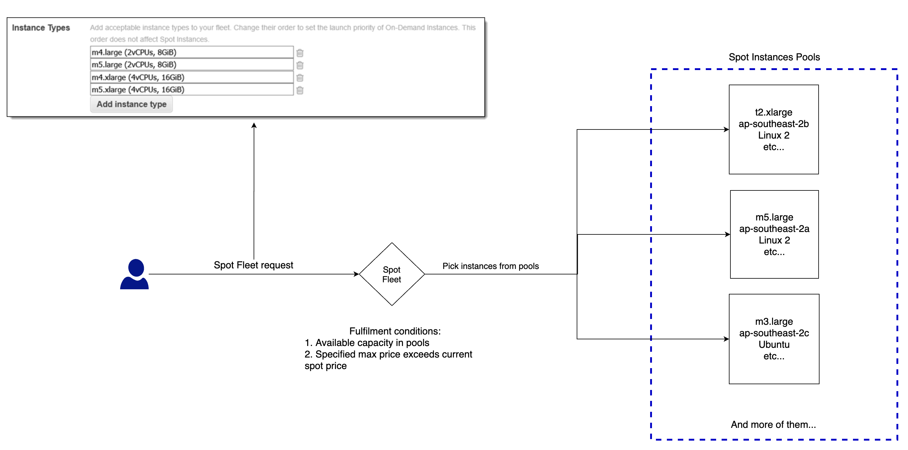
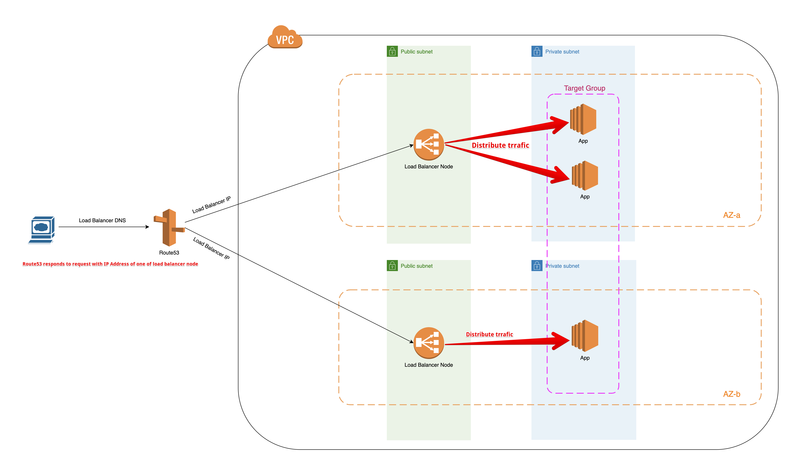
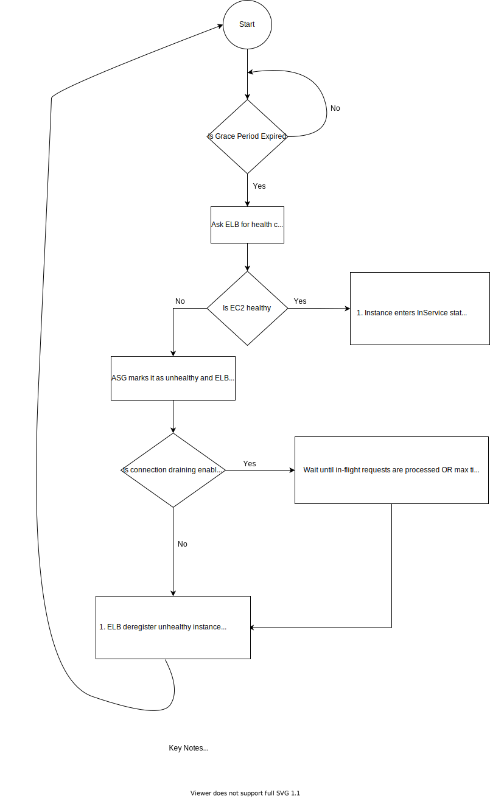

## ASG/ELB

- [ASG](#asg)
  - [Scaling Policy](#scaling-policy)
  - [Health Check](#health-check)
  - [Termination Policy](#termination-policy)
  - [lifecycle hooks](#lifecycle-hooks)
  - [Tear down ASG](#tear-down-asg)
  - [Cooldown period](#cooldown-period)
  - [Spot Fleet](#spot-fleet)
- [ELB](#elb)
  - [Load balancer with HA](#load-balancer-with-ha)
  - [ALB vs NLB](#alb-vs-nlb)
  - [Connection Draining](#connection-draining)
  - [Pre-warming](#pre-warming)
  - [Cost Reduction Methods](#cost-reduction-methods)
  - [Best Practices](#best-practices)
  - [Notes](#notes)
- [References](#references)

## ASG

### Scaling Policy

- Scale in/out within the boundary of Min/Max capacity
- Desired capacity is subject to change over time but is always between Min/Max capacity range

### Health Check

- By default, ASG will consider an instance healthy if it passes instance status check
- Change health check type to be `ELB` so an instance is seen as healthy ONLY if it passes both ALB and EC2 health check
- Unhealthy instances will be killed and replaced by ASG
- If you attach multiple load balancer target groups, all of them must report that the instance is healthy in order for it to consider the instance healthy. If any one of them reports an instance as unhealthy, the Auto Scaling group replaces the instance, even if other ones report it as healthy

Use case scenario: In an ECS application fronted with ALB. ALB health check will fail when putting a container instance on `DRAINING` mode. However, instance is still seen as healthy by ASG since it passes status check. Therefore, ASG will do nothing. To fix it, set `health check type` to be `ELB` which will turn this instance to an unhealthy one as it fails ALB health check. Now, ASG will see and action to replace this unhealthy instance.

### Termination Policy

Use it to control which instances need to be terminated when scale in. i.e `OldestLaunchTemplate` tells ASG to terminate instances launched by the oldest launch template. Useful when phasing out old instances after updates.

⚠️⚠️⚠️ Termination policy will be applied to AZ with most instances first i.e imbalanced AZs before other balanced AZs. For example, suppose you have 2 instances in `2a` and 1 instance in `2b`, termination policy will be applied to `2a` first to take one of two instances down. Consequently, you have 2 instances left. If desired count is 2, then ASG will stop looking further at `2b` even if you are expected to terminate another one in `2b` during a ami update process.

### Lifecycle Hooks

Use it when you need to perform some custom tasks berfore launching/terminating instances in scale out/in respectively.
See [this](https://docs.aws.amazon.com/autoscaling/ec2/userguide/lifecycle-hooks.html) for more details.

### Tear down ASG

When you delete an Auto Scaling group, its `desired, minimum, and maximum` values are set to 0. As a result, the instances are terminated.

### Cooldown period

No `cooldown period` - Say we have an ASG to scale in/out on some cloudwatch alarms. In an event of scaling out activity, ASG will add a new instance to the group and instance takes 3 mins to come up and become ready to serve traffic. During this period of time, alarm is likely to be triggered again which is causing ASG to add more instances. It's a big waste as we might only need one additional instance but not 2!!!.

Now, with help from `cooldown period` defaults to 5 mins, after the scaling activity is exercised, all subsequent scale-out requests will be blocked until `cooldown period` time is elapsed. After it's expired, scale-out activities will begin again. But, if alarm goes off after previous instance is in service, which indicates the launched instance is sufficient to bring metric back down, then the group will remain at that size. In this example, it will be 2.

Automatically applies to `dynamic scaling` and optionally to manual scaling but not supported for `scheduled scaling`.

### Spot Fleet



Refer to [Mixed instance type](https://github.com/DavidHe1127/dockerzon-ecs/tree/master/experiments/mixed-instance-type) for more details.

[Spot instances tips](https://medium.com/swlh/aws-ec2-spot-useful-tips-dc3cd8210028)

---

## ELB

### Load Balancer with HA
Diagram below explains how load balancer distributes traffic to a target group of instances when being configured with **2** AZs/public subnets.



### Connection Draining

When you enable `Connection Draining` on a load balancer, any back-end instances that you deregister will complete requests that are in progress before deregistration. Likewise, if a back-end instance fails health checks, the load balancer will not send any new requests to the unhealthy instance but will allow existing requests to complete.

### Pre-warming

ELB will not try to queue up reqs to be handled when it's at its capacity which resulting in `503` errors. If traffic goes up over time, ELB will keep up with such demand and handles reqs correctly. That said, when hefty traffic is hitting ELB at a rate that is higher than ELB can scale to meet it, contact AWS to enable pre-warming.

With pre-warming, specify start date/time & rps so that certain level of capacity will be added preemptively.

### Cost Reduction Methods

Data Transfer In is free whilst Data Transfer Out is charged. So the key is to cut response in size.

- Remove unnecessary HTTP response headers:

  Before 333 Bytes
  ```
  HTTP/1.1 200 OK Connection: Keep-Alive Content-Length: 15 Content-Type: application/json accept-encoding: gzip Access-Control-Allow-Origin: * X-GA-Service: collect Access-Control-Allow-Methods: GET, POST, OPTIONS Access-Control-Allow-Headers: Authorization, X-Requested-With, Content-Type, Content-Encoding {"status":"ok"}
  ```

  After 109 Bytes
  ```
  HTTP/1.1 200 OK Connection: Keep-Alive Content-Length: 15 Content-Type: application/json {"status":"ok"}
  ```
  Saving can add up to a big amount!
- Use smaller TLS cert. AWS ACM produces relatively larger cert! Typically, browser will cache and reuse cert being sent by server in the initial HTTPs connection for subsequent communication. However, if large number of new clients are there, cert will be transferred through ALB millions of times!
- Increase idle timeout i.e 10 mins to make the most of connection reuse - ALB will reuse established session without opening new one. Also, enable `keep-alive` on the server making it greater than idle timeout such that ALB will close connections
- Use ALB over Classic Load Balancer as ALB supports HTTP/2 while Classic one doesn't. HTTP/2 enables http header compression.

### ALB vs NLB

- ALB is layer 7 lb while NLB is layer 4 lb. With NLB, it does not access HTTP headers
- ALB/CLB supports connection multiplexing - reqs from multiple clients uses the single one backend connection. This improves latency and reduces load on your application. Set `Connection: close` header in your app HTTP response to disable it.

### Best Practices

- When ELB scales up, it updates the DNS records with new IPs so that these IPs are registered when more ELB resources being added. Records have TTL of 60 seconds. So client will re-lookup DNS at least every 60 seconds.
- When testing ELB load handling, make sure use multiple clients and ELB DNS is resolved every TTL so that these clients will not keep hitting a single IP of one ELB. However, such problem will not occur in the real world.

### Notes

- Client <---frontend conn---> ELB <---backend conn---> targets
- ELB marks an instance `InService` once it passes health check. ELB sends traffic to instance in `InService` status.
- ELB marks an instance `Out of Service` if it fails health check. At this point, ELB will stop sending traffic to it. If ASG is used, it will shut the instance down after health check grace period, replacing it with a new one.
- `In Service` state exists for ELB as well (besides EC2) - as long as one registered target is considered healthy, ELB enters `InService` state.
- ELB is not possible to work across multiple regions however it is possible to distribute traffic across multiple AZs within the same region. To enable multi-region ELB, you need to create ELB in each region you want to support and use Route53 with a proper routing policy.
- When an instance is fully configured and passes the Amazon EC2 health checks, it is attached to the ASG and it enters the `InService` state. The instance is counted against the desired capacity of the ASG.

When health check type is `ELB`, ASG will delegate this task to ELB which will perform health checks on ASG behalf. ASG will be notified of result.

- Health checks are not collected against metrics reported by CloudWatch but they will appear in your app logs if enabled.
- ELB will also make a conn to your instances to ensure the awareness when a registered instance is terminated.

## References

- [Using AWS Application Load Balancer and Network Load Balancer with EC2 Container Service](https://medium.com/containers-on-aws/using-aws-application-load-balancer-and-network-load-balancer-with-ec2-container-service-d0cb0b1d5ae5)
- [Ways to reduce your ELB cost](https://gameanalytics.com/product-updates/reduce-costs-https-api-aws/)
- [Best Practices in Evaluating ELB](https://aws.amazon.com/articles/best-practices-in-evaluating-elastic-load-balancing/#pre-warming][1])

