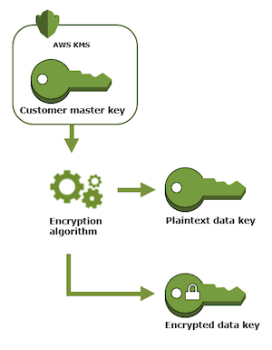

## KMS

- [Key concepts](#key-concepts)
- [References](#references)

### Key Concepts

#### CMK (Cstomer Master Key)
- It's **designed** to encrypt/decrypt data key. That's why there is a 4kb limit on plaintext amount. Use data key if you're intended to encrypt/decrypt application data.
- It's never retrievable in plain-text.
- Two types: AWS managed CMK and Customer managed CMK.
- Keys are accessed and managed in KMS console.

#### Data Key
- KMS gives you both plain-text and encrypted key. Encryption is done by a specific CMK - specified in the api call.
- Use Data Key to encrypt/decrypt application data. i.e objects on s3
- AWS KMS does not store, manage, or track your data keys, or perform cryptographic operations with data keys. You must use and manage data keys outside of AWS KMS.

#### How data key is used?

Procedure below describes how s3 uses KMS for data encryption/decryption.

Encryption:
- S3 requests a plaintext data key and a copy of the key encrypted by the specified CMK.
- AWS KMS generates a data key, encrypts it under the CMK, and sends both the plaintext data key and the encrypted data key to S3.
- S3 encrypts the data using the data key and removes the plaintext key from memory as soon as possible after use.
- S3 stores the encrypted data key as metadata with the encrypted data.

Decryption:
- S3 sends the encrypted data key to AWS KMS.
- AWS KMS decrypts the key by using the same CMK and returns the plaintext data key to Amazon S3.
- S3 decrypts the ciphertext and removes the plaintext data key from memory as soon as possible.

### References

- [KMS concepts](https://docs.aws.amazon.com/kms/latest/developerguide/concepts.html#data-keys)
- [how-to-use-aws-kms-securely](https://security.stackexchange.com/questions/146330/how-to-use-aws-kms-securely)
