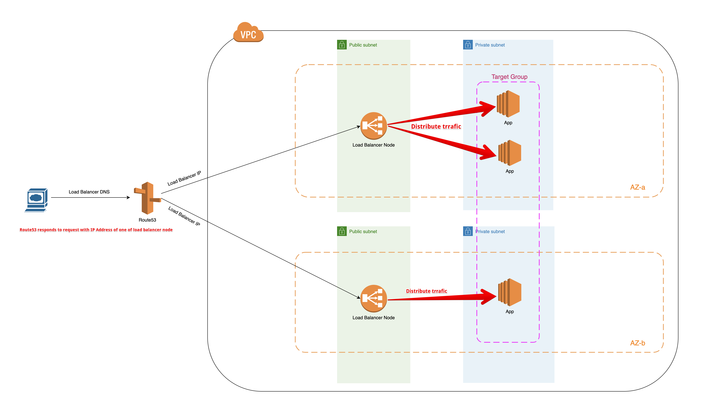

## ASG/ALB

- [ASG](#asg)
  - [Scaling Policy](#scaling-policy)
  - [Health Check](#health-check)
  - [Termination Policy](#termination-policy)
- [Load balancer with HA](#load-balancer-with-ha)

### ASG
Instances are registered as targets with a target group. When you plan to use your load balancer with an ASG, you select the target group created from load balancers and
ASG will auto-scale instances in that selected target group.

[Using AWS Application Load Balancer and Network Load Balancer with EC2 Container Service](https://medium.com/containers-on-aws/using-aws-application-load-balancer-and-network-load-balancer-with-ec2-container-service-d0cb0b1d5ae5)

#### Scaling Policy

- `Desired Capacity` tells the number of instances auto scaling need to provision
- `Min/Max Capacity` tells the minimum/maximum number of instances ASG needs to have at any given time

`Scaling Policies` tell auto scaling to change the `Desired Capacity` within the `min/max` boundary.

For example, an Amazon CloudWatch alarm triggered by CPU exceeding a given threshold could be configured to trigger a Scaling Policy. The Scaling Policy could be configured with a rule of Add 1 instance, which would cause the Desired Capacity to increment by 1. (Note: Desired Capacity will always stay within the boundaries of the Min and Max, so a scaling policy might not actually change the Desired Capacity.)

### Load Balancer with HA
Diagram below explains how load balancer distributes traffic to a target group of instances when being configured with 2 AZs/public subnets.

#### Health Check

- By default, ASG will consider an instance healthy if it passes instance status check
- Change health check type to be `ELB` so an instance is seen as healthy ONLY if it passes both ALB and EC2 health check
- Unhealthy instances will be killed and replaced by ASG
- If you attach multiple load balancer target groups, all of them must report that the instance is healthy in order for it to consider the instance healthy. If any one of them reports an instance as unhealthy, the Auto Scaling group replaces the instance, even if other ones report it as healthy

Use case scenario: In an ECS application fronted with ALB. ALB health check will fail when putting a container instance on `DRAINING` mode. However, instance is still seen as healthy by ASG since it passes status check. Therefore, ASG will do nothing. To fix it, set `health check type` to be `ELB` which will turn this instance to an unhealthy one as it fails ALB health check. Now, ASG will see and action to replace this unhealthy instance.

#### Termination Policy

Use it to control which instances need to be terminated when scale in. i.e `OldestLaunchTemplate` tells ASG to terminate instances launched by the oldest launch template. Useful when phasing out old instances after updates.
