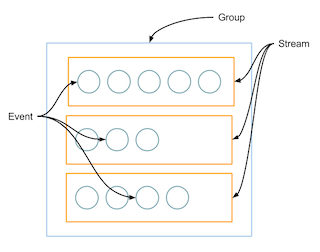

## CloudWatch

- [Logging](#logging)
- [Datapoint](#datapoint)
- [Alarm](#alarm)

### Logging



### Datapoint

A datapoint is the value of a metric for a given metric aggregation period i.e. if you use one minute as an aggregation period for a metric, then there will be one datapoint every minute. With this feature, you can now create a CloudWatch alarm that alerts you when M out of N datapoints of a metric are above your predefined threshold, such as three out of five times in any given five minutes interval or two out of six times in a thirty minutes interval. When any M out of N datapoints are below your threshold in an interval, the alarm will be in OK state. Please note that the M datapoints out of N datapoints in an interval can be of any order and does not need to be consecutive. Consequently, you can now get alerted even when the spikes in your metrics are intermittent over an interval. 

### Alarm

Define the number of `datapoints` within the `evaluation period` that must be breaching to cause the alarm to go to `ALARM` state.

`Period` defines the smallest unit of each time period.

i.e Given Period being 6 hours, Evaluation Period being 8 and Datapoints being 7, it means when alarm threshold has been hit 7 times during 8 * 6 hours, the alarm state will be changed to `IN ALARM`.

Likewise, given Period being 1 minute, Evaluation Period being 3 and Datapoints being 3, it means when alarm threshold has been reached in 3 consecutive periods during 3 * 1 minutes, the alarm state will be changed to `IN ALARM`.

A practical example below: Alarm is based on average (can also be min/max, see [statistics](https://docs.aws.amazon.com/AmazonCloudWatch/latest/monitoring/cloudwatch_concepts.html#Statistic)) CPUUtilisation with a threshold > 45% for 3 data points out of 3 evaluation periods and a period of 300 seconds.

Aggregated metrics
```md
05:25:00: data: {Avg=61.123}
05:30:00: data: {Avg=57.847}
05:35:00: data: {Avg=60.503}
05:40:00: data: {Avg=55.473}
05:45:00: data: {Avg=41.685}
05:50:00: data: {Avg=58.390}
05:55:00: data: {Avg=57.846}
06:00:00: data: {Avg=61.123}
```

Alarm status
```md
05:35 ALARM
05:40 ALARM
05:45 ALARM to OK
05:50 OK
05:55 OK
06:00 OK to ALARM
```

When evaluating `06:00` period, CW will look at two previous records `05:55:00: data: {Avg=57.846}` and `05:50:00: data: {Avg=58.390}`. Both of them breaches the threshold as well as `06:00` itself. So it satisfies the condition that 3 consecutive data points breaches the threshold.
