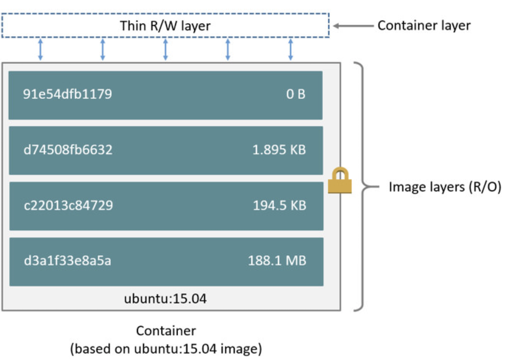
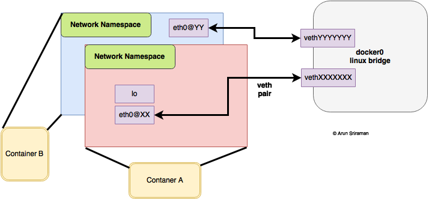

## Docker

- Docker
  - [Architecture](#Architecture)
  - [Image and Container](#image-and-container)
  - [Dockerfile](#dockerfile)
  - [Networking](#Networking)
  - [Caching](#caching)
  - [Security](#security)
  - [Disk space on daemon](#disk-space-on-daemon)
  - [Data persistence](#data-persistence)
  - [Behind a proxy server](#behind-a-proxy-server)
  - [Dangling images](#dangling-images)
  - [Clean-up](#clean-up)
  - [Docker-in-Docker](#docker-in-docker)
  - [Docker cheatsheet](https://www.linode.com/docs/applications/containers/docker-commands-quick-reference-cheat-sheet/)
- Docker Compose
  - [Networking](#networking)
  - [Mount your code as a volume to avoid image rebuilds](#Mount-src-to-volume)
  - [Communication between containers](#communication-between-containers)
  - [Memory and CPU limit](#memory-and-cpu-limit)
- Useful commands
  - [Show Dockerfile from an image](#show-dockerfile-from-an-image)
  - [Overwrite ENTRYPOINT at runtime](#overwrite-entrypoint)
- Posts
  - [Run multiple instances of a service using docker-compose](https://pspdfkit.com/blog/2018/how-to-use-docker-compose-to-run-multiple-instances-of-a-service-in-development/)

### Architecture

Docker Engine aka Docker Daemon/Docker is architected as follow:


### Image and Container



- Base image is read-only while container layer allows read/write
- Any changes only occur in container layer without touching base image
- Container layer is added on top when a new container is started
- Not allowed to change history image

### dockerfile

Layers are also known as intermediate images. Each instruction in `Dockerfile` composes one layer of final image. More layers more complex. So try to group instructions.

Use `docker history <image>` to view constituted layers of an image.

Docker images are layered. When you build a new image, Docker does this for each instruction (RUN, COPY etc.) in your Dockerfile:

- Create a temporary container from the previous image layer (or the base FROM image for the first command
- Run the Dockerfile instruction in the temporary `intermediate` container
- Save the temporary container as a new image layer

#### ARGS vs ENV


- Keep it in mind that this is not shell script you should try to write as less lines of intructions as possible.
- Remember to remove/clean up redundant files you've created during build/setup to reduce image footprint.
- Each line of instruction should only do things relating to that layer.

#### ENTRYPOINT VS CMD

The ENTRYPOINT specifies a command that will always be executed when the container starts, by default it is `/bin/sh -c`.
The CMD specifies arguments that will be fed to the ENTRYPOINT.

Given example docker file below:

```dockerfile
ENTRYPOINT ["/bin/chamber", "exec", "production", "--"]
CMD ["/bin/service", "-d"]
```
if we run `docker run myservice`, container will be created with below arguments:
`["/bin/chamber", "exec", "production", "--", "/bin/service", "-d"]`. It looks similar to `/bin/chamber exec production -- /bin/service -d` which is the command container is run on start-up.

We can override `CMD` by doing `docker run myservice /bin/debug`. In this case, command `["/bin/chamber", "exec", "production", "--", "/bin/debug"]` will be executed.

We can also override `ENTRYPOINT` by doing `docker run --entrypoint /bin/logwrap myservice`. In this case, command `["/bin/logwrap", "/bin/service", "-d"]` will be executed.

If you want to make an image dedicated to a specific command you will use `ENTRYPOINT ["/path/dedicated_command"]`. Otherwise, if you want to make an image for general purpose, you can leave **ENTRYPOINT** unspecified and use `CMD ["/path/dedicated_command"]` as you will be able to override the setting by supplying arguments to docker run.

### Networking

#### Bridge network

The Docker server creates and configures the host system’s **docker0** interface as an Ethernet bridge inside the Linux kernel that could be used by the docker containers to communicate with each other and with the outside world.

When docker engine is started, the default bridge network named **docker0** is created - not visible on Mac via ifconfig since it’s in VM (on OS X docker host is a linux virtual machine called docker machine). You can run `docker-machine ssh default` to ssh into docker machine.

Docker bridge network:




As shown above, **docker0** bridge is virtual interface created by docker, it randomly chooses an address and subnet from the private range that are not in use on the host machine, and assigns it to **docker0**. By default, all the docker containers will be connected to the **docker0 bridge**, the docker containers connnected to the **docker0 bridge** could use the **iptables NAT rules** created by docker to communicate with the outside world.

Bridge network provides isolations that containers sitting outside the default bridge network (custom one) cannot communicate with ones sitting inside.

Containers connected to the default bridge network can communicate and it doesn't need port mapping but **ONLY by IP address**, unless they are linked using the `legacy--link flag`.

#### expose vs ports

`expose` - The expose tag will let you expose ports without publishing them to the host machine, but they will be exposed to the containers networks. `ports` on the other hand will be mapping the host port with the container port `HOST:CONTAINER`.

compose file
```
services
  redis:
    build:
      context: .
      dockerfile: Dockerfile-redis
    expose:
      - "6379"
```

#### What happens when you run a container

The `docker0` Ethernet bridge settings are used every time you create a new container. Docker selects a free IP address from the range available on the bridge each time you `docker run` a new container, and configures the container’s `eth0` interface with that IP address and the bridge’s netmask. The Docker host’s own IP address (randomly picked by docker from the private ip range that's not used on the host machine) on the bridge is used as the default gateway by which each container reaches the rest of the Internet.

#### Bridge network gateway

It determines where traffic should go if destination ip does not match any container's ip in the network.

#### veths

Docker network drivers utilize **veths** to provide explicit connections between namespaces when Docker networks are created. When a container is attached to a Docker network, one end of the veth is placed inside the container (usually seen as the ethX interface) while the other is attached to the Docker network (bridge network). See [Virtual Ethernet Devices](https://github.com/DavidHe1127/Mr.He_HandBook/blob/master/cloud/linux.md#networking)

#### DNS

- By default, containers on default `bridge` network has a copy of `/etc/resolv.conf` from host.
- Containers using `user-defined` network (aka custom network) including bridge, overlay and MACVLAN use Docker's embedded DNS server addressed at `127.0.0.11`.
This DNS server provides name resolution to all of the containers on the custom network.
- If containers cannot reach any of the IP addresses you specify - i.e --dns xxx.xxx.xx.xx then it will use Google's public DNS server `8.8.8.8`.

#### DNS resolution process


In this example there is a service of two containers called `myservice`. A second service (client) exists on the same network. The client executes two curl operations for `docker.com` and `myservice`. These are the resulting actions:

- DNS queries are initiated by client for `docker.com` and `myservice`.
- The container's built-in resolver intercepts the DNS queries on `127.0.0.11:53` and sends them to Docker Engine's DNS server.
- Docker Engine then checks if the DNS query belongs to a container or service on network(s) that the requesting container belongs to. If it does, then Docker Engine looks up the IP address that matches a container or service's name in its key-value store and returns that IP or service Virtual IP (VIP) back to the requester. In this example, `myservice` does exist on the network so internal DNS resolve its name and return associated IP to the client.
- `docker.com` does not exist as a service name in the `mynet` network and so the request is forwarded to the configured default DNS server.

#### [Between-container communication](https://www.jianshu.com/p/710f4bb5a1a6)

---

### Caching

#### Caching for ADD and COPY
The targeting files are examined and checksum is calculated for each of them. During cache lookup, every checksum is compared with the existing one individually (if there is any) and if a change is detected, cache will be invalidated and a new layer will be built. This also has the following lines of code rerun - new layer could be built.

Consider the following sample

```Dockerfile
FROM node:8
COPY . /app
RUN npm install --production
EXPOSE 3000
CMD ["node", "app/index.js"]

FROM node:8
COPY package.json /app/package.json
RUN cd /app; npm install --production
COPY . /app
EXPOSE 3000
CMD ["node", "app/index.js"]
```

Second build example is better. Why? The only time we need to run `npm install` is when a change occurs to dependencies, in other words `package.json`. If a change is made to other source files, the first build will still run `npm install` while the second build won't.

### Security

#### Never run container as a root

By default, docker run commands as user root and a lot of images don't give you `sudo` command.

```shell
drwxr-xr-x  1 root root  4096 Dec 17 04:03 ..
-rw-r--r--  1 root root   265 Dec 25 10:54 package.json
-rw-r--r--  1 root root 15624 Dec 25 10:54 package-lock.json
-rw-r--r--  1 root root    27 Dec 25 10:54 .dockerignore
-rw-r--r--  1 root root   498 Dec 31 03:54 Dockerfile
-rwxr-xr-x  1 root root   176 Dec 31 04:40 start.sh
-rw-r--r--  1 root root   864 Dec 31 04:40 server.js
drwxr-xr-x 51 root root  4096 Dec 31 04:49 node_modules
drwxr-xr-x  1 root root  4096 Dec 31 04:49 .
```

Use `root` user will pose potential security threats in case your container is hacked. The best way to avoid it is create and use a non-privileged user after you install dependencies.

### Disk space on daemon

```shell
$ docker system df // to see space usage status
$ docker system prune // remove build cache, dangling images, stopped containers networks not used by any one container
```

### Data Persistence

Volume is independent of container lifecycle. This means data stored in volume will not be gone when the running container stopped or deleted.

Volume can also be shared among different containers. Data in volume will be mirrored across to mounting directory inside the container.

3 ways:

- Volumes - stored in `/var/lib/docker/volumes/` managed by Docker. Non-docker processes should not modify it. The best option.

attach volume `myvol1` to `/var/jenkins_home` in container. By default, Jenkins will write all data to this directory. With mounting in place, everytime Jenkins writes data to `/var/jenkins_home`, the same data will be copied to `myvol1`.

```shell
$ docker run -v myvol1:/var/jenkins_home -p 8080:8080 jenkins
```

- Bind mounts - stored anywhere on host file system - i.e Desktop. non-docker processes can modify it anytime.

```shell
$ docker run -v /Users/david.he/Desktop/Jenkins_Home:/var/jenkins_home -p 8080:8080 jenkins
```

- tmpfs - stored in host system's memory only. Never written to host filesystem.

### Behind a proxy server
By default, docker daemon will look for global environment variables on the host to use. i.e `http_proxy`, `https_proxy` and `no_proxy`. However, these values can be overwritten when specifying them in docker service file. This example shows docker service file on a linux distribution:

```
# /etc/systemd/system/docker.service.d/http-proxy.conf

[Service]
Environment="HTTP_PROXY=http://proxy.example.com:80/"
```

Config file can be modified at the runtime. Run these 2 commands below to apply changes afterwards:

```shell
$ sudo systemctl daemon-reload
$ sudo systemctl restart docker
```

### Dangling images

Dangling images can be produced

-  Intermediate images (different layers) and can be seen using `docker images -a`. They don’t result into a disk space problem but it is definitely a screen real estate problem (good)
- When a new image is built due to changes but use the same tag from previous build.
i.e In your first build, you tag built image as `1.0`. Then you make changes to codebase and build it again using the same tag `1.0`. A new image will be built with different id as a result of new build. However, given it's using the same tag `1.0`, the previous built image will become dangling since Docker takes tag from previous build and attach it to the current one. (bad)

Run `docker image prune -f` to remove them.

### Clean-up

Use `docker system df` to give you an overview of

```txt
- Images:         Total size of disk space taken by pulled images as well as locally-built ones
- Containers:     The disk space used by the containers running on the system, meaning the space of each containers’ read-write layer.
- Local Volumes:  Storage persisted on the host but outside of a container’s filesystem.
- Build Cache:    the cache generated by the image build process (only if using BuildKit, available from Docker 18.09).
```

Header `RECLAIMABLE` means the space docker doesn't need and therefore is able to be given back to host. Note, an image is not reclaimable if it's used by a running or stopped container. It turns into reclaimable resource only if container is removed

For more information, [See this post](https://medium.com/better-programming/docker-tips-clean-up-your-local-machine-35f370a01a78)

### Docker-in-Docker

Docker-in-docker is useful when considering 2 cases below:

- Continuous Integration (CI) pipeline
  - In a Jenkins pipeline, the agent may be a Docker container tasked with building or running other Docker containers.
- Sandboxed Docker environments
  - Developers that want to play around with Docker containers in a sandboxed environment, isolated from their host environment

Two approaches:

#### Docker-in-Docker

- Running the Docker daemon inside a container, using Docker’s DinD container image
- Lead to security concerns and hence generally not recommended

#### Docker-out-of-Docker

- Only the Docker CLI runs in a container and connects to the Docker daemon on the host through a socket - When the Docker platform is installed on a host, the Docker daemon listens on the `/var/run/docker.sock` Unix socket by default.
```shell
$ docker run -it -v /var/run/docker.sock:/var/run/docker.sock docker
```
- Containers being created by agent will be on the host machine.
- Potential naming conflict - agent container builds a container that has the same name as an existing container on the host.
- port mapping conflict - if the container running the Docker CLI creates a container with a port mapping, the port mapping occurs at the host level, potentially colliding with other port mappings.

#### References:
- [docker.sock explained](https://stackoverflow.com/questions/35110146/can-anyone-explain-docker-sock/35110344#:~:text=125-,docker.,defaults%20to%20use%20UNIX%20socket.&text=There%20might%20be%20different%20reasons,Docker%20socket%20inside%20a%20container.)
- [Secure Docker-in-Docker with System Containers](https://blog.nestybox.com/2019/09/14/dind.html)

---

## Docker Compose

### Networking

Suppose there is a `docker-compose.yml` in `myapp` directory.

```yml
version: "3"
services:
  web:
    build: .
    ports:
      - "8000:8000"
  db:
    image: postgres
    ports:
      - "8001:5432"
```

When you run `docker-compose up` from project root, the following happens:

1. A network called `myapp_default` is created.
2. A container is created using web’s configuration. It joins the network myapp_default under the name web.
3. A container is created using db’s configuration. It joins the network myapp_default under the name db.

Each container can now look up the hostname `web` or `db` and get back the appropriate container’s IP address. For example, web’s application code could connect to the URL `postgres://db:5432` and start using the Postgres database.

Run `docker network ls` to find the desired network and run `docker network inspect <NETWORK_ID>` to see network configs.

**Access docker host from inside the container**

Use special DNS `host.docker.internal` when trying to access services running on docker host on OS X/windoes. i.e instead of `http://localhost:4000` try `http://host.docker.internal:4000`.

### Mount src to volume

Any time you make a change to your code, you need to rebuild your Docker image (which is a manual step and can be time consuming). To solve this issue, mount your code as a volume. Now manual rebuilds are no longer necessary when code is changed. It's because changes on host will also be replicated in the mounted volume inside the container.

```yml
services:
  web:
    volumes:
      - ./webapp:/opt/webapp
      # With this, you don't have to manually copy node_modules into container during dev
      # Another benefit is you can debug node_modules locally
      - ./node_modules:/home/node/app/server/node_modules
```

### Communication between containers

Use `links` is deprecated!!! Able to access service by name out of box.

```yml
web:
  links:
    - db
db:
  image: postgres:latest
```

Code inside web can access database using `db:5432`.

Another way to let containers on the same network to communicate with each other via container name is done through custom network.

```shell
# 1. create a custom bridge network
$ docker network create mynet

# 2. connect two containers to mynet and run them
$ docker run -d --name server1 --net mynet networking:server1
$ docker run -d --name server2 --net mynet networking:server2

# 3. now you can curl server1 from inside server2 by container name
$ curl http://server1:8080/
```
Caveats:
- You must create a custom bridge network. Default bridge work only allows connection via ip.
- Must specify a container name. Random name won't work.
- Must specify connection port which is exposed by container unless `80` is exposed.
- Need set `HOST` on `server1` to `0.0.0.0` to enable it expose all interfaces.

### Memory and CPU limit

By default, containers specified in `docker-compose` file can consume as much as memory/cpu on the docker host as it needs. This could potentially harm docker host when poorly written apps overconsume memory/cpu. When this occurs, on Linux hosts, kernal will see insufficient memory to perform important system functions, it throws an `OOME`, or `Out Of Memory Exception`. As a result, kernal will start killing processes. They might include critical ones or even Docker Daemon. That's why we sometimes need to constraint resources for our docker services down to certain limits. Now even resources over-consumption will not happen.

Memory/CPU reservations on the other hand specify the least resources a service needs to run correctly.

```yml
version: "3.8"
services:
  redis:
    image: redis:alpine
    deploy:
      resources:
        limits:
          cpus: '0.50'
          memory: 50M
        reservations:
          cpus: '0.25'
          memory: 20M
```

---

### Show Dockerfile from an image

```shell
$ docker history <IMAGE_ID>
```


