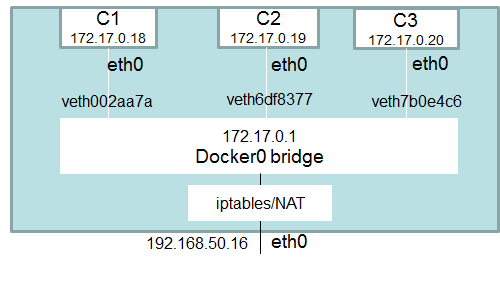

## Docker

- Docker
  - [Architecture](#Architecture)
  - [Dockerfile](#dockerfile)
  - [Enter running container](#Enter-running-container)
  - [Logging](#Logging)
  - [Copy files](#Copy-files)
  - [Delete dangling images](#Delete-dangling-images)
  - [Networking](#Networking)
  - [Disk space on daemon](#disk-space-on-daemon)
  - [Data persistence](#data-persistence)
  - [Docker cheatsheet](https://www.linode.com/docs/applications/containers/docker-commands-quick-reference-cheat-sheet/)
- Docker Compose
  - [Networking](#networking)
  - [Mount your code as a volume to avoid image rebuilds](#Mount-src-to-volume)
  - [Communication between containers](#communication-between-containers)
  - [Force Re-build image and re-create container](#force-rebuild)

### Architecture

When people say `docker` they typically refer to `docker engine` whose architecture is below:


### dockerfile

Layers are also known as intermediate images. Each instruction in `Dockerfile` composes one layer of final image. More layers more complex. So try to group instructions.

Use `docker history <image>` to view constituted layers of an image.

Docker images are layered. When you build a new image, Docker does this for each instruction (RUN, COPY etc.) in your Dockerfile:

- Create a temporary container from the previous image layer (or the base FROM image for the first command
- Run the Dockerfile instruction in the temporary `intermediate` container
- Save the temporary container as a new image layer

#### ARGS vs ENV


- Keep it in mind that this is not shell script you should try to write as less lines of intructions as possible.
- Remember to remove/clean up redundant files you've created during build/setup to reduce image footprint.
- Each line of instruction should only do things relating to that layer.

#### ENTRYPOINT VS CMD

The ENTRYPOINT specifies a command that will always be executed when the container starts, by default it is `/bin/sh -c`.
The CMD specifies arguments that will be fed to the ENTRYPOINT.

If you want to make an image dedicated to a specific command you will use `ENTRYPOINT ["/path/dedicated_command"]`. Otherwise, if you want to make an image for general purpose, you can leave **ENTRYPOINT** unspecified and use `CMD ["/path/dedicated_command"]` as you will be able to override the setting by supplying arguments to docker run.

### Networking

#### Bridge network

The Docker server creates and configures the host system’s **docker0** interface as an Ethernet bridge inside the Linux kernel that could be used by the docker containers to communicate with each other and with the outside world.

When docker engine is started, the default bridge network named **docker0** is created - not visible on Mac via ifconfig since it’s in VM (on OS X docker host is a linux virtual machine called docker machine). You can run `docker-machine ssh default` to ssh into docker machine.

Docker bridge network:




As shown above, **docker0** bridge is virtual interface created by docker, it randomly chooses an address and subnet from the private range that are not in use on the host machine, and assigns it to **docker0**. By default, all the docker containers will be connected to the **docker0 bridge**, the docker containers connnected to the **docker0 bridge** could use the **iptables NAT rules** created by docker to communicate with the outside world.

Bridge network provides isolations that containers sitting outside the default bridge network (custom one) cannot communicate with ones sitting inside.

Containers connected to the default bridge network can communicate, but **ONLY by IP address**, unless they are linked using the `legacy--link flag`.

#### What happens when you run a container

The `docker0` Ethernet bridge settings are used every time you create a new container. Docker selects a free IP address from the range available on the bridge each time you `docker run` a new container, and configures the container’s `eth0` interface with that IP address and the bridge’s netmask. The Docker host’s own IP address (randomly picked by docker from the private ip range that's not used on the host machine) on the bridge is used as the default gateway by which each container reaches the rest of the Internet.

#### Bridge network gateway

It determines where traffic should go if destination ip does not match any container's ip in the network.

#### veths

Docker network drivers utilize **veths** to provide explicit connections between namespaces when Docker networks are created. When a container is attached to a Docker network, one end of the veth is placed inside the container (usually seen as the ethX interface) while the other is attached to the Docker network (bridge network). See [Virtual Ethernet Devices](https://github.com/DavidHe1127/Mr.He_HandBook/blob/master/cloud/linux.md#networking)

### Disk space on daemon

```shell
$ docker system df // to see space usage status
$ docker system prune // remove build cache, dangling images, stopped containers networks not used by any one container
```

### Data Persistence

Volume is independent of container lifecycle. This means data stored in volume will not be gone when the running container stopped or deleted.

Volume can also be shared among different containers. Data in volume will be mirrored across to mounting directory inside the container.

3 ways:

- Volumes - stored in `/var/lib/docker/volumes/` managed by Docker. Non-docker processes should not modify it. The best option.

attach volume `myvol1` to `/var/jenkins_home` in container. By default, Jenkins will write all data to this directory. With mounting in place, everytime Jenkins writes data to `/var/jenkins_home`, the same data will be copied to `myvol1`.

```shell
$ docker run -v myvol1:/var/jenkins_home -p 8080:8080 jenkins
```

- Bind mounts - stored anywhere on host file system - i.e Desktop. non-docker processes can modify it anytime.

```shell
$ docker run -v /Users/david.he/Desktop/Jenkins_Home:/var/jenkins_home -p 8080:8080 jenkins
```

- tmpfs - stored in host system's memory only. Never written to host filesystem.

---

## Docker Compose

### Networking

Suppose there is a `docker-compose.yml` in `myapp` directory.

```yml
version: "3"
services:
  web:
    build: .
    ports:
      - "8000:8000"
  db:
    image: postgres
    ports:
      - "8001:5432"
```

When you run `docker-compose up` from project root, the following happens:

1. A network called `myapp_default` is created.
2. A container is created using web’s configuration. It joins the network myapp_default under the name web.
3. A container is created using db’s configuration. It joins the network myapp_default under the name db.

Each container can now look up the hostname `web` or `db` and get back the appropriate container’s IP address. For example, web’s application code could connect to the URL `postgres://db:5432` and start using the Postgres database.

Run `docker network ls` to find the desired network and run `docker network inspect <NETWORK_ID>` to see network configs.

### Mount src to volume

Any time you make a change to your code, you need to rebuild your Docker image (which is a manual step and can be time consuming). To solve this issue, mount your code as a volume. Now manual rebuilds are no longer necessary when code is changed. It's because changes on host will also be replicated in the mounted volume inside the container.

```yml
services:
  web:
    volumes:
      - ./webapp:/opt/webapp
      # With this, you don't have to manually copy node_modules into container during dev
      # Another benefit is you can debug node_modules locally
      - ./node_modules:/home/node/app/server/node_modules
```

### Communication between containers

Use `links` is deprecated!!! Able to access service by name out of box.

```yml
web:
  links:
    - db
db:
  image: postgres:latest
```

Code inside web can access database using `db:5432`.

Another way to let containers on the same network to communicate with each other via container name is done through custom network.

```shell
# 1. create a custom bridge network
$ docker network create mynet

# 2. connect two containers to mynet and run them
$ docker run -d --name server1 --net mynet networking:server1
$ docker run -d --name server2 --net mynet networking:server2

# 3. now you can curl server1 from server2 by container name
$ curl http://server1:8080/
```
To communicate via container name:
- You must create a custom bridge network. Default bridge work only allows connection via ip.
- Must specify a container name. Random name won't work.
- Must specify connection port which is exposed by container unless `80` is exposed.

### Force rebuild

`$ docker-compose up --force-recreate --build`


