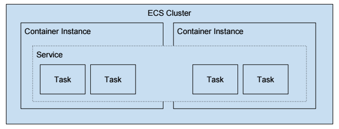
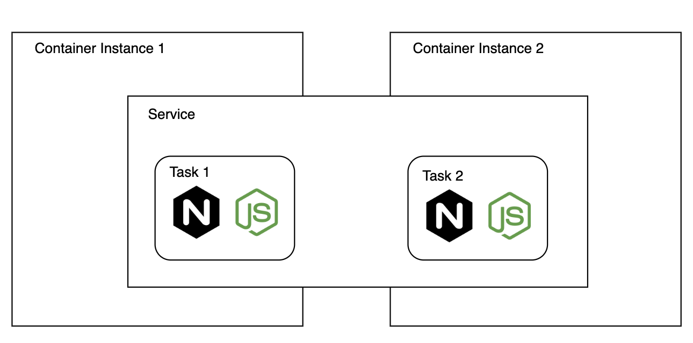
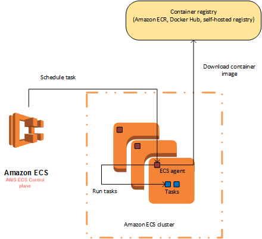

## ECS

- [Core concepts](#core-concepts)
  - [Task Definition](#task-definition)
  - [Task](#task)
  - [Service](#service)
  - [Cluster](#cluster)
  - [Container Instance](#container-instance)
  - [Desired Count](#desired-count)
  - [ECS agent](#ecs-agent)

- [Run a service in cluster](#run-a-service-in-cluster)
- [Run a task in cluster](#run-a-task-in-cluster)
- [Troubleshooting guide](#troubleshooting-guide)

### Core Concepts

#### Task Definitions
Blueprint describes how a container should launch. It contains settings like exposed port, docker image, cpu shares, memory requirement, command to run and env vars.

#### Task
This is a running container with the settings defined in the Task Definition. It can be thought of as an `instance` of a Task Definition.

#### Service
Defines long running tasks of the same Task Definition i.e a web application. This can be 1 running container or multiple running containers all using the same Task Definition. Task here is the same as task mentioned above besides if any one task goes down, ecs service scheduler will replace it as per desired task(instance of task definition) count specified in input json.

#### Input JSON
Serves as defined operations being performed against a service.

```json
{
    "cluster": "production",
    "serviceName": "web",
    "taskDefinition": "web",
    "loadBalancers": [
        {
            "loadBalancerName": "dockerzon-web",
            "containerName": "nginx",
            "containerPort": 80
        }
    ],
    "role": "arn:aws:iam::216659404274:role/ecs-deepdive-servicerole",
    "desiredCount": 2,
    "deploymentConfiguration": {
        "maximumPercent": 100,
        "minimumHealthyPercent": 50
    }
}
```

#### Cluster
A logic group of EC2 instances. When an instance launches the `ecs-agent` software on the server it registers the instance to an ECS Cluster. This is easily configurable by setting the ECS_CLUSTER variable.

#### Container Instance
This is just an EC2 instance that has docker and ecs-agent running on it. It's part of ECS cluster.



#### Desired Count
Desired count of running tasks. Say your task definition defines two containers (nginx + express) and you create and run a service with desired count 2. This will lead to 2 running tasks instantiated by the specified task definition are deployed onto each container instances respectively.



#### ECS Agent



---

### Run a service in cluster

Prerequisites:

- security group
- ssh keypair for ssh into ec2 instance
- ECS relevant IAM roles

1. Create ECS cluster.
2. Store container agent config file on s3. `ECS_CLUSTER` env specified in the file will register a container instance to clusters.
3. Create a container instance using ECS optimized AMIs (container agent & docker engine pre-baked in).
  - Script logic to copy container agent config file over. Load script via ec2 instance user data
4. Write up a task definition and register (upload) it to the cluster
5. Create a service from registered task definition

```shell
$ aws ecs create-service --cluster deepdive --service-name web --task-definition web --desired-count 1
```

### Run a task in cluster

- Tasks are short-lived/1 off tasks that exit when done. That means ecs will not replace a task when it dies.
- 2 ways of running a task
  - RunTask: randomly distribute tasks on your cluster. But minimizes specific instances from getting overloaded
  - StartTask: lets you pick where you want to run a task on cluster

Run task is similar to what we see in run a service.

```shell
$ aws ecs run-task --cluster deepdive --task-definition web --count 1
```

### Troubleshooting Guide

- If container instances failed to register to target group, it's most likely because they all fail health check. So make sure they pass it.
- If container instances not shown in `Container Instances` tab in `service`, it's most likely due to wrong rules have been setup in security group.
