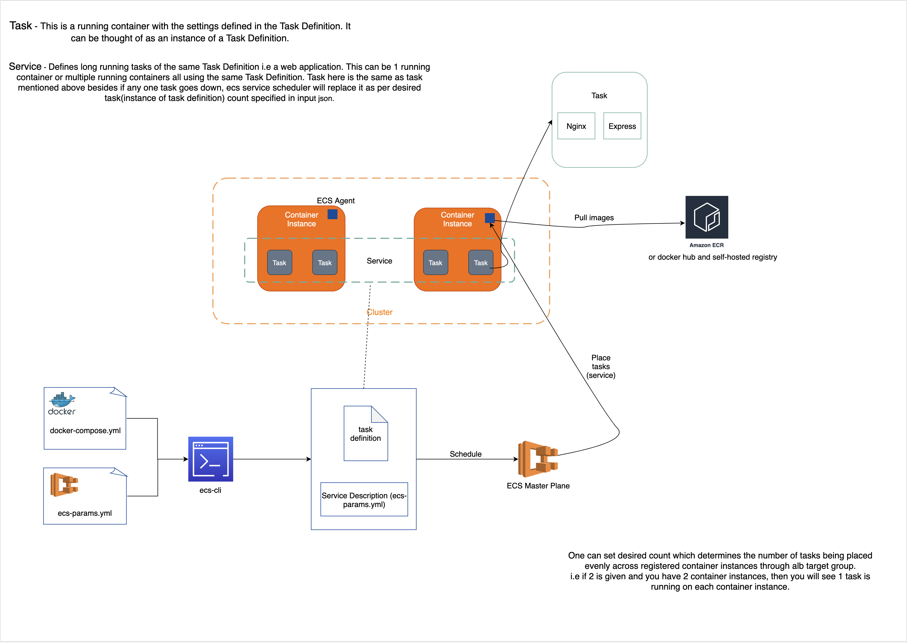

## ECS

- [Core concepts](#core-concepts)
  - [Task Definition](#task-definition)
  - [Cluster](#cluster)
  - [Desired Count](#desired-count)
  - [Overview](#overview)
- [Run a service in cluster](#run-a-service-in-cluster)
- [Run a task in cluster](#run-a-task-in-cluster)
- [Auto scaling](#asg)
- [Troubleshooting guide](#troubleshooting-guide)

### Core Concepts

#### Task Definitions
Blueprint describes how a container should launch. It contains settings like exposed port, docker image, cpu shares, memory requirement, command to run and env vars.

#### Cluster
A logic group of EC2 instances. When an instance launches the `ecs-agent` software on the server it registers the instance to an ECS Cluster. This is easily configurable by setting the ECS_CLUSTER variable.

#### Desired Count
Desired count of running tasks. Say your task definition defines two containers (nginx + express) and you create and run a service with desired count 2. This will lead to 2 running tasks instantiated by the specified task definition are deployed onto each container instances respectively.


#### Overview


---

### Run a service in cluster

Prerequisites:

- security group
- ssh keypair for ssh into ec2 instance
- ECS relevant IAM roles

1. Create ECS cluster.
2. Store container agent config file on s3. `ECS_CLUSTER` env specified in the file will register a container instance to clusters.
3. Create a container instance using ECS optimized AMIs (container agent & docker engine pre-baked in).
  - Script logic to copy container agent config file over. Load script via ec2 instance user data
4. Write up a task definition and register (upload) it to the cluster
5. Create a service from registered task definition

```shell
$ aws ecs create-service --cluster deepdive --service-name web --task-definition web --desired-count 1
```

### Run a task in cluster

- Tasks are short-lived/1 off tasks that exit when done. That means ecs will not replace a task when it dies.
- 2 ways of running a task
  - RunTask: randomly distribute tasks on your cluster. But minimizes specific instances from getting overloaded
  - StartTask: lets you pick where you want to run a task on cluster

Run task is similar to what we see in run a service.

```shell
$ aws ecs run-task --cluster deepdive --task-definition web --count 1
```

### ASG

#### Memory Reservation
Defines how much of memory it requires (is reserved) to run a container/task. It's considered to be a soft limit. Along with `memory` aka memory hard limit, they work hand in hand to help ECS scheduler with decision-making on tasks placement into container instances.

Example one, given `memoryReservation` and `memory` with value of `128MiB` and `300MiB` respectively, it means ECS will reserve `128MiB` of memory to ensure your container has enough resource to work. In the event of insufficient resources as required, your container is allowed to burst up to `300MiB` for short periods of time but not exceeds that particular amount. This would only happen when no other containers require resources from instance.

Example two, if you reserve 1024 cpu units for a particular task and that amount is equal to entire cpu units a container instance has, then scheduler will not place anymore tasks into this instance when such requirement arises.

Example three, a cluster has two active container instances registered: a `c4.4xlarge` instance and a `c4.large` instance. The `c4.4xlarge` instance registers into the cluster with `16,384` CPU units and `30,158 MiB` of memory. The `c4.large` instance registers with `2,048` CPU units and `3,768 MiB` of memory. The aggregate resources of this cluster are `18,432` CPU units and `33,926` MiB of memory.

If a task definition reserves `1,024` CPU units and `2,048` MiB of memory, and ten tasks are started with this task definition on this cluster (and no other tasks are currently running), a total of `10,240` CPU units and `20,480` MiB of memory are reserved. This is reported to CloudWatch as `55%` CPU reservation and `60%` memory reservation for the cluster.


### Troubleshooting Guide

- If container instances failed to register to target group, it's most likely because they all fail health check. So make sure they pass it.
- If container instances not shown in `Container Instances` tab in `service`, it's most likely due to wrong rules have been setup in security group.
