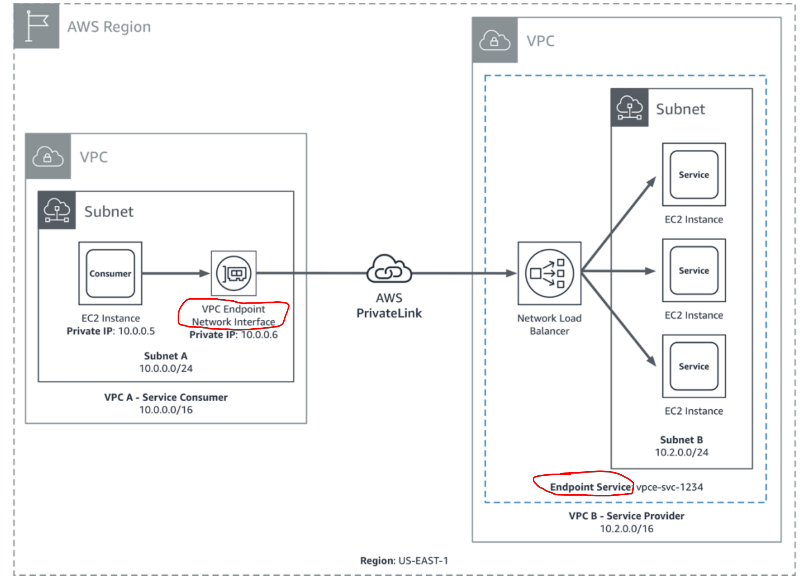

## VPC

- [NAT Gateway](#nat-gateway)
  - [NAT Gateway vs IP gateway](#nat-gateway-vs-ip-gateway)
- [Cost](#cost)
- [Endpoint](#endpoint)
- [Public IP vs Elastic iP](#public-ip-vs-elastic-ip)

### NAT Gateway

Enable instances in a private subnet to connect to the internet or other AWS services, but prevent the internet from initiating a connection with those instances.

[Detailes about IGW and NATs](https://medium.com/awesome-cloud/aws-vpc-difference-between-internet-gateway-and-nat-gateway-c9177e710af6)

### Public IP vs Elastic IP
Public IP addresses are dynamic - i.e if you stop/start your instance you get reassigned a new public IP.

Elastic IPs get allocated to your account and stay the same - it's up to you to attach them to any instance or not. you could say they are `static public ip addresses`. To avoid charge over using elastic ip, make sure it's attached to an instance. It will incur charges if it's detached.

### NAT Gatway vs IP Gateway
Attaching an IGW to a VPC allows instances with public IPs to access the internet, while NATs allow instances with no public IPs to access the internet.

### Cost
VPC themselves are free but you need to pay for the services running within it. i.e NAT gateway, internet gateway, EC2s.

- [Use vpc endpoint to save money](https://medium.com/nubego/how-to-save-money-with-aws-vpc-endpoints-9bac8ae1319c)

### Endpoint

- It allows your services in your VPC to talk to AWS services through their endpoints without the need for traffic to go through public internet. Hence, public ip is not required
- VPC endpoints are virtual devices. They are horizontally scaled, redundant, and highly
available Amazon VPC components that allow communication between instances in an
Amazon VPC and services without imposing availability risks or bandwidth constraints
on network traffic
- It also allows services residing in different VPCs to talk with each other via AWS PrivateLink. i.e The owner of VPC B has a service endpoint (vpce-svc-1234) with an associated Network Load Balancer that points to the instances in subnet B as targets. Instances in subnet A of VPC A use an interface endpoint to access the services in subnet B.



2 types - Interface Endpoint and Gateway Endpoints


#### Security Group

It controls the traffic to the endpoint network interface from resources in your VPC.

#### Policy

Policy below allows lambda within your vpc to publish messages to SNS through a private link (vpc endpoint).

```json
{
  "Statement": [{
    "Action": ["sns:Publish"],
    "Effect": "Allow",
    "Resource": "arn:aws:sns:region:account:topic-name",
    "Principal": {
      "Service": "lambda.amazonaws.com"
    }
  }]
}
```
