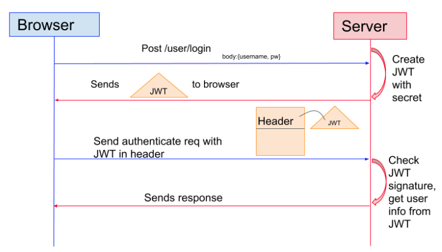
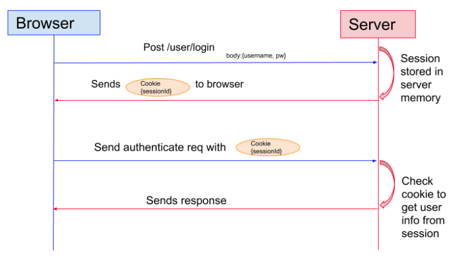

## Auth

It outlines different approaches of authenticating applications and their features.

- [JWT](#jwt)
- [Session(Cookie)](#session)
- [More Readings](#more-readings)

### JWT

- comprised of 3 parts - **xxxx.yyyyy.zzzz** = **header**.**payload(claim)**.**signature**. Each bit is base64 encoded.
- header is as follow. It shows the algorithm we use to generate the signature. It needs to be base64 encoded.

```js
{
  "typ": "JWT",
  "alg": "HS256"
}
```

- payload(claim) contains metadata as follow. It then base64 encoded.

```js
{
  "iss": "Mr He. JWT", // issuer
  "iat": 1441593502, // issued at
  "exp": 1441594722, // expire at
  "aud": "www.lendi.com.au", // audience - server
  "sub": "david.he@lendi.com" // subject - client
}
```

- signature is generated by joining the above two base64 encoded strings first and then encrypted with secret - 'I love this game'.

```js
signature = header_alg(xxxxxxx.yyyyyyyy, YOUR_SECRET);
```

#### Important

- Never ever put the senstive data in **header** and **payload** - they are `base64` encoded not encrypted!!!
- Why do we need signature? - It prevents somebody modifying the data.
- How does server do the authentication? - Server will use the specified algorithm in the header, secret stored on the server, **header** and **payload** to generate another signature. Then, server will do the comparison with the sent one if they don't match it indicates the token has been tampered with.
- With JWT, you should NEVER EVER store token in db on server side. Instead it needs to be stored safely on client side.
- It makes scaling easier since any server in a cluster can serve the request given no session is kept on the server side.
- People use JWT to protect their APIs.


#### Downsides

- JWT can be a sizeable piece of data in the header!
- Not suitable for holding user sessions i.e shopping cart

#### FAQs

- #### How to invalidate a token?

A: Add a property to your user object in the server database, to reference the datetime the token was created at. To invalidate the token, just update its value, and if `iat` (holding the same value at the time of token creation) is older than updated value, you can reject the token.

- #### Where should I save it on the client side?

A: JWT needs to be stored inside an `httpOnly cookie` - a special kind of cookie that’s only sent in HTTP requests to the server, and it’s never accessible (both for reading or writing) from JavaScript running in the browser.

Never save it to `localStorage`. If any of the third-party scripts you include in your page gets compromised, it can access all your users’ tokens.

---

### Session

- Used to know user session state.
- sessionId is created and stored on the server (db or cache). It's also being sent down the wire to client through cookie.
- After authenticated, all subsequent requests will have sessionId attached automatically by browser.



#### Downsides

- Cookies normally work on a single domain or subdomains and they are normally disabled by browser if they work cross-domain (3rd party cookies)
- Given the fact it's stored in server's memory, scaling becomes a problem since a different server than the original one who generates the sessionId would fail to know incoming request state.

---

### More readings

[Microservices Authentication and Authorization Solutions](https://medium.com/tech-tajawal/microservice-authentication-and-authorization-solutions-e0e5e74b248a)
