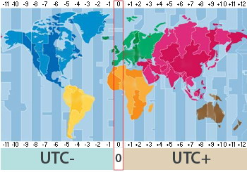

## Timestamp

- [ISO](#iso)
- [UTC](#utc)

### iso
The ISO format is a simplification of the ISO 8601 extended format. See format as follow:

```js
// format UTC time in ISO 8601 format
moment.tz('2018-03-22T00:00:00Z','Asia/Kolkata').format() // 2018-03-22T05:30:00+05:30
```

A few notes:
* `T` specifies the start of a time
* `Z` can be any values of:
  - Z indicates UTC time.
  - +hh:mm indicates that the input time is the specified offset after UTC time.
  - -hh:mm indicates that the input time is the absolute value of the specified offset before UTC time.

  i.e Australia Eastern Standard Time is denoted by `2017-09-07T08:00:00+10:00`

### utc
It is the time standard commonly used across the world.



