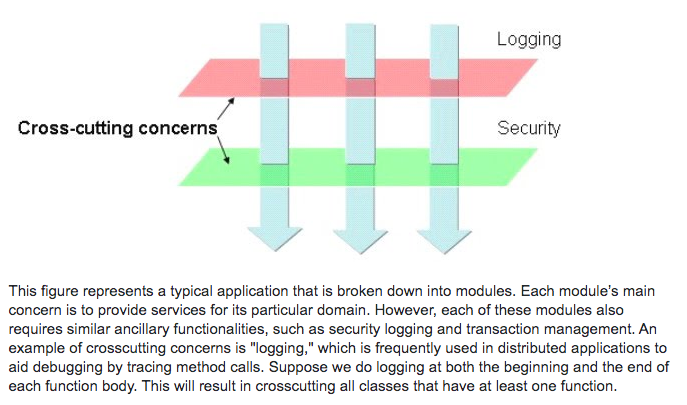

## Miscellaneous

- [Traditional Pagination vs Cursor-based Pagination](#traditional-pagination-vs-cursor-based-pagination)
- [Debounce vs Throttle](#debounce-vs-throttle)
- [Cross-cutting concerns](#cross-cutting-concerns)
- [Encoding](./char_encodings.md)
- [Timestamp](./timestamp.md)
- [Debugging](./debugging.md)
- [SSR](./ssr.md)
- [Marshall vs Unmarshall](#marshall-vs-unmarshall)
- [Memory leak and detection](https://www.arbazsiddiqui.me/a-practical-guide-to-memory-leaks-in-nodejs/)

## Traditional Pagination VS Cursor-based Pagination

### Problem with tradtional pagination (ONLY applicable to real time data)
Let's say we have 20 comments in total and want to display them in two pages so 10 for each.

```js
pg1 1 2 3 4 5 6 7 8 9 10
pg2 11 12 13 14 15 16 17 18 19 20
```

User A is reading all comments on page one. Everything works fine so far until someone adds a new comment.

Normally, the most recent comment should be presented at the top.

Now, User A goes to page 2 where it loads the next 10 comments as below
```js
SELECT * FROM comments ORDER BY date DESC LIMIT 10 SKIP 10
```

Since there is a new comment being pushed to the top, the next 10 comments will be (10 11 12 13 14 15 16 17 18 19).

It is obvious that the 10th comment that appeared previously at the bottom on page 1 now became the first one on page two.

User A sees 10th comment twice!

### Cursor-based pagination
Cursor-based pagination works by returning a pointer to a specific item in the dataset. On subsequent requests, the server returns results after the given pointer. This method addresses the drawbacks of using offset pagination, but does so by making certain trade offs:

  * The cursor must be based on a unique, sequential column (or columns) in the source table.
  * There is no concept of the total number of pages or results in the set.
  * The client can’t jump to a specific page.

  #### How it works?
  * We’d pick a unique, sequential column to paginate on. In this case, we’ll use the id field and assume this is an auto-incremented, primary key value.
  * Similar to the offset implementation, the client would make a request with a parameter indicating the number of results they want per page - `count`. Instead of the page parameter, we would accept a `cursor` parameter, which the client would get in the response from the previous request.
  * The server would then use cursor and count to paginate through the list.

  #### Workflow
  Let’s assume we want to paginate from the most recent user, to the oldest user. For the first request, we’d select the first page:

```sql
   SELECT * FROM users
   WHERE team_id = %team_id
   ORDER BY id DESC
   LIMIT %limit
```

Where limit is equal to count plus one, to fetch one more result than the count specified by the client. The extra result isn’t returned in the result set, but we use the ID of the value as the `next_cursor`.

The response from the server would be:
  ```js
  {
      "users": [...],
      "next_cursor": "123456",  # the user id of the extra result
  }
  ```

The client would then provide `next_cursor` as cursor in the second request:

```sql
SELECT * FROM users
WHERE team_id = %team_id
AND id <= %cursor
ORDER BY id DESC
LIMIT %limit
```

Again, limit is equal to count plus one. By setting the limit to one more than the count requested by the client, we’ll know we’re at the last page when the number of rows returned is less than count. At that point, we’ll return an empty `next_cursor` which tells the client there are no more pages to be fetched.

The response from the server would be:

```js
{
    "users": [...],
    "next_cursor": ""
}
```

### Debounce vs Throttle

* Throttle - enforce a max num of times a func can be called over time. i.e Under normal circumstances you would call this func 1000 times over 10 seconds. If you throttle it to only once per 100ms, it would only execute that func at most 100 times.

* Debounce - enforce that a func not be called again until a certain amount of time has passed without it being called.

### cross-cutting concerns


### marshall-vs-unmarshall

Go's terminology calls `marshal` the process of generating a JSON string from a data structure, and unmarshal the act of parsing JSON string back to a data structur.
