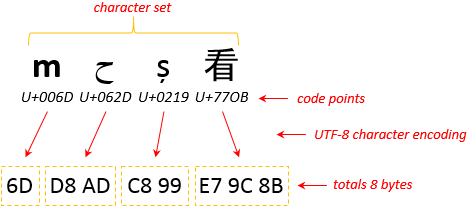

## Encoding

- [ASCii](#ascii)
- [Unicode](#unicode)
- [UTF-8](#utf-8)
- [base64 vs utf-8](#base64-vs-utf-8)

- Further reading
  - [ascii, unicode and utf-8 in Chinese](http://www.ruanyifeng.com/blog/2007/10/ascii_unicode_and_utf-8.html)
  - [Unicode and utf-8, utf-16 in Chinese](https://www.jianshu.com/p/9ed19a6645df)
  - [Convert Base64 encoded data to ASCII Text](https://www.hcidata.info/base64.htm)
  - [Why do we use Base64? ](https://stackoverflow.com/questions/3538021/why-do-we-use-base64)

### ascii

- `8 bits = 1 byte` which forms `256` combinations of `1` and `0` from `00000000` to `11111111`.
- `ASCii` is comprised of `128` characters. i.e `A` is 65 (01000001), `SPACE` is 32 (00100000). `32` out of `128` is non-printable. Each char takes `7` bits and leave the first bit `0`.
- Can only suffice english characters not other chars from other languages.

### unicode

- A huge set of unique codes for all characters.
- Represents as `U+<codepoint>`. i.e `鱼` is `U+9C7C`
- [Unicode](http://www.ruanyifeng.com/blog/2014/12/unicode.html)

### utf-8

- `UTF-8` implements `unicode`
- It has variable-length and uses `1~4` bytes to denote a single character

### base64-vs-utf-8

- `base64` is a way to encode binary data for the purpose of transmission over internet whereas `utf-8` is an encoding scheme to encode text for storage purpose.
- `utf8/16` are ways to encode `unicode` text.

### example

A few points to note here:

1. The prefix `0x` is used in code to indicate that the number is being written in `hex`. Similarly, `u+` denotes an `unicode code point`.
2. Letter m's unicode code point is `u+006D`. Its `hex` representation is `0x6D`(case-insensitive). `utf-8` encoding scheme is used.
3. Character set in the diagram is an universal unicode set
