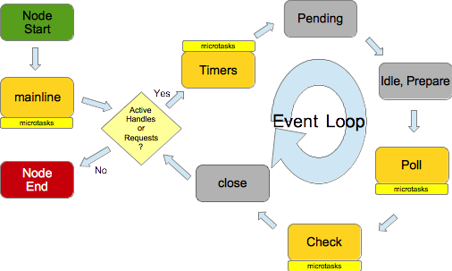

## Event Loop and V8 Engine

- [Event Loop and Process](#event-loop-and-process)
- [References](#references)




### Key Notes

- In any specific phase, event loop will pick the oldest from the queue and push its callback to stack to run which in return creates a frame.
  - Stack is FILO.
  - A frame contains the function call and its arguments, local variables.
  - Frame is pushed onto stack for execution and popped out once execution is done.
  - Event loop will take next task in the queue and go through the same operation process again until either task queue is empty or max number of callbacks has been executed. When these happen, the event loop will move to the next phase, and so on.
  - Each phase has a FIFO queue of callbacks to execute
- When blocking happens i.e long running operation in sync function call event loop will be completely blocked and will do nothing at all except wait until the operation finishes.
- A tick in event loop refers to one full cycle.

- Event loop basic job is to look both at the stack and the task queue, pushing the first thing on the queue to the stack when it see stack as empty.

With code below:
```js
setTimeout(myCallback, 1000);
```

That doesn’t mean that `myCallback` will be executed in 1,000 ms but rather that, in 1,000 ms, `myCallback` will be added to the queue. The queue, however, might have other events that have been added earlier — your callback will have to wait.

### Don't block your thread

2 types of threads in NodeJS:
- main thread Event Loop uses
- worker thread in a thread pool

Worker thread is used to execute IO operations. When either type of thread is taking a long time to execute, e.g executing a callback by EventLoop OR executing an IO operation on worker thread, we call it "blocked". Blocked thread cannot handle requests from other clients.

- Performance: If you regularly perform heavyweight activity on either type of thread, the throughput (processed requests/second) of your server will suffer.
- Security: If it is possible that for certain input one of your threads might block, a malicious client could submit this "evil input", make your threads block, and keep them from working on other clients. This would be a Denial of Service attack.

### Monitor your event loop lag

It measures the time span between the scheduling of a callback (pushing ready-to-execute callbacks into callback queue) and its execution. High event loop lag can indicate that the application is experiencing blocking I/O operations or CPU-intensive tasks that are taking too long to complete.

### What does poll phase do in event loop?

The poll phase has two main jobs:

- Figuring out how long it should block and poll for I/O
- Process events in the poll queue - iterate through events and execute code you write in the events handlers

If there are no timers scheduled when the event loop reaches the poll phase, one of two things will happen:

If the poll queue is not empty, the event loop will iterate through its callback queue, running them synchronously until the queue is exhausted or the system-dependent hard limit is met.
If setImmediate() was not used to schedule scripts, the event loop would wait for callbacks to be added to the queue before executing them.

For more, read [this](https://www.geeksforgeeks.org/what-is-poll-phase-in-node-js-event-loop/) and [this](https://tealfeed.com/poll-phase-nodejs-event-loop-inwwv).

### References

[Event Loop/Task Queue](https://medium.com/@gaurav.pandvia/understanding-javascript-function-executions-tasks-event-loop-call-stack-more-part-1-5683dea1f5ec)
[Complete guide to event loop](https://blog.logrocket.com/a-complete-guide-to-the-node-js-event-loop/)
[Process/Event Loop Official docs](https://nodejs.org/en/docs/guides/event-loop-timers-and-nexttick/?source=post_page---------------------------)
