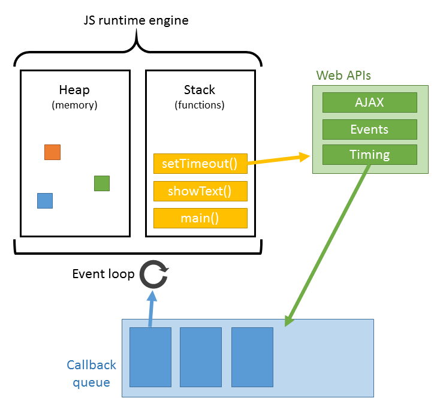

## Event Loop and V8 Engine

- [Event Loop and Process](#event-loop-and-process)
- [References](#references)




### Key Notes

- In any specific phase, event loop will pick the oldest from the queue and push its callback to stack to run which in return creates a frame.
  - Stack is FILO.
  - A frame contains the function call and its arguments, local variables.
  - Frame is pushed onto stack for execution and popped out once execution is done.
  - Event loop will take next task in the queue and go through the same operation process again until either task queue is empty or max number of callbacks has been executed. When these happen, the event loop will move to the next phase, and so on.
  - Each phase has a FIFO queue of callbacks to execute
- When blocking happens i.e long running operation in sync function call event loop will be completely blocked and will do nothing at all except wait until the operation finishes.
- A tick in event loop refers to one cycle. i.e from one timers phase to the next timers phase.

- Event loop basic job is to look both at the stack and the task queue, pushing the first thing on the queue to the stack when it see stack as empty.

With code below:
```js
setTimeout(myCallback, 1000);
```

That doesn’t mean that myCallback will be executed in 1,000 ms but rather that, in 1,000 ms, myCallback will be added to the queue. The queue, however, might have other events that have been added earlier — your callback will have to wait.

### References

[Event Loop/Task Queue](https://medium.com/@gaurav.pandvia/understanding-javascript-function-executions-tasks-event-loop-call-stack-more-part-1-5683dea1f5ec)
[Complete guide to event loop](https://blog.logrocket.com/a-complete-guide-to-the-node-js-event-loop/)
[Process/Event Loop Official docs](https://nodejs.org/en/docs/guides/event-loop-timers-and-nexttick/?source=post_page---------------------------)
