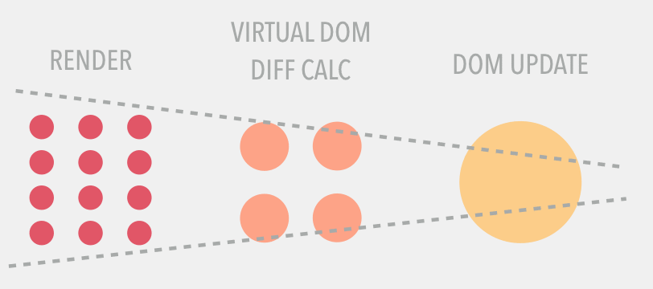

# React Essentials and Tips

## Hooks

- [Hooks](./hooks.md)

## State

- [State](./state.md)

## General

- [How react works](#how-react-works)
- [Why use PropTypes](#why-use-proptypes)
- [React Component as prop](https://www.developerway.com/posts/react-component-as-prop-the-right-way#part2)
- [Event Listeners](#event-listeners)
- [Prevent unnecessary re-rendering](#prevent-unnecessary-rerendering)
- [Avoid inadvertent mounting/unmounting](./avoid_inadvertent_mounting_unmounting.md)
- [Why need keys](#why-need-keys)
- [Controlled vs uncontrolled components](#controlled-vs-uncontrolled)
- [Useful tools/resources](#useful-tools-resources)
- [Render Props](#render-props)
- [Create component dynamically](#create-component-dynamically)
- [Namespace your components](#namespace-your-components)
- [Why findDOMNode only works on classical component](#finddomnode-only-works-on-classical-component)
- [Use shouldComponentUpdate correctly](#use-shouldcomponentupdate-correctly)
- [Use controlled component widely](#use-controlled-component-widely)
- [JSX Control Statement](#jsx-control-statement)
- [local state or prop](#local-state-or-prop)
- [Why need to import react even for stateless components](#react-import-need-for-stateless-component)
- [Compound Components](#compound-components)
- [Refs](./refs.md)
- [Test](./test.md)
- [Pass props to parent children](#props-forwarding-to-children)
- [Pass param to event handler](#pass-param-to-event-handler)
- [Use props.children to prevent props drilling](#prevent-props-drilling)
- [React Context](./context.md)
- [Lazy loading](#lazy-loading)

## [Cookbook](./cookbook.md)

## Styled-components

- [Styled-components](./styled-components.md)

## JSS

- [Elegant media queries](./media-queries-jss.md)

## Ohter topics

- [Abstract logic from JSX into class](./abstract-logic-into-class.md)

### How React works

Every time `state` or `prop` changes in component, process below happens

- React will re-render your UI with updated `state` or `prop` to a virtual DOM representation.
- React then smartly calculates the difference between the two virtual DOM (current state vs previous state)
- The resulting difference will be applied to real DOM to reflect changes. Note, React updates only what needs to be updated in the
  real DOM
  

3 important phases

- `render` - is when React calls your function to get React elements.
- `reconciliation` - is when React compares those React elements with the previously rendered elements to work out the differences.
- `commit` - is when React takes those differences and makes the DOM updates.

```
render → reconcilitation → commit
      ↖                   ↙
           state change
```

### why-use-proptypes

Use `propTypes` on all occasions - You can use it to document your components. You no longer need to look around the source code of the `render` method to figure out what properties needs to be provided.

### event-listeners

React doesn’t actually attach event handlers to the nodes themselves, instead when React starts up, it starts listening for all events at the top level using a single event listener, and when your component is mounted the event handlers are added to an internal mapping. Then when an event occurs, React knows how to dispatch it using this mapping. When your component is unmounted the event handlers are removed from the internal mapping so you don’t need to worry about memory leaks.

### why-need-keys

It is for react to determine what component in the list has changed. When a key changes, React will **create a new component instance rather than update the current one**. Keys are usually used for dynamic lists not useful for fixed lists.

Use `shortid` as keys rather than `index` in the array. Using `index` as keys leads to performance issue when you

- Add new elements to the front
- Sort the list

Elements will be compared one by one on each index - two elements both on index 0 will be compared.

> If an element has a key property, elements will be compared by a value of a key, not by index. As long as keys are unique, React will move elements around without removing them from DOM tree and then putting them back (a process known in React as mounting/unmounting).

For more details, read [Why need keys](https://paulgray.net/keys-in-react/?utm_source=reactnl&utm_medium=email)

### controlled-vs-uncontrolled

In a nutshell, Uncontrolled - Use `ref` to reference the component and get the value. While on the other hand, controlled means you access the component from the callback.

For more details - read [Controlled vs Uncontrolled form inputs](https://goshakkk.name/controlled-vs-uncontrolled-inputs-react/)

### useful-tools-resources

[Bits - the powerful way to share react UI components among projects](https://bitsrc.io/bit/movie-app/components/navigation)

### render-props

```js
import React from 'react';
import ReactDOM from 'react-dom';
import PropTypes from 'prop-types';

// Instead of using a HOC, we can share code using a
// regular component with a render prop!
class Mouse extends React.Component {
  static propTypes = {
    render: PropTypes.func.isRequired,
  };

  state = { x: 0, y: 0 };

  handleMouseMove = event => {
    this.setState({
      x: event.clientX,
      y: event.clientY,
    });
  };

  render() {
    return (
      <div style={{ height: '100%' }} onMouseMove={this.handleMouseMove}>
        {this.props.render(this.state)}
      </div>
    );
  }
}

const App = React.createClass({
  render() {
    return (
      <div style={{ height: '100%' }}>
        <Mouse
          render={({ x, y }) => (
            // The render prop gives us the state we need
            // to render whatever we want here.
            <h1>
              The mouse position is ({x}, {y})
            </h1>
          )}
        />
      </div>
    );
  },
});

ReactDOM.render(<App />, document.getElementById('app'));
```

### create-component-dynamically

Example 1 works in components

```js
import React, { Component } from 'react';
import FooComponent from './foo-component';
import BarComponent from './bar-component';
class MyComponent extends Component {
  components = {
    foo: FooComponent,
    bar: BarComponent,
  };
  render() {
    const TagName = this.components[this.props.tag || 'foo'];
    return <TagName />;
  }
}
export default MyComponent;
```

Example 2 **ONLY** works on standard html tags

```js
const FullForm = isGreyhounds(raceType) ? 'input' : 'textarea';
return <FullForm key={key} formData={val} />;
```

### namespace-your-components

```js
const FKEventCompetitorProperty = {
  Sex: {
    Label: () => <div><span>Sex:</span></div>
  }
};

...
<FKEventCompetitorProperty.Sex.Label value={'good'} />
```

### finddomnode-only-works-on-classical-component

`findDOMNode` only works on mounted component that why it only works on **classical** component not functional component.

### use-shouldcomponentupdate-correctly

`shouldComponentUpdate` is best used as a performance optimization, not to ensure correctness of derived state.

### use-controlled-component-widely

Instead of trying to **"mirror" a prop value in state**, make the component **controlled**, and consolidate the two diverging values in the state of some parent component. For example, rather than a child accepting a `committed(final)` **props.value** and tracking a `draft(transitional)` **state.value**, have the parent manage both **state.draftValue** and **state.committedValue** and control the child’s value directly. This makes the data flow more explicit and predictable.

### jsx-control-statement

With [this](https://github.com/AlexGilleran/jsx-control-statements), you can do things below

```js
// before transformation
<If condition={test}>
  <span>Truth</span>
</If>;

// after transformation
{
  test ? <span>Truth</span> : null;
}
```

### react-import-need-for-stateless-component

Code below:

```js
import React from 'react';
const App = () => <div>Hello World!!!</div>;
export default App;
```

will be transpiled into:

```js
var App = function App() {
  return React.createElement('div', null, 'Hello World!!!');
};
```

See React? that's why we need to explicitly import react. Get bored of doing this? See [Babel-plugin-react-require](https://github.com/vslinko/babel-plugin-react-require)

### Compound Components

Say components `A` and `B` will nowhere be used individually, it makes sense only when they're used with `Main`. And for better maintainability you prefer managing them in different files. So you can use this trick below to achieve what you expect.

```js
// A.js
export class A extends Component {
  render() {
    return <div>A</div>
  }
}

// B.js
export class B extends Component {
  render() {
    return <div>B</div>
  }
}

// Main.js
import A from './A';
import B from './B';

export class Main extends Component {
  static A = A
  static B = B

  render() {
    return <div>Main</div>
  }
}

// usage
<Main.A></Main.A>
<Main.B></Main.B>
```

[Composite Components](https://itnext.io/using-advanced-design-patterns-to-create-flexible-and-reusable-react-components-part-1-dd495fa1823)

### Pass param to event handler

```js
// instead of doing this
<li onClick={() => this.handleClick(letter)}>{letter}</li>

// do this
<ul>
  {this.state.letters.map(letter =>
    <li key={letter} data-letter={letter} onClick={this.handleClick}>
      {letter}
    </li>
  )}
</ul>
...
// handler
handleClick = e => {
  this.setState({
    justClicked: e.target.dataset.letter
  });
}
```

### Props forwarding to children

```js
import React, { Children, cloneElement } from 'react';

const Parent = ({ children }) => {
  const arrayOfChildren = Children.toArray(children);

  return (
    <>
      {arrayOfChildren.map(x => {
        return cloneElement(x, { disabled: true });
      })}
    </>
  );
};
```

### Prevent props drilling

`GrandChild` props are passed all the way down from `Parent` without being traced from `Child` component that is sitting middle in the passing path.

```js
function Parent({ parentProps, childProps, grandchildProps }){
  return (
      <ul>
        <Child { ...childProps }>
            <Grandchild { ...grandchildProps } />
        </Child>
    </ul>;
}

function Child({ childProps }) {
  return <li { ...childProps }>{ childProps.children }</li>;
}

function Grandchild({ grandchildProps }){
  return <a { ...grandchildProps }>link</a>;
}
```

### Lazy loading

Lazy load module when an introduced dependency is

- too large i.e pdf generator
- needed only in certain circumstances i.e user click a generate button to produce pdf

Then you can do `const LazyPDFDocument = React.lazy(() => import("./PDFPreview"));`.


