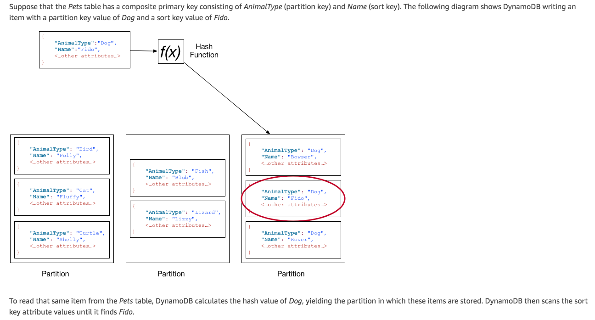

## DynamoDB

- [Primary Key](#primary-key)
- [Secondary Indexs](#secondary-index)
- [Streams](#streams)
- [Caveats](#caveats)
- [Design pattern](#design-pattern)
- [Multi-region architecture](#multi-region-architecture)
- [Backup](#backup)

### Partition

- An allocation of storage for a table backed by SSD and auto replicated across multiple AZs within a region
- AWS allocates additional partitions when:
  - If you increase the table's provisioned throughput settings beyond what the existing partitions can support.
  - If an existing partition fills to capacity and more storage space is required.
- GSI in DynamoDB are also composed of partitions.
- When writing data, partition key will be used to determine which partition the data will be stored.
- When reading data, partition key will be used to determine which partition the data can be found.
- Choose a partition key that can have a large number of distinct values relative to the number of items in the table.
- Items with the same partition key value are stored physically close together, ordered by sort key value.
  

### Primary Key

- Only key-related attributes need to be defined beforehand. No need put non-key attributes in definition.
- Primary Key
  - **Partition key (hash attribute)** - DynamoDB uses the partition key's value as input to an internal hash function.
    The output determins the partion in which the item will be stored. It's type must be scalar and can only hold one value - string, number or binary.
  - **Partition key + sort key (range attribute)** - AKA `composite primary key`. Comprised of two attributes - partition key attr + sort key attr.
    `Partition key` determines where data is stored whereas `sort key` determines sorted order.
    For tables with composite primary key, partition key can be the same but sort key must be different.

### Secondary Index

- In reality when you create global secondary key, DynamoDB creates a separate table and replicates all the table operations like insert, update and deletion asynchronously
- Provide more querying flexibility - i.e sort table items by any attribute other than table's sort key
- Allow 1 or more SI on a table
- Allow query data using an alternate key in addition to queries against the PK
- GSI
  - An index with a partition key and sort key that can be different from those on the table. Max no. on a table - 20
  - **Must** have a partition key and can have a sort key.
  - Cannot fetch attributes from base table! Make sure you choose the right projected attributes.
  - Key attributes projected automatically.
- LSI
  - An index that has the **same** partition key as the table, but a different sort key. Max no. on a table - 5
  - Key attributes projected automatically.
  - Can fetch from base table for non-projected attributes in index at a greater latency and with higher provisioned throughput costs.
    

  At a minimum, DynamoDB projects the key attributes from base table into the index.

### Streams


### Caveats

- `Query` requires partition key to be provided while sort key is optional. However `Get` requires you provide both partition key and sort key.
- Not equal `<>` sign not allowed as a comparator operator on Sort Key Attribute.
- `Cond1 AND Cond2 or Cond1` - no more than 2 logical comparator is allowed.

### Design Pattern

Defining the database architecture for microservices we need to consider below points.

- Services must be loosely coupled. They can be developed, deployed, and scaled independently.
- Business transactions may enforce invariants that span multiple services.
- Some business transactions need to query data that is owned by multiple services.
- Databases must sometimes be replicated and shared in order to scale.
- Different services have different data storage requirements.

Database per Service

To solve the above concerns, one database per microservice must be designed; it must be private to that service only. It should be accessed by the microservice API only. It cannot be accessed by other services directly. For example, for relational databases, we can use private-tables-per-service, schema-per-service, or database-server-per-service.

### Backup

[Backup](https://serverless-stack.com/chapters/backups-in-dynamodb.html)

### Multi-region Architecture

- Use global table which consists of multiple replica tables
- Global table uses global network backbone that provides lower cost and more consistent cross-region network latency when compared with the public internet
- Active-active config meaning read/write to all replica tables in all regions
- DynamoDB automatically propagates these writes to the other replica tables in the AWS Regions you choose

[DynamoDB Global Table](https://aws.amazon.com/blogs/database/how-to-use-amazon-dynamodb-global-tables-to-power-multiregion-architectures/)

### Data modeling

Use composite primary key. Give PK/SK generic names:

```
 DynamoDBTable:
    Type: AWS::DynamoDB::Table
    Properties:
      AttributeDefinitions:
        - AttributeName: "PK"
          AttributeType: "S"
        - AttributeName: "SK"
          AttributeType: "S"
      KeySchema:
        - AttributeName: "PK"
          KeyType: "HASH"
        - AttributeName: "SK"
          KeyType: "RANGE"
```

This config allows you to save different types of ids into one attribute:

```
PK                         SK
USER#UserId (User)         #METADATA#UserId
USER#UserId (Post)         POST#PostId#Timestamp
POST#PostId#Timestamp      COMMENT#CommentsId#Timestamp (Comment)
```

a table of data might look like:

```
PK            SK               First_Name    Last_Name
USER#1234     #METADATA#1234   David         He
PK            SK               Name          Address     Feedback
USER#1234     POST#1111#xxxx   A post        xxx         xxxyyyzzz
```

To query:

```
userId = "USER#{}".format(event['pathParameters']['id'])
metaId = "METADATA#{}".format(event['pathParameters']['id'])

# fetch user from the database
result = table.get_item(
    Key={
        'PK': userId,
        'SK': metaId
    }
)
```

For more details, see [dynamoDB table design](https://phatrabbitapps.com/building-modern-serverless-apis-with-aws-dynamodb-lambda-and-api-gatewaypart-3).
