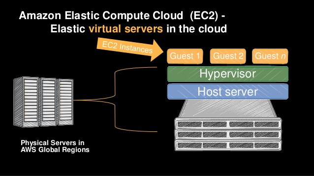
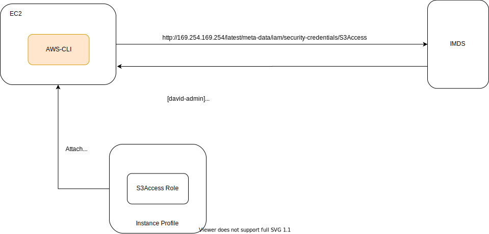

## EC2

- [How EC2 works](#how-ec2-works)
- [Security Group](#security-group)
- [IP and DNS](#ip-and-dns)
- [EIP and Public IPv4](#eip-and-public-ipv4)
- [Reboot](#reboot)
- [Internetwork traffic privacy in aws vpc](#internetwork-traffic-privacy-in-aws-vpc)
- [EC2 & EBS cost](#ec2_ebs_cost)
- [ENI](#eni)
- [IMDS(Instance Metadata service)](#IMDS)
- [Metrics](#metrics)
- [Instance Connect](https://docs.aws.amazon.com/AWSEC2/latest/UserGuide/Connect-using-EC2-Instance-Connect.html)
- [Bastion Host](#bastion-host)
- [AMI](#ami)
- [UserData](#user-data)
- [EBS](#ebs)
  - [Snapshots](#snapshots)
  - [Block devices infor](#block-devices-infor)
  - [IOPS and throughput](#iops-and-throughput)
- [AutoScaling](#asg)
  - [Cooldown](#cooldown)
  - [LaunchConfiguration](#launch-configuration)

### How EC2 works?



Hypervisor is a software to control resources allocations for VMs.

### Security Group

- For ingress rule, it specifies traffic source and destination port range etc. i.e given `fromPort` 0 and `toPort` 65535 basically means the SG allows conn to any ports from 0 to 65535 inclusive to be established.
- For egress rule, it specifies traffic destination and destination port range etc. i.e given `fromPort` 1025 and `toPort` 2025 basically means the SG allows conn to any ports (on destination service) from 1025 to 2025 inclusive to be established.

### IP and DNS

`Private/Public DNS` as shown on EC2 panel resolves to private/public ip of an instance.
i.e Private DNS hostname `ip-10-156-61-79.ap-southeast-2.compute.internal` resolves to private ip `10.156.61.79`.

### EIP and Public IPv4

- `EIP` is basically a public and static IPv4.
- `EIP` will remain yours until you explicitly release it. If it's not attached to any instance, you will be charged.
- When you associate an Elastic IP address with an instance or its primary network interface, the instance's public IPv4 address (if it had one) is released back into Amazon's pool of public IPv4 addresses. You cannot reuse a public IPv4 address, and you cannot convert a public IPv4 address to an Elastic IP address.
- You cannot auto-assign a public IP address if you specify more than one network interface in your instance. Use `EIP` in this case.

### Reboot

Since a reboot happens within the EC2 instance hardware, the state of the EC2 instance does not change from `running`. There is no rebooting state. And there is no mechanism to determine when the OS of your EC2 instance starts and/or completes its reboot.

One thing to note is after instance reboots, vol other than root one will be unmounted!!! You need to mount it back.

[How to mount ebs during boot](https://docs.aws.amazon.com/AWSEC2/latest/UserGuide/ebs-using-volumes.html)

### Internetwork traffic privacy in AWS VPC
Amazon security groups and network ACLs don't filter traffic to or from link-local addresses (169.254.0.0/16) or AWS reserved IPv4 addresses (these are the first four IPv4 addresses of the subnet, including the Amazon DNS server address for the VPC). So call to inquire instance metadata does not require
opening port on http.

### EC2 EBS Cost

- `EC2` accrue charges only while they're running.
- `EBS` accrue charges unless they are deleted (NOT ATTACHED!).
- To avoid any charges to `EBS`, make sure have them deleted as well as `snapshots` created from them.
- `EBS snapshots` are billed at a lower rate than active `EBS volumes` are. So for cost effectiveness, you can create `EBS` snapshots from `EBS` volumes and delete active `EBS` volumes. Later, you can restore the `EBS` volumes from the snapshots when needed.

### ENI

- Represents virtual/logical networking interface.
- Security Group is attached to ENI to enable firewall on traffic whereas EIP is associated with ENI.
- Check `Description` to help discover the resource ENI is attached to.

### IMDS

- Allow app running on EC2 to access AWS resources. Without it, we would have to use hard-coded API keys to enable comm between AWS services and resources. IMDS solves this problem via “temporary security credentials”. These credentials are rotated on a regular basis and managed by the AWS STS service.
- AWS STS enables you to request temporary, limited-privilege credentials for IAM users or for users that you authenticate (federated users).
- IMDS does not require internet access. `169.254.0.0/16` is a reserved ip block and it is used for local, internal communication.
- Use v2 over v1 due to security concerns v1 has [Why v2 more secure?](https://medium.com/@shurmajee/aws-enhances-metadata-service-security-with-imdsv2-b5d4b238454b). i.e IMDSv2 will always reject requests with an `X-Forwarded-For` header that is seeable in requests passed through by reverse proxy services. This layer of protection prevents users from accessing IMDS endpoint from outside EC2 such as via ELB or reverse proxy server that's open to public.
- The AWS SDKs use IMDSv2 calls by default. If the IMDSv2 call receives no response, the SDK retries the call and, if still unsuccessful, uses IMDSv1. This can result in a delay.
- In a container environment, if the hop limit is 1, the IMDSv2 response does not return because going to the container (bridge network other than host network) is considered an additional network hop. To avoid the process of falling back to IMDSv1 and the resultant delay, **in a container environment we recommend that you set the hop limit to 2**.

#### Useful commands:
```sh
# verify IMDSv2 is enabled or not
$ aws ec2 describe-instances --region ap-southeast-2 --instance-id i-0123456789abcdef --query Reservations[0].Instances[0].MetadataOptions
{
    "State": "applied",
    # token is required for v2
    "HttpTokens": "optional",
    "HttpPutResponseHopLimit": 1,
    "HttpEndpoint": "enabled"
}

# v2 is enabled if return code 401
$ curl -w "%{http_code}\n" http://169.254.169.254/
```



Note, If you are on an EC2 that was launched with an IAM role, the AWS CLI will automatically retrieve credentials for you. You do not need to configure any credentials.

### Bastion Host

[Bastion Host setup walkthrough](https://vaughanj10.github.io/creating-a-bastion-host-for-aws/)

### Metrics

Stats on EC2s pulled out by CloudWatch by default. Data is sent every 5 minutes by default, or every minute if detailed monitoring is enabled.

- `CPUUtilization` - Recorded as a percentage value that is the amount of allocated EC2 compute units that are currently in use on the instance.

### AMI

AMI in one account can be shared with another account by modifying its permissions. If EBS volumes within AMI are encrypted, they can only be shared if encryption is done by Custom CMK NOT AWS managed CMK! Also, make sure you grant proper permissions of encryption CMK to the number of target aws account. This is a required step!

```json
{
    "Version": "2012-10-17",
    "Statement": [
        {
            "Effect": "Allow",
            "Action": [
                "kms:DescribeKey",
                "kms:ReEncrypt*",
                "kms:CreateGrant",
                "kms:Decrypt"
            ],
            "Resource": [
                "arn:aws:kms:us-east-1:<111111111111>:key/<key-id of cmkSource>"
            ]
        }
    ]
}
```

### User Data

Scripting UserData with [cloud-config](https://www.digitalocean.com/community/tutorials/an-introduction-to-cloud-config-scripting) is supported in CloudFormation.

```yml
UserData:
  Fn::Base64: !Sub
    - |-
        #cloud-config
        write_files:
        - path: /opt/test/cloudformation/env
          content: |
            STACK_NAME=${AWS::StackName}
            STACK_RESOURCE=Dashboard
            STACK_REGION=${AWS::Region}
```

### EBS

#### Snapshots

An EBS snapshot is a backup of a single EBS volume. The EBS snapshot contains all the data stored on the EBS volume at the time the EBS snapshot was created.

An AMI image is a backup of an entire EC2 instance. Associated with an AMI image are EBS snapshots. Those EBS snapshots are the backups of the individual EBS volumes attached to the EC2 instance at the time the AMI image was created.

```
EC2  <-- EBS Volume (Boot) + EBS Volume
                           ^
                           |
         EBS (only of specific volume)
                           ^
                           |
         AMI (Combined snapshots of all volumes, AMI snapshot must have boot volume)
                           ^
                           |
        Launch a new Instance (same installed softwares and configs, different specs)
```

#### List block devices information

Use `lsblk`. Note, it removes `/dev/` in front of all device names.
`part` indicate it's a partition.

```shell
NAME        MAJ:MIN RM SIZE RO TYPE MOUNTPOINT
nvme0n1     259:1    0  20G  0 disk
└─nvme0n1p1 259:2    0  20G  0 part /
nvme1n1     259:0    0  40G  0 disk /home/ec2-user/workspace
```

We have 2 devices `/dev/nvme0n1` and `/dev/nvme1n1` with `/dev/nvme0n1` mounted as root device (/) and `/dev/nvme1n1` mounted to `/home/ec2-user/workspace`.

Another example
```shell
NAME    MAJ:MIN RM  SIZE RO TYPE MOUNTPOINT
xvda    202:0    0    8G  0 disk
-xvda1  202:1    0    8G  0 part /
xvdf    202:80   0   10G  0 disk
```
This shows `/dev/xvdf` is attached but not mounted.

See more about [mounting](https://gist.github.com/DavidHe1127/7b038d9901ac285af1486f9cc3485ecd)

#### IOPS and throughput

IOPS represents total number of input/output operations per second. Hard drive type determines the max amount of data (Block Size) that's counted as a single I/O. For example, I/O size is capped at 256 KiB for SSD volumes and 1,024 KiB for HDD volumes.

When small I/O operations are physically contiguous, Amazon EBS attempts to merge them into a single I/O operation up to the maximum size. For example, for SSD volumes, a single 1,024 KiB I/O operation counts as 4 operations (1,024÷256=4), while 8 contiguous I/O operations at 32 KiB each count as 1 operation (8×32=256). However, 8 random non-contiguous I/O operations at 32 KiB each count as 8 operations. In this case, each I/O operation under 32 KiB counts as 1 operation.

Throughput is the measure of the amount of data transferred from/to a storage device in a second. i.e If a storage device can write 1000 blocks of 128K each, throughput is 1000*128K/s = 128MB/s.

`Throughput = IOPS * block size`.

EBS operations is network-based traffic. Enable EBS optimization for optimal I/O performance as this gives your instance dedicated bandwidth for I/O operations. In other words, other network traffic will not compete for the same bandwidth being hogged by I/O.

Throughput limit - For example, a gp2 volume under 1000 GiB with burst credits available has an IOPS limit of 3,000 and a volume throughput limit of 250 MiB/s. If you are using a 256 KiB I/O size, your volume reaches its throughput limit at 1000 IOPS (1000 x 256 KiB = 250 MiB). For smaller I/O sizes (such as 16 KiB), this same volume can sustain 3,000 IOPS because the throughput is well below 250 MiB/s. (These examples assume that your volume's I/O is not hitting the throughput limits of the instance.)

[EBS IO characteristics](https://docs.aws.amazon.com/AWSEC2/latest/UserGuide/ebs-io-characteristics.html)

### AutoScaling

- EC2 sends metrics to CW in every 1 or 5 minutes depending on monitoring type - 5 mins for simple monitoring while 1 min for detailed monitoring. CW will evaluate aggregated metrics and work out if a specific alarm is triggered based on the alarm policy. When a new EC2 is launched, it will not send metrics before monitoring period either 1 or 5 mins has elapsed resulting in `insufficient data`. **Use detailed monitoring to have more frequent updates on resources utilization change**.
- EC2 is considered to be `unhealthy` if its state is in any state of `stopping`, `stopped`, `terminating`, `terminated` other than `running`.
- When each instance is fully configured and passes the Amazon EC2 health checks, it is attached to the Auto Scaling group and it enters the `InService` state. The instance is counted against the desired capacity of the Auto Scaling group.

#### Simple Scaling

You pick ANY CW metric i.e `CPUUtilization`. You specify a SINGLE THRESHOLD beyond which you define how you want to scale accordingly.
```
EXAMPLE: how many EC2 instances do you want to add or remove when selected metric breaches the threshold.
```
The scaling policy then acts.
```
THRESHOLD - add 1 instance when CPUUtilization is between 40% and 50%
```
NOTE: This is the ONLY Threshold. Plus the main issue with simple scaling is that after a scaling activity is started, the policy must wait for the scaling activity or health check replacement to complete and the cooldown period to expire before responding to additional alarms. While Step/target tracking Scaling policy can continue to react to additional alarms.

#### Step Scaling

You specify MULTIPLE thresholds along with different scaling strategies.

```
EXAMPLE:
Threshold A - add 1 instance when CPU Utilization is between 40% and 50%
Threshold B - add 2 instances when CPU Utilization is between 50% and 70%
Threshold C - add 3 instances when CPU Utilization is between 70% and 90%
```

NOTE: There are multiple thresholds

#### Target Tracking:

It’s automatic. All you need to do is pick a metric, set the value (target) and that’s it. i.e maintain CPUUtilization at around 50% constantly. Auto scaling does the rest by adding and removing the capacity in order to keep chosen metric as close as possible to the target value. It’s SELF OPTIMIZING which means it has an algorithm that learns how your metric changes over time and uses that information to make sure that over and under scaling are minimized. You get the fastest scaling response.

#### Cooldown

- Simple Scaling Policy has 300 secs cooldown by default
- Without cooldown, ASG will continue to add/remove ec2s as per triggering alarm even when an scaling activity is still in progress. i.e ec2 not in `InService` yet.
- With cooldown, ASG will block scaling activities meaning further scaling request will be dropped until cooldown period is expired. After that, new scaling requests can be processed again.
- When the instance enters the `InService` state, the cooldown period starts to count. IMPORTANT! User data might not finish executing at this point!!!
- When multiple:
Two cooldowns 1) Default cooldown 300 secs 2) Scaling-specific cooldown. Scaling-specific cooldown is useful. i.e lesser wait time in scale-in activity. EC2 termination process is faster than launch one so it might not need to wait 5 mins before next ec2 needs to be killed. This leads to faster scale-in experience
- When multiple instances involved in a single scaling activity, cooldown starts when the last instance finishes launching/terminating. i.e Once 1st instance is launched, cooldown steps in.

#### Launch Configuration

- One remarkable issue with it is once Launch Configuration is created, you cannot change it i.e cannot change AMI with it. You have to create a new Launch Configuration based on the existing one with changed AMI and then update ASG to point to the new one.
