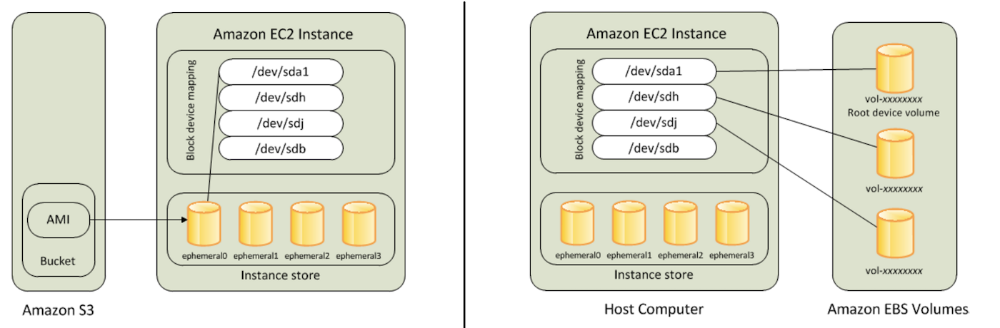

## EBS
- [Cost](#cost)
- [EBS vs Instance Store](#ebs-vs-instance-store)
- [Snapshots](#snapshots)
- [Block devices infor](#block-devices-infor)
- [IOPS and throughput](#iops-and-throughput)

### Cost

- `EC2` accrue charges only while they're running.
- `EBS` accrue charges unless they are deleted (NOT WHEN DETACHED!).
- To avoid any charges to `EBS`, make sure have them deleted as well as `snapshots` created from them.
- `EBS snapshots` are billed at a lower rate than active `EBS volumes` are. So for cost effectiveness, you can create `EBS` snapshots from `EBS` volumes and delete active `EBS` volumes. Later, you can restore the `EBS` volumes from the snapshots when needed.

### EBS vs Instance Store

One pro with instance store is it's physically attached to the host hence it gives better perf and more reliability than EBS.



### Snapshots

An EBS snapshot is a backup of a single EBS volume. The EBS snapshot contains all the data stored on the EBS volume at the time the EBS snapshot was created.

An AMI image is a backup of an entire EC2 instance. Associated with an AMI image are EBS snapshots. Those EBS snapshots are the backups of the individual EBS volumes attached to the EC2 instance at the time the AMI image was created.

```
EC2  <-- EBS Volume (Boot) + EBS Volume
                           ^
                           |
         EBS (only of specific volume)
                           ^
                           |
         AMI (Combined snapshots of all volumes, AMI snapshot must have boot volume)
                           ^
                           |
        Launch a new Instance (same installed softwares and configs, different specs)
```

### List block devices information

Use `lsblk`. Note, it removes `/dev/` in front of all device names.
`part` indicate it's a partition.

```shell
NAME        MAJ:MIN RM SIZE RO TYPE MOUNTPOINT
nvme0n1     259:1    0  20G  0 disk
└─nvme0n1p1 259:2    0  20G  0 part /
nvme1n1     259:0    0  40G  0 disk /home/ec2-user/workspace
```

We have 2 devices `/dev/nvme0n1` and `/dev/nvme1n1` with `/dev/nvme0n1` mounted as root device (/) and `/dev/nvme1n1` mounted to `/home/ec2-user/workspace`.

Another example
```shell
NAME    MAJ:MIN RM  SIZE RO TYPE MOUNTPOINT
xvda    202:0    0    8G  0 disk
-xvda1  202:1    0    8G  0 part /
xvdf    202:80   0   10G  0 disk
```
This shows `/dev/xvdf` is attached but not mounted.

See more about [mounting](https://gist.github.com/DavidHe1127/7b038d9901ac285af1486f9cc3485ecd)

### IOPS and throughput

- `Throughput = IOPS * block size`.
- EBS operations is network-based traffic. Enable EBS optimization for optimal I/O performance as this gives your instance dedicated bandwidth for I/O operations. In other words, other network traffic will not compete for the same bandwidth being hogged by I/O.
- Throughput limit - For example, a gp2 volume under 1000 GiB with burst credits available has an IOPS limit of 3,000 and a volume throughput limit of 250 MiB/s. If you are using a 256 KiB I/O size, your volume reaches its throughput limit at 1000 IOPS (1000 x 256 KiB = 250 MiB). For smaller I/O sizes (such as 16 KiB), this same volume can sustain 3,000 IOPS because the throughput is well below 250 MiB/s. (These examples assume that your volume's I/O is not hitting the throughput limits of the instance.)
- Use `gp3` over `gp2` whenever is possible. `gp3` allows for consistent perf (same as gp2 burst perf) and there is no burst credits anymore.
