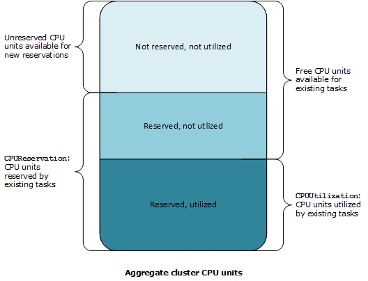
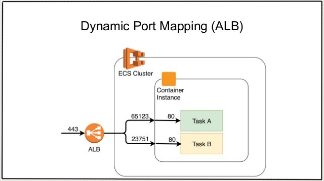

## ECS/ECR

- [Core concepts](#core-concepts)
  - [Task Definition](#task-definition)
  - [Cluster](#cluster)
  - [Desired Count](#desired-count)
  - [Overview](#overview)
  - [Networking](#networking)
  - [Running modes](#running-modes)
- [Run a service in cluster](#run-a-service-in-cluster)
- [Run a task in cluster](#run-a-task-in-cluster)
- [Resource Allocation and Utilization](#resource-allocation-utilization)
- [Rolling update](#rolling-update)
- [Roles comparison](#roles-comparison)
- [Logging](#logging)
- [Monitoring](#monitoring)
- [Troubleshooting guide](#troubleshooting-guide)
- [Dynamic port mapping](#dynamic-port-mapping)
- [Tips and Caveats](#tips-and-caveats)

- ECR
  - [Repo Owner](#repo-owner)

### Core Concepts

#### Task Definitions
Blueprint describes how a container should launch. It contains settings like exposed port, docker image, cpu shares, memory requirement, command to run and env vars.

#### Cluster
A logic group of EC2 instances. When an instance launches the `ecs-agent` software on the server it registers the instance to an ECS Cluster. This is easily configurable by setting the ECS_CLUSTER variable.

#### Desired Count
Desired count of running tasks. Say your task definition defines two containers (nginx + express) and you create and run a service with desired count 2. This will lead to 2 running tasks instantiated by the specified task definition are deployed onto each container instances respectively.


#### Overview


#### Networking

**awsvpc**

- Lets you attach an ENI directly to a task. This simplifies network configuration, allowing you to treat each task just like an EC2 instance with full networking features, segmentation, and security controls in the VPC. It provides the below benefits:
  - Run multiple copies of the container on the same instance using the same container port without needing to do any port mapping or translation, simplifying the application architecture.
  - Containers that belong to the same task can communicate over the `localhost` interface
  - Extract higher network performance from your applications as they no longer contend for bandwidth on a shared bridge.
  - Enforce finer-grained access controls for your containerized applications by associating security group rules for each Amazon ECS task, thus improving the security for your applications.
- Caveat: each task requires an individual ENI and EC2 instance has a limit number of ENI that can be attached it. For example, `C5.large` might only have 3 ENIs so that you can only run 2 tasks on it. 1 primary taken by instance itself.

**bridge**
- Containers on an instance are connected to each other using the `docker0` bridge - see [docker0 diagram](./docker.md#Networking). Containers also use this bridge to communicate with endpoints outside of the instance, using the primary ENI of the instance on which they are running. Containers share and rely on the networking properties of the primary ENI, including the firewall rules (security group subscription) and IP addressing. Given all containers share the same ENI from instance, you cannot address them by IP only but rather IP+Port.

References:
- [ECS Networking](https://aws.amazon.com/blogs/compute/introducing-cloud-native-networking-for-ecs-containers/)
- [ECS awsvpc](https://ufoships.com/docs/extras/ecs-network-mode/)

#### Running modes

- ECS Fargate allows you to focus on apps - task level without having to worry about underlying compute resources. In other words you don't have to provision, configure, or scale clusters of virtual machines to run containers.

---

### Run a service in cluster

Prerequisites:

- security group
- ssh keypair for ssh into ec2 instance
- ECS relevant IAM roles

1. Create ECS cluster.
2. Store container agent config file on s3. `ECS_CLUSTER` env specified in the file will register a container instance to clusters.
3. Create a container instance using ECS optimized AMIs (container agent & docker engine pre-baked in).
  - Script logic to copy container agent config file over. Load script via ec2 instance user data
4. Write up a task definition and register (upload) it to the cluster
5. Create a service from registered task definition

```shell
$ aws ecs create-service --cluster deepdive --service-name web --task-definition web --desired-count 1
```

### Run a task in cluster

- Tasks are short-lived/1 off tasks that exit when done. That means ecs will not replace a task when it dies.
- 2 ways of running a task
  - RunTask: randomly distribute tasks on your cluster. But minimizes specific instances from getting overloaded
  - StartTask: lets you pick where you want to run a task on cluster

Run task is similar to what we see in run a service.

```shell
$ aws ecs run-task --cluster deepdive --task-definition web --count 1
```

### Resource Allocation and Utilization

#### Memory Reservation
Defines how much of memory it requires (is reserved) to run a container/task. It's considered to be a soft limit. Along with `memory` aka memory hard limit, they work hand in hand to help ECS scheduler with decision-making on tasks placement into container instances.

Example one, given `memoryReservation` and `memory` with value of `128MiB` and `300MiB` respectively, it tells ECS to reserve `128MiB` of memory to ensure your container has enough resource to work. In the event of insufficient resources as required, your container is allowed to burst up to `300MiB` for short periods of time but not exceeds that particular amount. This would only happen when no other containers require resources from instance.

Example two, if you reserve 1024 cpu units (or 1 vCPU) for a particular task and that amount is equal to entire cpu units a container instance has, then scheduler will not place anymore tasks into this instance when such requirement arises.

Example three, a cluster has two active container instances registered: a `c4.4xlarge` instance and a `c4.large` instance. The `c4.4xlarge` instance registers into the cluster with `16,384` CPU units and `30,158 MiB` of memory. The `c4.large` instance registers with `2,048` CPU units and `3,768 MiB` of memory. The aggregate resources of this cluster are `18,432` CPU units and `33,926` MiB of memory.

If a task definition reserves `1,024` CPU units and `2,048` MiB of memory, and ten tasks are started with this task definition on this cluster (and no other tasks are currently running), a total of `10,240` CPU units and `20,480` MiB of memory are reserved. This is reported to CloudWatch as `55%` CPU reservation and `60%` memory reservation for the cluster.



[CPU Utilization Explained](https://stackoverflow.com/questions/48529434/what-is-the-impact-if-my-service-exceeds-100-service-cpu-utilization)

#### Task Resource Allocation range

- While task resource allocation is optional for `EC2`, it's **mandatory** for `fargate`.
- For `EC2` launch type, `128 CPU units (0.125 vCPUs) and 10240 CPU units (10 vCPUs)` is allowed.
- For `Fargate` launch type, only predefined combination of cpu/mem is allowed. See link below.

[Task Resource Allocation Range](https://docs.aws.amazon.com/AmazonECS/latest/developerguide/task-cpu-memory-error.html)

#### How Scaling works in ECS

In essence, 2 scaling aspects need to be considered:

- Cluster Scaling
- Service Scaling (aka Application Auto Scaling)

`Cluster Scaling` refers to auto scaling up/down by adding/removing container instances in your Cluster as per workload demand. Automation is achieved by setting a CW alarm which will go on/off when associated metric goes up/below threshold. i.e When alarm goes above 70% percent of `CPUReservation` allocated to run tasks in a particular service, we trigger the alarm. The scaling action that's tied to an alarm will be carried out as a response. i.e Add 50% percent of instances in a scaling group.

`Service Scaling` on the other hand, refers to service-level auto-scaling by adding/removing tasks in a service. Automation is driven by CW alarm. This time, metric will be `CPUUtilization`. Application auto scaling will add/remove tasks as per scaling policy.

These 2 scaling operations work hand-in-hand to make your ECS service scalable.

An example of this is: Massive workload will cause `CPUUtilisation` to go up and once monitored metric threshold breaches, ECS will add more tasks to deal with more traffic. This could lead to overwhelming needs in `CPUReservations`. When it's incremented, it might trigger the cluster alarm which will in turn bring up more container instances to suffice resources requirements.

**Metrics are collected by ECS agent on each deployed container instance. The metrics are then sent over to CloudWatch**.

#### Desired count, min and max

The ECS service scheduler respects the desired count at all times, but as long as you have active scaling policies and alarms on a service, Service Auto Scaling could change a desired count that was manually set by you.

i.e App has desired count 2, min 1 and max 5. When scaling in happens, desired count will drop down to `1` but it will not drop below min which is 1. Likewise, scaling up might bring more container instances up to 5 but not beyond it.

#### Cluster Auto Scaling

**ECS Fargate does not require CAS**

- With capacity provider, tasks drive the scaling activity which means you determine total number of tasks to run and capacity provider will work out the compute capacity needed to serve those tasks. Using EC2 capacity provider as an example, you can just set the max number of instances while leaving min and desired to be 0 and capacity provider will help set min and desired on your behalf.
- CAS relies on ECS capacity providers, which provide the link between your ECS cluster and the ASGs you want to use.
- Previously, tasks that cannot be placed due to insufficient compute resources will fail immediately. Now with managed scaling policy enabled in capacity provider, tasks will go into provisioning state instead and later be deployed when more instances come up as result of scale out. Currently, it allows 100 tasks in provisioning state to be queued.

#### Scaling Design/Strategy

We use `M` to represent the right number of instances and `N` to represent the current number of instances.

- 2 factors work hand in hand to help determine scaling activity - metric and target. CAS uses a new CloudWatch metric call `CapacityProviderReservation`. Target corresponds to `Target Capacity` defined in `CAS` without %.

```
CapacityProviderReservation = M / N * 100
```

Above formula calculates the value of this metric. At the end of the day, scaling aims to make `target` equal to/get close to `CapacityProviderReservation` by adjusting `N`. Adjustments indicates scale in/out activity.

Examples:

```shell
#1 Given M = 2, N = 3 and Target = 100

CapacityProviderReservation = 66 (2 / 3 * 100)

Scaling policy needs to tweak N so computed result equals 100. So it will remove one instance to bring N down to 2. As a result, 2 / 2 * 100 = 100
In this process, a scale in activity is carried out.

One thing to note is, set target to be 100 means all all instances are fully used. In other words, no more tasks can be placed on them unless new instances are launched.

#2 Given M = 2, N = 3 and Target = 50

CapacityProviderReservation = 66.6 (2 / 3 * 100)

Likewise, scaling policy will add 1 more instance to meet target value that is 50.

Also to note, setting target to value below 100 means spare capacity. In the above example, we will always make sure 50% instances are idle and not running any tasks on them. Besides, below-100 value makes scaling to zero impossible.
```

Reference

- [Deep dive on CAS](https://aws.amazon.com/blogs/containers/deep-dive-on-amazon-ecs-cluster-auto-scaling/)
- [Deep dive on Amazon ECS Capacity Provider](https://www.youtube.com/watch?v=Vb_4wAEcfpQ)

### Rolling Update

Key notes

- When set an instance to `draining`, tasks on it are still be able to serve incoming requests until the point they are drained and stopped by ECS task scheduler
- Drained instances will finally be removed from asg if you have it configured

### Various Roles

| Name | AWS Managed Role/Policy | Purpose | Note
| --- | --- | --- | --- |
| Container Instance Role | AmazonEC2ContainerServiceforEC2Role | Allows container agent to make calls to ECS API on your behalf | EC2 launch type only
| Service-Linked Role | AWSServiceRoleForECS | Enable load-balancing, asg and more. [See this](https://docs.aws.amazon.com/AmazonECS/latest/developerguide/using-service-linked-roles.html) | 👍
| Task Execution Role | AmazonECSTaskExecutionRolePolicy | Executes ECS actions such as pulling the image and storing the application logs in cloudwatch and even more i.e Private Registry authentication |
| Task Role           | N/A | Defines what aws services your task have access to. i.e call s3 from your task | Allows to associate fine-grained access control with a single task rather than the underlying instance that host those taks
| Service Scheduler Role | AmazonEC2ContainerServiceRole | Grants ECS scheduler permissions to register/deregister container instances with load balancers | ❌ deprecated. Use service-linked role instead
| Auto-Scaling Role | AmazonEC2ContainerServiceAutoscaleRole | Used for service auto scaling | ❌deprecated. Use service-linked role instead

### Dynamic Port Mapping

Used to resolve ports conflict. Only available for `EC2` launch type since it uses `bridge` networking. However, for `fargate` launch type, each task will be assigned an `ENI` with an unique IP making it like an individual `EC2` instance. Hence, multiple tasks with the same port can run without conflict issues. Note, container port **must** matches host port on `fargate` mode.



### Logging

`firelens` is no more than a Syntactic Sugar allowing you to put `fluentd` or `fluentbit` config in task definition from which these params will then be transformed into a config file being mounted into `fluentbit/fluentd` container. It's not a log driver rather it uses `fluentd` docker log driver under the hood.

```txt
 "logConfiguration": {
   "logDriver":"awsfirelens",
   "options": {
    "Name": "firehose",
    "region": "us-west-2",
    "delivery_stream": "my-stream"
  }
}

becomes...

[OUTPUT]
  Name   firehose
  Match  app-firelens*
  region us-west-2
  delivery_stream my-stream
```
Use `fluentbit` rather than `fluentd` as the former one consumes less resources than the latter one.

The `awslogs` log driver simply passes these logs from Docker to CloudWatch Logs.


Notes: Logs are sent from app to `firelens` container with fluent logger library. `FLUENT_HOST` and `FLUENT_PORT` are injected into app container.

```python
from fluent import sender
# connect to FireLens log router
# container name is 'app'
logger = sender.FluentSender('app-firelens', host=os.environ['FLUENT_HOST'], port=int(os.environ['FLUENT_PORT']))

# send a debug message with tag app-firelens.debug
logger.emit('debug', {'log': 'debug info'})

# send an error message with tag app-firelens.error
logger.emit('error', {'log': 'Error: Something went wrong'})
```

### Monitoring

- [Using Prometheus metrics in AWS CloudWatch](https://aws.amazon.com/blogs/containers/using-prometheus-metrics-in-amazon-cloudwatch/)
- [Container Insights with Prom walkthrough](https://docs.amazonaws.cn/en_us/AmazonCloudWatch/latest/monitoring/ContainerInsights-Prometheus-Setup-memcached-ecs.html)

References:

- [Firelens - a new way to manage container logs](https://aws.amazon.com/blogs/aws/announcing-firelens-a-new-way-to-manage-container-logs/)
- [Centralized container logging with fluentbit](https://aws.amazon.com/blogs/opensource/centralized-container-logging-fluent-bit/)
- [Fargate container logs collection/analysis with firelens/sumologic](https://aws.amazon.com/blogs/opensource/fargate-container-logs-collection-analysis-firelens-sumo-logic/)
- [How to set fluentd/fluentbit input params with firelens](https://aws.amazon.com/blogs/containers/how-to-set-fluentd-and-fluent-bit-input-parameters-in-firelens/)
- [Build log solution aggregator](https://aws.amazon.com/blogs/compute/building-a-scalable-log-solution-aggregator-with-aws-fargate-fluentd-and-amazon-kinesis-data-firehose/)
- [Under the hood firelens for amazon ecs tasks](https://aws.amazon.com/blogs/containers/under-the-hood-firelens-for-amazon-ecs-tasks/)

---

### Troubleshooting Guide

- If container instances failed to register to target group, it's most likely because they all fail health check. So make sure they pass it.
- If container instances not shown in `Container Instances` tab in `service`, it's most likely due to wrong rules have been setup in security group.

---

### Tips and Caveats

- When using task execution role, it will overwrite EC2 instance role you've defined. Therefore, if you use predefined `AmazonEC2ContainerServiceforEC2Role` as your instance profile role, which gives you permissions to do things like pull images from ECR, you need to make sure task execution role has the same permissions as well.

---

## ECR

### Repo Owner

When a repo is created through an IAM role, the AWS account owning this role becomes repo owner. This means, all roles under that account will have full access to the repo unless explicitly denied.
