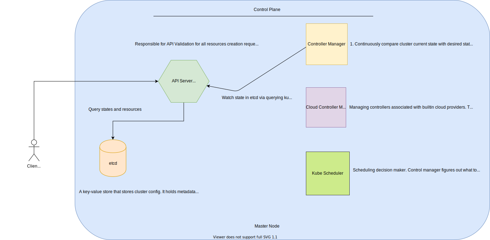

# EKS

- [Architecture](#architecture)
  - [Control Plane](#control-plane)
    - [API Server](#api-server)
  - [Data Plane](#data-plane)
- [User Account vs Service Account](#user-account-vs-service-account)
- [RBAC](#RBAC)
- [OIDC provider](#OIDC-provider)
- [Workloads](#workloads)
- [Node](./node.md)
- [Useful code snippets](useful-code-snippet)

## Architecture

### Control Plane



#### API Server

Contact point for control plane. It's how you can interact with your cluster. It validates users requests and process them if valid. Use `kubectl` or REST API for communication.
You can even use a 3rd k8s provider for interaction too.

```
// Pulumi communicates with the API Server using the official Kubernetes client-go library
export const provider = new kubernetes.Provider('main', {
  kubeconfig: {
    ...
  }
});
```

### Data Plane


### User Account vs Service Account

User Account allows us, humans, to access the given Kubernetes cluster to perform administrative tasks or a developer accessing the cluster to deploy applications etc.

A Service Account is an identity that is attached to the processes running within a pod. It is used to authenticate machine level processes to get access to our Kubernetes cluster.

### RBAC

Defines and controls who can access what within the cluster. It's implemented via `rbac.authorization.k8s.io`.

3 groups:
- Subjects - User/Group/Service Account
- Operations - list/get/post/delete etc
- Resources - Pods/Nodes/ConfigMaps etc

Operations are executed against API server.

- 4 components:
  - Role - defines namespace level resources access
  - ClusterRole - cluster level which applies to all namespaces. be careful!
  - RoleBinding - similar to IAM role assumption
  - ClusterRoleBinding
- Only `allow` rules no `deny` ones
- Role always applies to a particular `namespace`. You must set `namespace` on the role. While `ClusterRole` must be non-namespaced, applies to all namespaces within a cluster.
- Either ClusterRole/Role binding acts similar to IAM role assumption in AWS.
- You can bind a role to a service account in a namespace for authorizations.

### OIDC Provider

OIDC - OpenID Connect - a standard to authenticate users.

Why do we need OIDC Provider in our cluster? The OIDC provider you create in your cluster is responsible for validating JWT. It contains signing keys for `ProjectedServiceAccountToken` validation.

How it works? K8S automatically issues `ProjectedServiceAccountToken` which is a valid OIDC JWT for pod. Pod then passes this token to `AssumeRoleWithWebIdentity` API operation to assume the IAM role. AWS STS validates identity token with OIDC provider. Once succeeded, pod will receive temp credentials for making calls to AWS resources.

https://pnguyen.io/posts/eks-iam-roles-for-service-accounts/#step-7-aws-sts-validate-identity-token-with-oidc-provider
https://blogs.halodoc.io/iam-roles-for-service-accounts-2/

#### Referring to resources

```
# to grant perms to access GET /api/v1/namespaces/{namespace}/pods/{name}/log
apiVersion: rbac.authorization.k8s.io/v1
kind: Role
metadata:
  namespace: default
  name: pod-and-pod-logs-reader
rules:
- apiGroups: [""]
  resources: ["pods", "pods/log"]
  verbs: ["get", "list"]
  # or access a ConfigMap called my-configmap
  resources: ["configmaps"]
  resourceNames: ["my-configmap"]
```

#### Referring to subjects

A RoleBinding or ClusterRoleBinding binds a role to subjects. Subjects can be groups, users or ServiceAccounts.

```
subjects:
# user
- kind: User
  name: "alice@example.com"
  apiGroup: rbac.authorization.k8s.io
# group
- kind: Group
  name: "frontend-admins"
# default service account in kube-system namespace
- kind: ServiceAccount
  name: default
  namespace: kube-system
```

### Workloads

A way to manage a set of pods so that you don't have to manage each pod individually. i.e use `deployment` workload type to define stateless app manifest.

```
apiVersion: apps/v1
kind: Deployment
metadata:
  name: nginx-deployment
  labels:
    app: nginx
spec:
  # num of pods
  replicas: 3
  # manage pods labelled nginx
  selector:
    matchLabels:
      app: nginx
  template:
    # label pods with nginx
    metadata:
      labels:
        app: nginx
    spec:
      containers:
      - name: nginx
        image: nginx:1.14.2
        ports:
        - containerPort: 80
```

## Useful code snippet


```shell
# grant perms for entity to interact with cluster
aws eks update-kubeconfig --name cluster-name --profile david-adm
```
