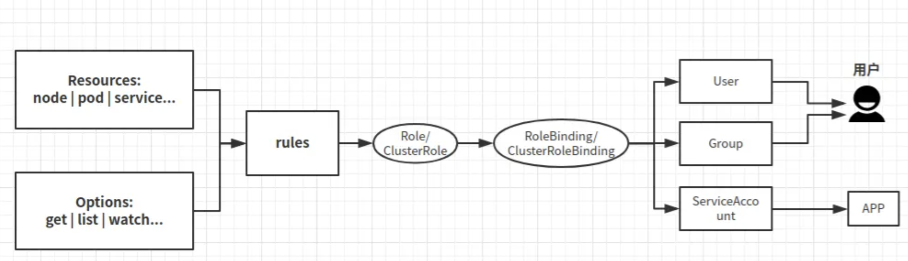

# Auth (RBAC)

- [RBAC](#RBAC)
- [OIDC Provider](#oidc)
- [authmap](#authmap)

### RBAC

Defines and controls who can access what within the cluster. It's implemented via `rbac.authorization.k8s.io`.



3 groups:
- Subjects - User/Group/Service Account
- Operations - list/get/post/delete etc
- Resources - Pods/Nodes/ConfigMaps etc

Operations are executed against API server.

- 4 components:
  - Role - defines namespace level resources access
  - ClusterRole - cluster level which applies to all namespaces. be careful!
  - RoleBinding - similar to IAM role assumption
  - ClusterRoleBinding
- Only `allow` rules no `deny` ones
- Role always applies to a particular `namespace`. You must set `namespace` on the role. While `ClusterRole` must be non-namespaced, applies to all namespaces within a cluster.
- One service account can have more than 1 role bound to it to access resources in multiple namespaces.

#### Referring to resources

```
# to grant perms to access GET /api/v1/namespaces/{namespace}/pods/{name}/log
apiVersion: rbac.authorization.k8s.io/v1
kind: Role
metadata:
  namespace: default
  name: pod-and-pod-logs-reader
rules:
- apiGroups: [""]
  resources: ["pods", "pods/log"]
  verbs: ["get", "list"]
  # or access a ConfigMap called my-configmap
  resources: ["configmaps"]
  resourceNames: ["my-configmap"]
```

#### Referring to subjects

A RoleBinding or ClusterRoleBinding binds a role to subjects. Subjects can be groups, users or ServiceAccounts.

```
subjects:
# user
- kind: User
  name: "alice@example.com"
  apiGroup: rbac.authorization.k8s.io
# group
- kind: Group
  name: "frontend-admins"
# default service account in kube-system namespace
- kind: ServiceAccount
  name: default
  namespace: kube-system
```

### OIDC Provider

OIDC - OpenID Connect - a standard to authenticate users.

Why do we need OIDC Provider in our cluster? The OIDC provider you create in your cluster is responsible for validating JWT. It contains signing keys for `ProjectedServiceAccountToken` validation. This is required for our workload to access AWS resources.

How it works? K8S automatically issues `ProjectedServiceAccountToken` which is a valid OIDC JWT for pod. Pod then passes this token to `AssumeRoleWithWebIdentity` API operation to assume the IAM role. AWS STS validates identity token with OIDC provider. Once succeeded, pod will receive temp credentials for making calls to AWS resources.

### Authmap

It maps IAM roles/users to users in K8s identity system. In other words, it gives your IAM users/roles access to cluster resources on behalf of k8s users.

```
{
    rolearn: `arn:aws:iam::${id}:role/david-write`,
    username: 'david-write',
    groups: ['david-write'],
},
```

Note, you also need to define perms on roles and bind them to the user `Group` to grant access:

```
new kubernetes.rbac.v1.RoleBinding(
  `role-binding`,
  {
    metadata: {
      name: `david-write`,
      namespace: namespace,
    },
    roleRef: {
      name: david-write-role.metadata.name,
      kind: 'Role',
      apiGroup: 'rbac.authorization.k8s.io',
    },
    subjects: [
      {
        name: `david-write`,
        // you can create multiple roles in different ns and assign them all to the same group
        // such that the user from that group can have access to those ns
        kind: 'Group',
      },
    ],
  },
  { parent: this },
);


```
