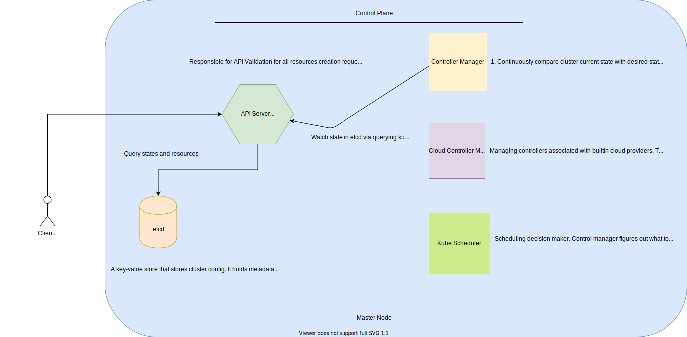

## Control Plane



### Services

They make up the control plane.

#### API Server

Contact point for control plane. It's how you can interact with your cluster. It validates users requests and process them if valid. Use `kubectl` or REST API for communication.
You can even use a 3rd k8s provider for interaction too.

```
// Pulumi communicates with the API Server using the official Kubernetes client-go library
export const provider = new kubernetes.Provider('main', {
  kubeconfig: {
    ...
  }
});
```

#### Backing Store

k8s uses `etcd` - a key/value store. It uses `etcd` to store current and desired state of all objects.

#### Scheduler

Responsible for the assignment of workloads across nodes. Monitors the cluster for newly created containers and assigns them to nodes.

#### Controller Manager

Responsible for launching and monitoring the controllers configured for a cluster through the API server.

k8s uses controllers to track state of objects in the cluster. Controller check current state and if different takes action to ensure wanted state. e.g deployment controller, node controller

Cloud controller manager integrates with underlying cloud technologies. For example, these services can be load balancer or storage etc.


