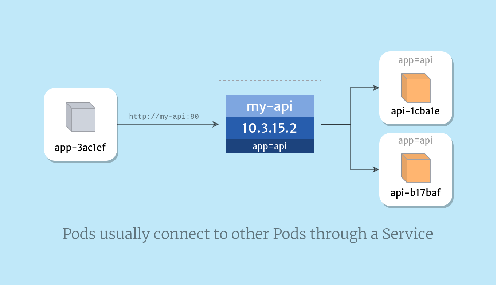

## Networking

- [3 types of IPs](#different-ips)
- [Communications](#communications)
- [kube-proxy](#kube-proxy)
- [Container Network Interface](#CNI)
- [Networking Bible](https://medium.com/google-cloud/understanding-kubernetes-networking-services-f0cb48e4cc82)

### Different IPs

- ClusterIP: The IP address assigned to a Service.
- Pod IP: The IP address assigned to a given Pod. This is ephemeral.
- Node IP: The IP address assigned to a given node.

### Communications

- Comm between containers within a pod occur via `localhost:port`. Similar to how `host` network mode works in Docker
- Inter-pods comms occur via pod IP. ip:<container_port>. Considering pod is transient, use service instead which also takes care of load balancing traffic across multiple pods behind the service. It also allows use of service name as hostname to reach the other pod.

### Kube-proxy

- A container in a pod in `kube-system` namespace
- Primary role is to forward traffic to the pods (registered as endpoints) behind a service. Usually, it runs in `iptables` mode to load balance inbound traffic across a group of pods via round-robin mechanism.

### VPC CNI

- VPC CNI plugin provided via addon assigns each pod an IP address from your VPC.
- It allocates AWS ENI to each node and uses the secondary IP range from each ENI for pods on the node.
- Deployed within each of your Amazon EC2 nodes in a Daemonset with the name `aws-node`.

The Amazon VPC Container Network Interface (CNI) plugin for Kubernetes is deployed with each of your Amazon EC2 nodes in a Daemonset with the name aws-node

### Key facts

- Each pod has its unique IP address. So, there are no port conflicts.
- The pods won’t serve traffic until and unless you expose them as a service.
- Creating a service out of pod assigns a NodePort (which is in range 30000-32000) on every node. This port must be unique for every service.
- If a node has multiple pods kube-proxy balances the traffic between those pods.
- Kubernetes imposes the following fundamental requirements on any networking implementation:
  - pods on a node can communicate with all pods on all nodes without NAT
  - agents on a node (e.g. system daemons, kubelet) can communicate with all pods on that node
