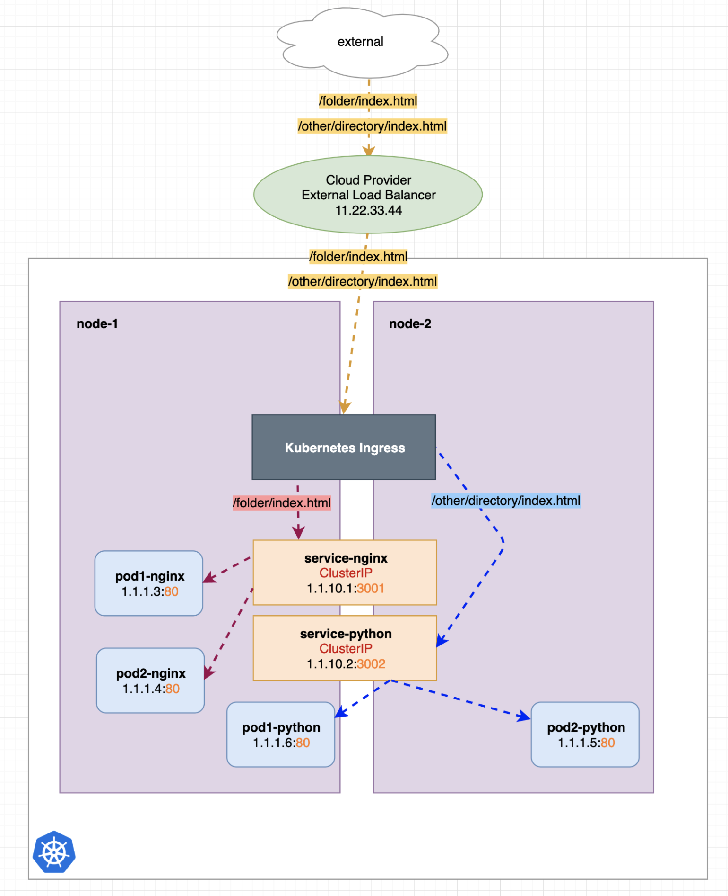

## Service

Services allow your applications to receive traffic from internal/external(outside cluster but still within the same network)/internet.

- [Types](#types)
- [Ingress](#ingress)
- [DNS Resolution](#dns-resolution)
- [Headless service](#headless-service)
- [Key Points](#key-points)

### Types

- ClusterIP
- NodePort
- LoadBalancer

#### ClusterIP

Exposes the Service on a cluster-internal IP. Choosing this value makes the Service only reachable from within the cluster. This is the default type. i.e fluentd service can be accessed on Node via:

```
# via service's clusterIP
http://<service_clusterIP>:<service_port>/fluentd.healthcheck?json=%7B%22ping%22%3A+%22pong%22%7D
# or via pod's ip
http://<pod_ip>:<container_port>/fluentd.healthcheck?json=%7B%22ping%22%3A+%22pong%22%7D
```

#### NodePort

Exposes the Service on each Node's IP at a static port (the NodePort). A ClusterIP Service, to which the NodePort Service routes, is automatically created. Traffic flows to VMs(NodeIP) via NodePort --> Service(ClusterIP) via port --> Pod(PodIP) via targetPort/containerPort.

```yaml
# NodePort service
kind: Service
apiVersion: v1
metadata:
  name: hostname-service
spec:
  # Expose the service on a static port on each node
  # so that we can access the service from outside the cluster
  type: NodePort
  # target pods via label
  selector:
    app: echo-hostname
  ports:
    # nodePort - a static port assigned on each the node. optional port ranging from 30000–32767 will be picked if not specified
    # port - port exposed internally in the cluster
    # targetPort - the container port to send requests to
    - nodePort: 30163
      port: 8080
      targetPort: 80
```

```yaml
# Deployment
kind: Pod
apiVersion: v1
metadata:
  name: hostname-pod-102
  labels:
    app: echo-hostname
    app-version: v102
spec:
  containers:
    - name: nginx-hostname
      image: kubegoldenguide/nginx-hostname:1.0.2
      ports:
        - containerPort: 80
```

Once deployed, service can be accessed from outside of cluster via NodeIP:NodePort (an IP assigned to the service). If node is assigned a public ip, then service can be accessed via public ip from internet. Should not be used in Production environment.

#### LoadBalancer

Exposes the Service externally using a cloud provider's load balancer. NodePort and ClusterIP Services, to which the **external load balancer** routes, are automatically created.

When using AWS, this will create a load balancer which proxies traffic to all EC2s of the TargetGroup tied to it and then via NodePort Service to all pods.

Remarkable downsid is each service will have a dedicated load balancer created for it resulting in large bills.

### Ingress (Production-ready)

Not a service – it merely describes a set of rules for the Kubernetes Ingress Controller to create a Load Balancer, its Listeners, and routing rules for them.

#### Ingress

It is an API object that provides routing rules to manage external users' access to the services in a cluster. It's comprised of Ingress API Object and Ingress Controller. It's assigned an IP when created.

[See example](./examples/ingress.yaml).

#### Ingress Controller

It watches API Server for changes to Ingress resource and creates ALB (external to cluster) with configured rules it reads from Ingress. It runs as a pod in cluster. For HA, it's deployed 2 replicas onto 2 selected nodes.

**Note, seems Nginx ingress controller does things differently, it also takes care of traffic load balancing?

#### Components

Take EKS as an example, when creating an Ingress, an external ALB (managed by Ingress and located outside of cluster) is created alongside other resources such as TargetGroup, Listeners, Rules etc.

[](./ingress_arch.png)

---

### DNS Resolution

There is `kube-dns` running as a ClusterIP service in `kube-system` ns responding to DNS resolution queries.

Use notation below to resolve a service. If namespace left unspecified, current pod namespace will be used.

```
<service>.<namespace>.svc.cluster.local
# reference to a endpoint pod behind the service
<pod>.<service>.<namespace>.svc.cluster.local
```

Normal service has a DNS record when resolved, it returns the ClusterIP.

### Headless Service

Headless service is not assigned a ClusterIP. DNS query against it returns IPs of registered pods whereas running the same query against normal service returns service's ClusterIP.

Query result shows 2 StatefulSet pods under `fluentd-headless` service.

```shell
$ nslookup fluentd-headless.logging.svc.cluster.local

Server:    172.20.0.10
Address 1: 172.20.0.10 kube-dns.kube-system.svc.cluster.local

Name:      fluentd-headless.logging.svc.cluster.local
Address 1: 10.66.149.226 fluentd-0.fluentd-headless.logging.svc.cluster.local
Address 2: 10.66.141.86 10-66-141-86.fluentd-aggregator.logging.svc.cluster.local
```

| Headless service is typically used with StatefulSets where the name of the pods are fixed. This is useful in situations like when you're settling up a MySQL cluster where you need to know the name of the master. StatefulSets appends an ordinal number to the name of the pod and it will always assign the same ordinal number of the pod is restarted or migrated by the scheduler. Using headless service gives you a list of all pods information without having to remember each single pod's infor.

Quoted from K8S In Action
| Each connection to the service is forwarded to one randomly selected backing pod. But what if the client needs to connect to all of those pods? What if the backing pods themselves need to each connect to all the other backing pods. Connecting through the service clearly isn’t the way to do this. What is?
| For a client to connect to all pods, it needs to figure out the the IP of each individual pod. One option is to have the client call the Kubernetes API server and get the list of pods and their IP addresses through an API call, but because you should always strive to keep your apps Kubernetes-agnostic, using the API server isn’t ideal
| Luckily, Kubernetes allows clients to discover pod IPs through DNS lookups. Usually, when you perform a DNS lookup for a service, the DNS server returns a single IP — the service’s cluster IP. But if you tell Kubernetes you don’t need a cluster IP for your service (you do this by setting the clusterIP field to None in the service specification ), the DNS server will return the pod IPs instead of the single service IP. Instead of returning a single DNS A record, the DNS server will return multiple A records for the service, each pointing to the IP of an individual pod backing the service at that moment. Clients can therefore do a simple DNS A record lookup and get the IPs of all the pods that are part of the service. The client can then use that information to connect to one, many, or all of them.
| Setting the clusterIP field in a service spec to None makes the service headless, as Kubernetes won’t assign it a cluster IP through which clients could connect to the pods backing it.

---

### Key Points

- The reason we say LoadBalancer type is a superset of NodePort is because, creating a LoadBalancer service automatically creates a NodePort service which in turn creates a ClusterIP service automatically too. The superset additionally creates other resources. i.e for LoadBalancer type, it creates an external load balancer in AWS.
- Selected pods are registered as endpoints for the service.

### References

- [Ingress vs load-balancer](https://stackoverflow.com/questions/45079988/ingress-vs-load-balancer)
- [Ingress 101](https://oteemo.com/ingress-101-what-is-kubernetes-ingress-why-does-it-exist/)
