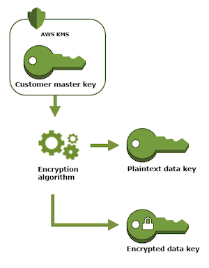

## KMS

- [Key concepts](#key-concepts)
- [Best practice](#best-practice)
- [References](#references)

### Key Concepts

#### CMK (Cstomer Master Key)
- It's **designed** to encrypt/decrypt data key. That's why there is a 4kb limit on plaintext amount. Use data key if you're intended to encrypt/decrypt application data.
- It's never retrievable in plain-text.
- Two types: AWS managed CMK and Customer managed CMK.
- Keys are accessed and managed in KMS console.

#### Data Key
- Use KMS CMK to create both plain-text and encrypted key. Encryption is done by a specific CMK - specified in the api call.
- Use Data Key to encrypt/decrypt application data. i.e objects on s3
- AWS KMS does not store, manage, or track your data keys, or perform cryptographic operations with data keys. You must use and manage data keys outside of AWS KMS.
- Using Data key saves you network bandwidth as content doesn't need to be travelled to AWS for encryption/decryption. Instead, use data key sent by AWS for these purposes.
- AWS services with KMS integrations are responsible for data encryption/decryption using a data key. If you need to encrypt your data using a data key, you can call KMS API to generate your data key via a specified CMK.



#### Envelope Encryption

When you encrypt your data, your data is protected, but you have to protect your encryption key. One strategy is to encrypt it. Envelope encryption is the practice of encrypting plaintext data with a data key, and then encrypting the data key under another key - CMK.

#### How data key is used?

Procedure below describes how s3 uses KMS for data encryption/decryption.

Encryption:
- S3 requests a plaintext data key and a copy of the key encrypted by the specified CMK.
- AWS KMS generates a data key, encrypts it with the CMK, and sends both the plaintext data key and the encrypted data key to S3.
- S3 encrypts the data using the data key and removes the plaintext key from memory as soon as possible after use.
- S3 stores the encrypted data key as metadata with the encrypted data.

Decryption:
- S3 sends the encrypted data key to AWS KMS.
- AWS KMS decrypts the key by using the same CMK and returns the plaintext data key to Amazon S3.
- S3 decrypts the ciphertext and removes the plaintext data key from memory as soon as possible.

#### Key Policy

To allow access to a KMS CMK, you must use the key policy, either **alone** or in combination with IAM policies or grants. IAM policies by themselves are not sufficient to allow access to a CMK, though you can use them in combination with a CMK's key policy.

#### Best Practice

Use the pattern below to specify a key. Big upside than using arn is when key is recreated no need to update the arn as long as alias stays the same.

```
'ForAnyValue:StringLike': { 'kms:ResourceAliases': 'alias/your-key-alias' },
```

### References

- [KMS concepts](https://docs.aws.amazon.com/kms/latest/developerguide/concepts.html#data-keys)
- [how-to-use-aws-kms-securely](https://security.stackexchange.com/questions/146330/how-to-use-aws-kms-securely)
