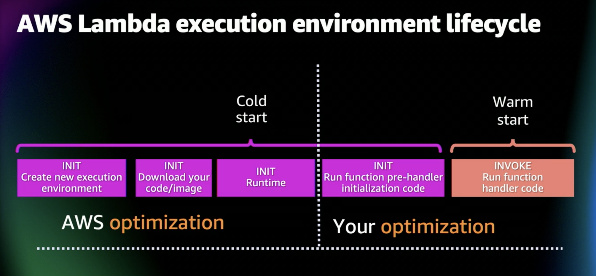
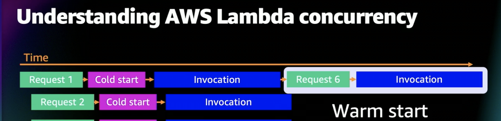
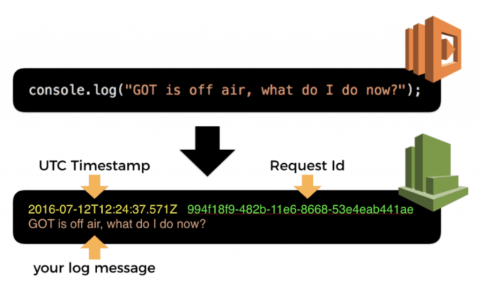

## Lambda

- [Cold vs Warm Start](#cold-vs-warm-start)
- [Permissions](#permissions)
- [Concurrency](#concurrency)
- [Logging with CloudWatch](#logging-with-cloudwatch)
- [Lambda placement](#lambda-placement)
- [Reusable execution context](#reusable-execution-context)
- [Invocation model](#invocation-model)
- [Error handling](#error-handling)
- [Monitoring](#monitoring)
- [Custom runtime and layers](#custom-runtime-and-layers)
- [Custom Resource](https://docs.aws.amazon.com/AWSCloudFormation/latest/UserGuide/walkthrough-custom-resources-lambda-lookup-amiids.html)
- Tips
  - [Env vars access](#env-vars-access)
  - [Share modules/libs](#share-modules/libs)
- Best Practices
- [Resources](#resources)

### Cold vs Warm start




AWS Lambda functions are stored as zip files in an S3 bucket. They are loaded up onto a container when the function is invoked. The time it takes to do this is called the cold start time. If a function has been recently invoked, the container is kept around. In this case, your functions get invoked a lot quicker and this delay is referred to as the warm start time. One of the factors that affects cold starts, is the size of your Lambda function package. The larger the package, the longer it takes to invoke your Lambda function.

Cold start happens once for each concurrent execution of your function. So if all the user requests to an API happen one after another, then sure, you will only experience one cold start in the process.

However, high volume of concurrent requests will cause more cold starts - i.e 100 requests with a concurrency of 10 would see 10 cold starts!

To mitigate this, one can pre-warm up lambdas via scheduling a trigger (cloudwatch schedule) that is firing a blast of concurrent requests to cause API gateway to spawn sufficient no. of concurrent executions of your function(s). i.e pre-warm up functions at 11:58 if 12:00 is your service peak time. Alternatively, use provisioned concurrency to make environments ready to immediately handle requests.

[Package Lambdas with serverless-bundle
](https://serverless-stack.com/chapters/package-lambdas-with-serverless-bundle.html)
[Understand lambda cold start correctly](https://medium.com/hackernoon/im-afraid-you-re-thinking-about-aws-lambda-cold-starts-all-wrong-7d907f278a4f)

### Permissions

To allow your lambda to interact with other AWS services, use lambda exec role. To allow other services to invoke your lambda, set Resource-based policy statements in lambda permissions. See [this](https://docs.aws.amazon.com/lambda/latest/dg/lambda-permissions.html).

### Concurrency

The first time you invoke your function, AWS Lambda creates an instance of the function and runs its handler method to process the event. When the function returns a response, it sticks around to process additional events. If you invoke the function again while the first event is being processed, Lambda creates another instance.

As more events come in, Lambda routes them to available instances and creates new instances as needed. Your function's concurrency is the number of instances serving requests at a given time.

The default concurrency limit per AWS Region is 1,000 invocations at any given time.

### Logging with CloudWatch

Whenever you write to `stdout`, those outputs are captured by the Lambda services and sent to `CloudWatch` Logs as logs.



One log group per function and one log stream for each concurrent invocation. Another entry of log stream will be created when a new instance is created and sends output to `stdout`. This occurs when all concurrent instance(s) are busy with processing requests - see `Concurrency` as above.

Since it's not easy to search for log messages in CloudWatch Logs, log aggregation services emerge such as `datadog`, `papertrail` and `sentry`. This is achieved by [CloudWatch Logs Subscription](https://docs.aws.amazon.com/AmazonCloudWatch/latest/logs/Subscriptions.html)

1. logs captured by lambda and pushed to CloudWatch logs asynchronously
2. CloudWatch forwards logs to another service (lambda) via subscription
3. Lambda ships logs to log aggregation service

Note, log group will automatically created as part of lambda creation but it will not be created until lambda is triggered for the very first time.

#### Limitations

- Cannot search across multiple log streams
- While CW logs insight allow you to write DSL queries to filter across multiple log streams it does not work across multiple aws accounts

The ultimate solution is use a log aggregator with analytics service. i.e Splunk, Data Dog

### Lambda placement

By default, Lambda functions are provisioned in a Service VPC, that is, a VPC managed by AWS over which you have no control. Any Lambda in this VPC would have Internet access, meaning your Lambda code could reach any public endpoint.

On the other hand, you could also place your lambda function within a VPC when there is a demand for your lambda to access resources within your VPC. If you want to do this, then the most important thing to note is lambda function **MUST BE** placed in private subnets. If you want to access internet resources or interact with other AWS services i.e SNS from Lambda, then you need to have the internet access for which you need to have a NAT Gateway setup for the VPC, where your lambda function resides and have the private subnet point to the NAT Gateway OR setup service VPC endpoints. When lambda functions are placed within public subnet ( with an IGW route), then the lambda function won't work. This is because even though your Lambda function is running inside a public subnet of a VPC, that Lambda functions do not, and cannot, have public IP addresses. You cannot send traffic to the internet, via the VPC's Internet Gateway, unless you have a public IP. You would need to route through a NAT.

The default route target for traffic in a VPC public subnet is the Internet Gateway (IGW) and, because the Lambda function only has a private IP, all packets to the internet from the Lambda function will be dropped at the IGW.

Triggering services such as EventBridge/S3 can still reach VPC-connected VPC. Only thing to ensure is security group to attach to lambda needs to allow all inbound traffic.

Think carefully before putting your lambdas inside a vpc because:

- Each time a lambda function is executed, it uses a proportion of your ENI(Elastic Network Interface) capacity from the subnet. You must have sufficient ENI capacity to support your lambda scaling requirement. If you run out of ENI capacity this will cause your lambda functions to fail.
- Increased cold start time!

[AWS lambdas in VPC](https://levelup.gitconnected.com/lambda-vpc-cold-starts-a-latency-killer-5408323278dd)

[Lambda VPC networking](https://www.ac3.com.au/resources/putting-vpc-networking-for-lambda-to-the-test)

[Use Service VPCE with your lambda](https://www.alexdebrie.com/posts/aws-lambda-vpc/#set-up-a-vpc-endpoint-for-your-aws-service)

### Reusable execution context

The execution context is a temporary runtime environment that initializes any external dependencies of your Lambda function.

> Background processes or callbacks initiated by your Lambda function that did not complete when the function ended resume if AWS Lambda chooses to reuse the Execution Context.

As per lambda docs, code below illustrates `console.log('timeout cb fired after' + ms + 'ms');` in the current execution will be resumed in the next lambda execution which happens after 5 seconds wait.
```js
function timeout(ms) {
  console.log('timeout start');
  return new Promise(resolve => {
    setTimeout(() => {
      console.log('timeout cb fired after' + ms + 'ms'); // picked up by next execution
      resolve();
    }, ms);
  });
}

async function main() {
  console.log('main start');
  timeout(5000);
  console.log('main end');
}

exports.handler = main;
```

### Invocation Model

#### Sync

Invoke the func and wait for the response to come back. i.e APIG triggers lambda. Caveat! In case of lambda triggering another service i.e RDS that's not configured to be as scalable as lambda, huge workload can potentially cause connection exhaustion issue on RDS end. i.e `Socket: too many file descriptors are opened`. To get around this, one way is to buffer your client requests using Kinesis Stream.

```
reqs ---> APIG ---> Kinesis <--- lambda auto-poll-for-events
```

#### Async

Lambda places the triggering event in a queue and returns a success response without additional information. A separate process reads events from the queue and sends them to your function. i.e S3, SNS, SES trigger lambda

#### Poll-based

Lambda will automatically poll the following services on your behalf, retrieve records, and invoke your functions

- Kinesis Firehose
- SQS
- DynamoDB Streams

#### Retry

- Sync offers no retry
- Async offers 2 retries on first failed attempt. i.e waits `1 min` before 2nd retry and `2 mins` before 3nd retry
- Poll-based offers a data-expiration-based retry i.e Kinesis Data Streams store record for 24 hours by default. Meaning `24 hours of retry`

### Error Handling

Configure Lambda to use DLQ for failed requests retry. [How?](https://www.youtube.com/watch?v=nqQh2KmHiLY). Note DLQ only works for lambda Async invocation model. It's used when an event fails all processing attempts or expires without being processed.

### Monitoring

Key metrics to monitor include but not restricted to

- Duration
- Throttles
- ProvisionedConcurrencySpilloverInvocations

For more see [monitoring metrics](https://docs.aws.amazon.com/lambda/latest/dg/monitoring-metrics.html)

### Custom runtime and layers

layers allow you to share code between lambdas. Custom runtime allows you to use runtime AWS by default doesn't support i.e Bash. See [layers](https://github.com/mthenw/awesome-layers) for public layers you can use.

One thing to note, You can use layers **ONLY** with Lambda functions deployed as a `.zip` file archive. For functions defined as a container image, you package your preferred runtime and all code dependencies when you create the container image.

### Env vars access

Env vars can be plaintext or encrypted in ssm param store. You can populate the value during build time:

```yml
functions
  withEnvVar-SSM
    handler: functions/withEnvVar.handler
    environment:
      key: ${ssm:/lab/lambda-envs-${self:provider.stage}~true} # true = decrypt it plz!
```

Then access it via `process.env.key`. The downside is env vars are visible to anyone who has access to lambda console. If env vars are non-sensitive values, it is fine to leave them in plain text. However, when it's sensitive and you want to restrict the access to those who have access to ssm rather than lambda you have to have values encrypted. Now new issue arises, encrypted value cannot be used without decryption...

To fix this problem, you have to turn to fetch env vars at runtime using AWS SDK.

```python
response = ssm.get_parameter(
    Name=parameter_name,
    WithDecryption=True
)
```

#### Use AppConfig

Using AppConfig with lambda extension allows you to change env vars values on the fly without touching your lambda. Read more at  [AWS AppConfig with lambda extension](https://www.linkedin.com/pulse/aws-appconfig-lambda-roshan-shetty/?trk=read_related_article-card_title)


### Share modules/libs

- Put common modules/libs in a `lib` folder sitting at the same level as `functions` directory.
```
-- lib/
    -- index.js
-- functions/
    -- lambda-a/
    -- lambda-b/
```
- For common modules across different repos, publish them to NPM.

---

### Best Practices

- Enable [keep-alive](https://docs.aws.amazon.com/sdk-for-javascript/v2/developer-guide/node-reusing-connections.html) in SDK.
- Use provisioned concurrency - set floor on min no. of execution envrionments.
- Init code such as db conn should live outside of handler.
- If app is mem/cpu/network bound, increase mem can improve perf and reduce cost.
- Try [lambda power tuning](https://github.com/alexcasalboni/aws-lambda-power-tuning) for cost/perf optimization. This tool helps find the right balance.
- Don't wait! If operation takes some time, try async model. i.e In one lambda, put object into S3 where processing happens asynchronously and once done, trigger an event which calls another lambda to carry on with the work.
- Try run lambda on ARM-based AWS Graviton 2 processor. 34% better than x86-based in price-perf ratio. No code change is required is lambda is written in NodeJS/Python. If written in compiled langs like go, Java, code needs to be re-compiled to target ARM64 env. Use `docker buildx` to help build arch-based images. Also, you need to provide docker manifest to the image so Docker knows the right arch image should be downloaded when running from the OS.
- The fastest and lowest-cost lambda func is the one you remove and replace with a built-in integration! i.e APIG --> DynamoDB w/o using lambdas.
- Use AWS RDS Proxy for conn pooling which effectively avoids overwhelming DB when huge number of db conns created from lambdas.
- To use docker image as deployment type, you must specify a private image URI, public one on ECR is not supported today.

---

### Resources

- [All my posts on Serverless & AWS Lambda](https://medium.com/theburningmonk-com/all-my-posts-on-serverless-aws-lambda-43c17a147f91)
- [Serverless land](https://serverlessland.com/)
- **[Where lambda does't fit](https://theburningmonk.com/2023/05/is-serverless-overpriced-what-can-we-learn-from-the-primevideo-team/)**
