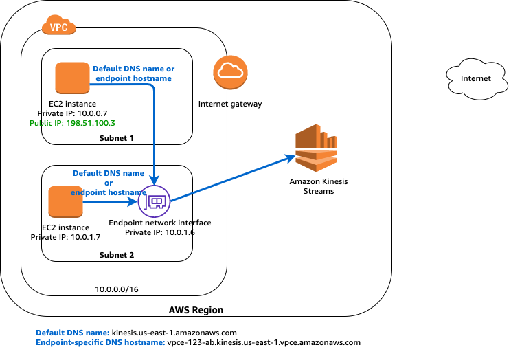
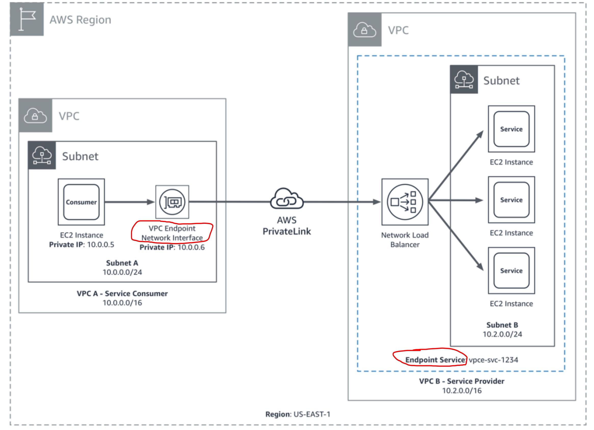
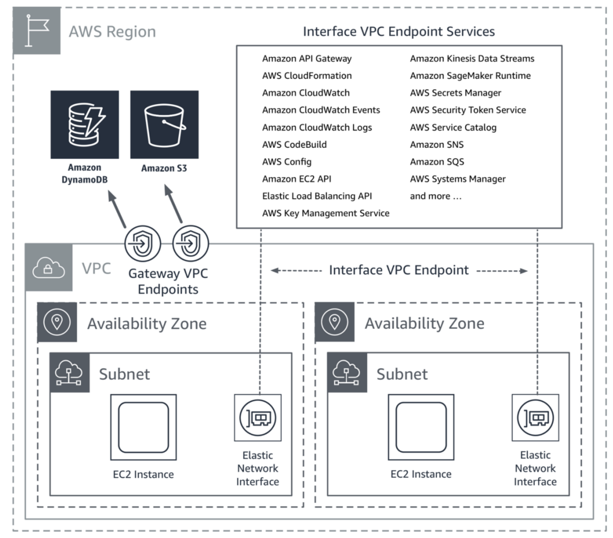

## VPC

- [ENI](#eni)
- [NAT Gateway](#nat-gateway)
- [CIDR](#cidr)
- [Cost](#cost)
- [VPC Endpoint and Endpoint Service](#vpc-endpoint-and-endpoint-service)
- [Public IP vs Elastic iP](#public-ip-vs-elastic-ip)

### ENI

- Each instance in your VPC has a default network interface (the primary network interface) that is assigned a private IPv4 address from the IPv4 address range of your VPC. You cannot detach a primary network interface from an instance. You can create and attach an additional network interface to any instance in your VPC.
- ENI cannot be detached when it's associated and used by a resource - i.e VPCE. To remove ENI, you need to delete parent service.

### NAT Gateway

- Create per-az NAT Gateway to reduce cross-az data transfer. i.e instance and NAT Gateway in different AZs.

[Reduce cost of NAT Gateway](https://www.stephengrier.com/reducing-the-cost-of-aws-nat-gateways/)

### CIDR

- Multiple VPCs in one account can have same cidr range. However, overlapped cidr range will preclude vpc peering when needed. As of `08/2017`, VPC allows customers to expand their VPCs by adding secondary IPv4 address ranges (CIDRs).
- Subnets within one VPC cannot have cidrs overlapped since AWS will treat the 2 subnets as one continuous network.

### Public IP vs Elastic IP
Public IP addresses are dynamic - i.e if you stop/start your instance you get reassigned a new public IP.

Elastic IPs get allocated to your account and stay the same - it's up to you to attach them to any instance or not. you could say they are `static public ip addresses`. To avoid charge over using elastic ip, make sure it's attached to an instance. It will incur charges if it's detached.

### Cost
VPC themselves are free but you need to pay for the services running within it. i.e NAT gateway, internet gateway, EC2s.

- [Use vpc endpoint to save money](https://medium.com/nubego/how-to-save-money-with-aws-vpc-endpoints-9bac8ae1319c)

### VPC Endpoint and Endpoint Service

- It Enables you to privately connect your VPC to supported AWS services and VPC endpoint services powered by AWS PrivateLink without requiring an internet gateway, NAT device, VPN connection, or AWS Direct Connect connection.
- VPC endpoints are virtual devices. They are horizontally scaled, redundant, and highly available Amazon VPC components that allow communication between instances in an Amazon VPC and services without imposing availability risks or bandwidth constraints on network traffic.

To connect to S3 via VPCE, setup a VPC endpoint in your VPC - consumer and point it to S3 VPCES address - provider.



#### Custom VPC Endpoint Service

- You can also turn your own application in a VPC into a VPCEs powered by AWS PrivateLink. That way, other AWS principals can create a connection from their VPC to your endpoint service using an interface VPC endpoint. You are service provider while others are service consumers.
- It also allows services residing in different VPCs to talk with each other via AWS PrivateLink. i.e The owner of VPC B has a service endpoint (vpce-svc-1234) with an associated Network Load Balancer that points to the instances in subnet B as targets. Instances in subnet A of VPC A use an interface endpoint to access the services in subnet B.
- The service provider can configure a private DNS name so consumers can access the service using an existing DNS name. This practice also requires providers to prove they have control over the domain. Basically, a `TXT` record containing DNS endpoint service domain infor needs to be added to a **public** hosted zone. Then verify the domain owernship. See [Private DNS names for endpoint services
](https://docs.aws.amazon.com/vpc/latest/userguide/verify-domains.html).



#### AWS VPC Endpoint services



#### Security Group

It controls the traffic to the endpoint network interface from resources in your VPC.

#### Policy

Policy below allows lambda within your vpc to publish messages to SNS through a private link (vpc endpoint).

```json
{
  "Statement": [{
    "Action": ["sns:Publish"],
    "Effect": "Allow",
    "Resource": "arn:aws:sns:region:account:topic-name",
    "Principal": {
      "Service": "lambda.amazonaws.com"
    }
  }]
}
```
