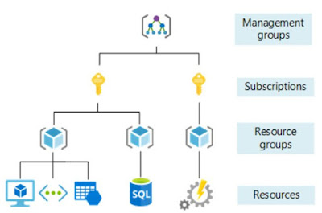

## Azure

### Resource Structure Management

- Management group <-> AWS OU in the Org
- Subscription <-> AWS Accounts
- Resource Group <-> similar to CFN but not the same. We don't have something similar in AWS

### Azure Roles vs Azure RBAC

Azure roles are used to control access of AD Resources such as users, groups. While Azure RBAC is used to control access to Azure resources.

### Service Plan

An App Service plan defines a set of compute resources for a web app to run.

### Application in Azure AD

It's basically an identity for your application. It's needed for your app auth with Azure AD.

Example use cases

- Allow Azure DevOps to access your subscription
- Want to access key vault service from within a VM

### App Service

Azure App Service is a fully managed platform as a service (PaaS) for hosting web applications such as REST APIs, and mobile back ends.

### AD Tenant

In simpler terms, an Azure AD tenant is like an organization's user directory or identity store in the cloud. When an organization signs up for Microsoft Azure, they are automatically assigned an Azure AD tenant. This tenant is unique to that organization and is used to store and manage information about its users, groups, and applications.

### RBAC

It includes

- Security Principal - who has access. can be an user, a group of users, a service or managed identity
- Scope - how much access
- Role Definition

Role assignment grants the access

