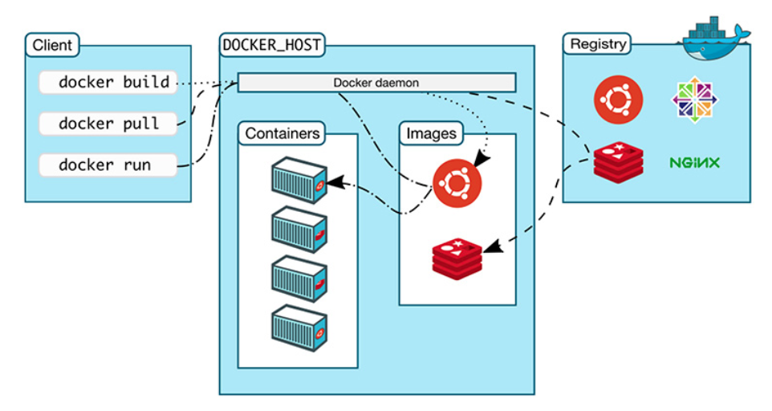
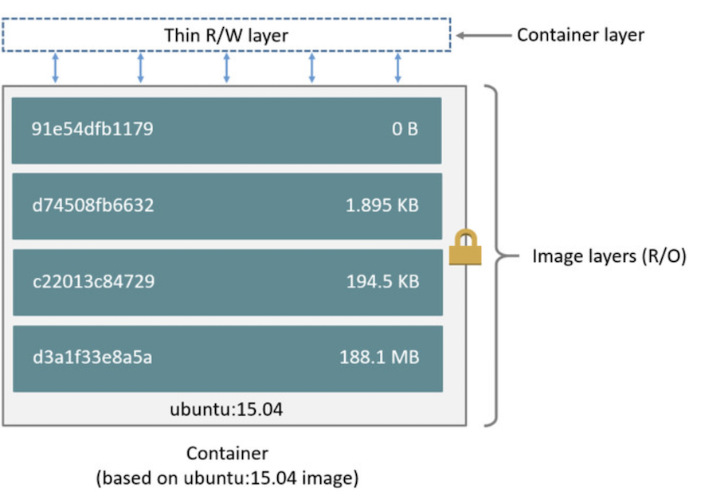

## Docker

- Docker
  - [Architecture](#Architecture)
  - [Image and Container](#image-and-container)
  - [Dockerfile](#dockerfile)
  - [Networking](./networking.md)
  - [Caching](./caching.md)
  - [Signals](#signals)
  - [HealthCheck](#health-check)
  - [Security](#security)
  - [Processes](#processes)
  - [Logging](./logging.md)
  - [Data persistence](#data-persistence)
  - [Behind a proxy server](#behind-a-proxy-server)
  - [Dangling images](#dangling-images)
  - [Clean-up](#clean-up)
    - [docker system prune](#docker-system-prune)
  - [Docker-in-Docker](#docker-in-docker)
  - [User namespace remapping](#user-namespace-remapping)
  - [Docker cheatsheet](https://www.linode.com/docs/applications/containers/docker-commands-quick-reference-cheat-sheet/)
  - [Anti-pattern and Best Practices](#anti-pattern-and-best-practices)
- Docker Compose
  - [Networking](#networking)
  - [Mount your code as a volume to avoid image rebuilds](#Mount-src-to-volume)
  - [Dependency](#dependency)
  - [Communication between containers](#communication-between-containers)
  - [Memory and CPU limit](#memory-and-cpu-limit)
  - [Env vars](#env-vars)
- Recipes
  - [Copy assets from container to host](#copy-assets-from-container-to-host)
  - [Enter stopped containers](#enter-stopped-containers)
  - [Grant user perms to use docker](#grant-user-perms-to-use-docker)
  - [Verify if a container is running correctly](#check-if-conatiner-is-running)
- References
  - [Run multiple instances of a service using docker-compose](https://pspdfkit.com/blog/2018/how-to-use-docker-compose-to-run-multiple-instances-of-a-service-in-development/)

### Architecture

Docker Engine aka Docker Daemon/Docker is architected as follow:



### Image and Container



- Base image is read-only while container layer allows read/write
- Any changes only occur in container layer without touching base image
- Container layer is added on top when a new container is started
- One can overwrite pre-baked contents with custom contents by means of volume
- Not allowed to change history image

### dockerfile

Layers are also known as intermediate images. Each instruction in `Dockerfile` composes one layer of final image. More layers more complex. So try to group instructions.

Use `docker history <image>` to view constituted layers of an image.

Docker images are layered. When you build a new image, Docker does this for each instruction (RUN, COPY etc.) in your Dockerfile:

- Create a temporary container from the previous image layer (or the base FROM image for the first command
- Run the Dockerfile instruction in the temporary `intermediate` container
- Save the temporary container as a new image layer

#### ARGS vs ENV


- Keep it in mind that this is not shell script you should try to write as less lines of intructions as possible.
- Remember to remove/clean up redundant files you've created during build/setup to reduce image footprint.
- Each line of instruction should only do things relating to that layer.

#### ENTRYPOINT VS CMD

The ENTRYPOINT specifies a command that will always be executed when the container starts, by default it is `/bin/sh -c`.
The CMD specifies arguments that will be fed to the ENTRYPOINT.

Given example docker file below:

```dockerfile
ENTRYPOINT ["/bin/chamber", "exec", "production", "--"]
CMD ["/bin/service", "-d"]
```
if we run `docker run myservice`, container will be created with below arguments:
`["/bin/chamber", "exec", "production", "--", "/bin/service", "-d"]`. It looks similar to `/bin/chamber exec production -- /bin/service -d` which is the command container is run on start-up.

We can override `CMD` by doing `docker run myservice /bin/debug`. In this case, command `["/bin/chamber", "exec", "production", "--", "/bin/debug"]` will be executed.

We can also override `ENTRYPOINT` by doing `docker run --entrypoint /bin/logwrap myservice`. In this case, command `["/bin/logwrap", "/bin/service", "-d"]` will be executed.

If you want to make an image dedicated to a specific command you will use `ENTRYPOINT ["/path/dedicated_command"]`. Otherwise, if you want to make an image for general purpose, you can leave **ENTRYPOINT** unspecified and use `CMD ["/path/dedicated_command"]` as you will be able to override the setting by supplying arguments to docker run.

### Signals

When running `docker kill` or `docker stop`, the main process inside the container will receive a signal.

`docker stop` - stop a running container. Main process will receive a `SIGTERM` at which point, docker is given time to do cleanup. If the process hasn't exited within the grace period (can be specified) a SIGKILL signal will be sent.

`docker kill` - send `SIGKILL` to kill the main process inside the container leaving no chance for cleanup.

Sometimes app may be configured to listen to a different signal - `SIGUSR1` and `SIGUSR2`, for example. In these instances, you can use the STOPSIGNAL instruction in Dockerfile to override the default.

```Dockerfile
STOPSIGNAL SIGTERM
```

### HealthCheck

```Dockerfile
HEALTHCHECK --interval=5m --timeout=3s \
  CMD curl -f http://localhost/ || exit 1
```

- Failing configured health check will not kill running container but rather marking it as `unhealthy`. See below:
```
CONTAINER ID        IMAGE               COMMAND                  CREATED             STATUS                     PORTS                    NAMES
c8b925b35dd6        healthcheck         "docker-entrypoint.s…"   2 minutes ago       Up 2 minutes (unhealthy)   0.0.0.0:7000->8080/tcp   pedantic_thompson
```
- Return health check status from a container
```
docker inspect --format='{{.State.Health.Status}}' 5c2f4e67f7c4
```

### Security

#### Never run container as a root

By default, docker run commands as user root and a lot of images don't give you `sudo` command.

```shell
drwxr-xr-x  1 root root  4096 Dec 17 04:03 ..
-rw-r--r--  1 root root   265 Dec 25 10:54 package.json
-rw-r--r--  1 root root 15624 Dec 25 10:54 package-lock.json
-rw-r--r--  1 root root    27 Dec 25 10:54 .dockerignore
-rw-r--r--  1 root root   498 Dec 31 03:54 Dockerfile
-rwxr-xr-x  1 root root   176 Dec 31 04:40 start.sh
-rw-r--r--  1 root root   864 Dec 31 04:40 server.js
drwxr-xr-x 51 root root  4096 Dec 31 04:49 node_modules
drwxr-xr-x  1 root root  4096 Dec 31 04:49 .
```

Use `root` user will pose potential security threats in case your container is hacked. The best way to avoid it is create and use a non-privileged user after you install dependencies.

#### Specify loopback ip in port binding

If you ever need to make sure contents are only accessible from host. i.e

```
http://{server_ip}:1234  # ❌
http://localhost:1234  # ✅
```
You can do this:
```yml
ports:
  - "127.0.0.1:8001:8001"
```

### Processes

- process specified in `ENTRYPOINT` or `CMD` becomes the main process owning pid `1`.


### Data Persistence

Volume is independent of container lifecycle. This means data stored in volume will not be gone when the running container stopped or deleted.

Volume can also be shared among different containers. Data in volume will be mirrored across to mounting directory inside the container.

3 ways:

- Volumes - stored in `/var/lib/docker/volumes/` managed by Docker. Non-docker processes should not modify it. The best option.

attach volume `myvol1` to `/var/jenkins_home` in container. By default, Jenkins will write all data to this directory. With mounting in place, everytime Jenkins writes data to `/var/jenkins_home`, the same data will be copied to `myvol1`.

```shell
$ docker run -v myvol1:/var/jenkins_home -p 8080:8080 jenkins
```

- Bind mounts - stored anywhere on host file system - i.e Desktop. non-docker processes can modify it anytime.

```shell
$ docker run -v /Users/david.he/Desktop/Jenkins_Home:/var/jenkins_home -p 8080:8080 jenkins
```

- tmpfs - stored in host system's memory only. Never written to host filesystem.

### Behind a proxy server
By default, docker daemon will look for global environment variables on the host to use. i.e `http_proxy`, `https_proxy` and `no_proxy`. However, these values can be overwritten when specifying them in docker service file. This example shows docker service file on a linux distribution:

```
# /etc/systemd/system/docker.service.d/http-proxy.conf

[Service]
Environment="HTTP_PROXY=http://proxy.example.com:80/"
```

Config file can be modified at the runtime. Run these 2 commands below to apply changes afterwards:

```shell
$ sudo systemctl daemon-reload
$ sudo systemctl restart docker
```

### Dangling images

Dangling images can be produced

-  Intermediate images (different layers) and can be seen using `docker images -a`. They don’t result into a disk space problem but it is definitely a screen real estate problem (good)
- When a new image is built due to changes but use the same tag from previous build.
i.e In your first build, you tag built image as `1.0`. Then you make changes to codebase and build it again using the same tag `1.0`. A new image will be built with different id as a result of new build. However, given it's using the same tag `1.0`, the previous built image will become dangling since Docker takes tag from previous build and attach it to the current one. (bad)

Run `docker image prune -f` to remove them.

### Clean-up

Use `docker system df` to give you an overview of

```txt
- Images:         Total size of disk space taken by pulled images as well as locally-built ones
- Containers:     The disk space used by the containers running on the system, meaning the space of each containers’ read-write layer.
- Local Volumes:  Storage persisted on the host but outside of a container’s filesystem.
- Build Cache:    the cache generated by the image build process (only if using BuildKit, available from Docker 18.09).
```

Header `RECLAIMABLE` means the space docker doesn't need and therefore is able to be given back to host. Note, an image is not reclaimable if it's used by a running or stopped container. It turns into reclaimable resource only if container is removed

For more information, [See this post](https://medium.com/better-programming/docker-tips-clean-up-your-local-machine-35f370a01a78)

#### docker system prune

A bit more about `docker system prune`. In terms of images and containers, it removes **dangling images** and **stopped containers**. However, it **DOES NOT** remove **unused images** - images not referenced by any running/stopped containers. Flag it with `-a` to remove them. But you should be extra careful!!!

### Docker-in-Docker

Docker-in-docker is useful when considering 2 cases below:

- Continuous Integration (CI) pipeline
  - In a Jenkins pipeline, the agent may be a Docker container tasked with building or running other Docker containers.
- Sandboxed Docker environments
  - Developers that want to play around with Docker containers in a sandboxed environment, isolated from their host environment

Two approaches:

#### Docker-in-Docker

- Running the Docker daemon inside a container, using Docker’s DinD container image
- Lead to security concerns and hence generally not recommended

#### Docker-out-of-Docker

- Only the Docker CLI runs in a container and connects to the Docker daemon on the host through a socket - When the Docker platform is installed on a host, the Docker daemon listens on the `/var/run/docker.sock` Unix socket by default.
```shell
# still need to install docker cli inside the container
$ docker run -it -v /var/run/docker.sock:/var/run/docker.sock docker
```
- Containers being created by agent will be on the host machine.
- Potential naming conflict - agent container builds a container that has the same name as an existing container on the host.
- port mapping conflict - if the container running the Docker CLI creates a container with a port mapping, the port mapping occurs at the host level, potentially colliding with other port mappings.

#### References:
- [docker.sock explained](https://stackoverflow.com/questions/35110146/can-anyone-explain-docker-sock/35110344#:~:text=125-,docker.,defaults%20to%20use%20UNIX%20socket.&text=There%20might%20be%20different%20reasons,Docker%20socket%20inside%20a%20container.)
- [Secure Docker-in-Docker with System Containers](https://blog.nestybox.com/2019/09/14/dind.html)

### User Namespace Remapping
By default, container is run as `root` which has the same level of access as `root` on host. This is unsecure. While you could specify an unprivileged user to run container, however, some apps are required to be run as `root`. Another downside is artifacts generated onto host via bind mounting are owned by root causing permission issues during cleanup. i.e jenkins is unable to delete them.

Solution is to use user namespace remapping. Basically, it lets you to continue to run app as `root` however, `root` is re-mapped to a less privileged user on host. As a result, files generated on host via mounting is owned by an user with restricted access. This way, files can be deleted by CI/CD agent.

when bootstrapping agent host:
```shell
# /etc/docker/daemon.json
{
  "userns-remap": "jenkins"
}

echo 'jenkins:231072:1' >> /etc/subuid
echo 'jenkins:231073:65536' >> /etc/subuid

echo 'jenkins:231072:1' >> /etc/subgid
echo 'jenkins:231073:65536' >> /etc/subgid
```

#### References:
- [docker uid and gid](https://www.cnblogs.com/sparkdev/p/9614164.html)
- [docker user namespace isolation](https://www.cnblogs.com/sparkdev/p/9614326.html)
- [user namespace remapping](https://dreamlab.net/en/blog/post/user-namespace-remapping-an-advanced-feature-to-protect-your-docker-environments/)

### Anti-pattern and Best Practices

- Tag your image and follow semantic versioning. This will ensure your Dockerfile remains immutable.
- Run every different service which composes your app in its own container.
- Use `LABEL` to add as much metadata as possible for better traceability, visibility, and maintainability.

```docerfile
LABEL vendor=ACME\ Incorporated \
      com.example.is-beta= \
      com.example.is-production="" \
      com.example.version="0.0.1-beta" \
      com.example.release-date="2015-02-12"
```
- Don't tag images as `dev,test,staging and production` as this voids the principle of a single source of truth.
- By default, Docker containers run as `root`. A Docker container running as `root` has full control of the host system. This is not desirable due to security concerns. Docker containers images that run with non-root add an extra layer of security and are generally recommended for production environments. However, because they run as a non-root user, privileged tasks are typically off-limits. You need to do some context switching if leveraging the USER instruction to specify a non-root user, as illustrated in the example below, is required.

```docerfile
# -m, --create-home
# Create the user's home directory if it does not exist
# -s, --shell SHELL
# The name of the user's login shell.
# RUN useradd -ms /bin/bash david

# add user david first as shown in previous step
USER david

# to switch back to root to perform privileged tasks
FROM <namespace>/<image>:<tag_version>
USER root
```
- Keep each image as lean as possible. Only include things required. This maximizes performance and minimizes security risks. Consider to use [multi-stage builds](https://docs.docker.com/develop/develop-images/multistage-build/).
- Use twistlock/clair to scan images for security holes.
- Don't store sensitive data. In case, developers inadvertently push images to public registry.
- Make sure your containers only write data to volumes. Use `tmpfs` for small temp files.
- Pin down package version in Dockerfile.
- Lint your Dockerfile. i.e [hadolint](https://github.com/hadolint/hadolint).

---

## Docker Compose

### Networking

Suppose there is a `docker-compose.yml` in `myapp` directory.

```yml
version: "3"
services:
  web:
    build: .
    ports:
      - "8000:8000"
  db:
    image: postgres
    ports:
      - "8001:5432"
```

When you run `docker-compose up` from project root, the following happens:

1. A network called `myapp_default` is created.
2. A container is created using web’s configuration. It joins the network myapp_default under the name web.
3. A container is created using db’s configuration. It joins the network myapp_default under the name db.

Each container can now look up the hostname `web` or `db` and get back the appropriate container’s IP address. For example, web’s application code could connect to the URL `postgres://db:5432` and start using the Postgres database.

Run `docker network ls` to find the desired network and run `docker network inspect <NETWORK_ID>` to see network configs.

**Access docker host from inside the container**

Use special DNS `host.docker.internal` when trying to access services running on docker host on OS X/windoes. i.e instead of `http://localhost:4000` try `http://host.docker.internal:4000`.

#### expose vs ports

`expose` - The expose tag will let you expose ports without publishing them to the host machine, but they will be exposed to the containers networks. `ports` on the other hand will be mapping the host port with the container port `HOST:CONTAINER`.

compose file
```
services
  redis:
    build:
      context: .
      dockerfile: Dockerfile-redis
    expose:
      - "6379"
```

### Mount src to volume

Any time you make a change to your code, you need to rebuild your Docker image (which is a manual step and can be time consuming). To solve this issue, mount your code as a volume. Now manual rebuilds are no longer necessary when code is changed. It's because changes on host will also be replicated in the mounted volume inside the container.

```yml
services:
  web:
    volumes:
      - ./webapp:/opt/webapp
      # With this, you don't have to manually copy node_modules into container during dev
      # Another benefit is you can debug node_modules locally
      - ./node_modules:/home/node/app/server/node_modules
```

### Dependency

`depends_on` only affects service start-up order. It will not wait until dependent services to be ready before starting itself.

```docker
version: '2'
services:
  web:
    build: .
    # this will always start up db followed by redis before web. But web start-up will not wait for db and redis to be ready
    depends_on:
      - db
      - redis
  redis:
    image: redis
  db:
    image: postgres
```

### Communication between containers

Use `links` is deprecated!!! Able to access service by name out of box.

```yml
web:
  links:
    - db
db:
  image: postgres:latest
```

Code inside web can access database using `db:5432`.

Another way to let containers on the same network to communicate with each other via container name is done through custom network.

```shell
# 1. create a custom bridge network
$ docker network create mynet

# 2. connect two containers to mynet and run them
$ docker run -d --name server1 --net mynet networking:server1
$ docker run -d --name server2 --net mynet networking:server2

# 3. now you can curl server1 from inside server2 by container name
$ curl http://server1:8080/
```
Caveats:
- You must create a custom bridge network. Default bridge work only allows connection via ip.
- Must specify a container name. Random name won't work.
- Must specify connection port which is exposed by container unless `80` is exposed.
- Need set `HOST` on `server1` to `0.0.0.0` to enable it expose all interfaces.

### Memory and CPU limit

By default, containers specified in `docker-compose` file can consume as much as memory/cpu on the docker host as it needs. This could potentially harm docker host when poorly written apps overconsume memory/cpu. When this occurs, on Linux hosts, kernal will see insufficient memory to perform important system functions, it throws an `OOME`, or `Out Of Memory Exception`. As a result, kernal will start killing processes. They might include critical ones or even Docker Daemon. That's why we sometimes need to constraint resources for our docker services down to certain limits. Now even resources over-consumption will not happen.

Memory/CPU reservations on the other hand specify the least resources a service needs to run correctly.

```yml
version: "3.8"
services:
  redis:
    image: redis:alpine
    deploy:
      resources:
        limits:
          cpus: '0.50'
          memory: 50M
        reservations:
          cpus: '0.25'
          memory: 20M
```

### Env Vars

Value for `DEBUG` will be supplied by the variable with the same name in the shell from which `docker-compose` is run.

```yaml
web:
  environment:
    # same as DEBUG=${DEBUG} where DEBUG is set on the host
    - DEBUG
```

This works the same when `env_file` is specified:

```shell
# .envfile
FOO
BAZ
```

```
web:
  # FOO and BAZ will be correctly populated with right values
  env_file: .envfile
```

---

### Copy assets from container to host

```shell
IMAGE_NAME="something-image"

# The docker create command creates a writeable container layer over the specified image and prepares it for running the specified command.
# The container ID is then printed to STDOUT. This is similar to docker run -d except the container is never started.
docker create -it \
  --name adhoc \
  "$IMAGE_NAME" \
  bash

docker cp adhoc:"/opt/platy/apps/lambda" "$(pwd)/build/"
docker rm -f adhoc
```

### Grant User Perms to use docker
Switch to the user and run:
```
$ chmod a+rw /var/run/docker.sock
```

### Enter stopped containers
Create an image from stopped container with **same** state.

```shell
$ docker commit <CONTAINER_ID> <IMAGE_NAME>/<TAG>
```
Then you can run it as you would normally.

### Check if a container is running

```shell
  # Exclude container that is in a crash loop and constantly restarting from showing that it's up
  if [ "$( docker container inspect -f '{{.State.Status}}' $container_name )" == "running" ]; then ...
```

