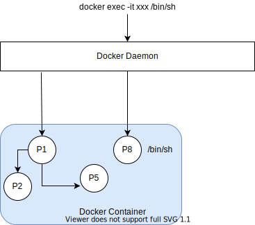

## Process



### ENTRYPOINT and CMD

- `ENTRYPOINT` specifies a command that will always be executed when the container starts, by default it is `/bin/sh -c`.
- `CMD` specifies arguments that is fed to `ENTRYPOINT`.
- Process specified in `ENTRYPOINT` or `CMD` becomes the main process owning pid `1`.
- Always use exec format.

```Dockerfile
# bad
ENTRYPOINT "/bin/chamber"
CMD "/bin/service"

# good
# same as ["/bin/chamber", "exec", "production", "--", "/bin/service", "-d"]
ENTRYPOINT ["/bin/chamber", "exec", "production", "--"]
CMD ["/bin/service", "-d"]
```
- Can be overwritten. i.e `docker run --entrypoint /bin/logwrap myservice`
- Use `ENTRYPOINT` if want to make an image dedicated to a specific command. If general purpose, then leave `ENTRYPOINT` unspecified and use `CMD`. Users can set `ENTRYPOINT` via cli to cater for their own needs.

### Signals

When running `docker kill` or `docker stop`, the main process inside the container will receive a signal.

`docker stop` - stop a running container. Main process will receive a `SIGTERM` at which point, docker is given time to do cleanup. If the process hasn't exited within the grace period (can be specified) a SIGKILL signal will be sent.

`docker kill` - send `SIGKILL` to kill the main process inside the container leaving no chance for cleanup.

Sometimes app may be configured to listen to a different signal - `SIGUSR1` and `SIGUSR2`, for example. In these instances, you can use the STOPSIGNAL instruction in Dockerfile to override the default.

```Dockerfile
STOPSIGNAL SIGTERM
```

### Init

If PID 1 is `init` - run docker with `--init` or use `tini`, PID 1 will help a) handle signal forwarding to its child process b) reap zombie processes. In this case, containers can be terminated via `ctrl+c` that sends interrupt (SIGINT) to the process.

If PID 1 is anything but `init` - program specified in `ENTRYPOINT` or `CMD`, container will not stop/terminate when `ctrl+c` from host unless there is code to handle `SIGTERM`, `SIGINT`.

However, container can still be killed from host via `docker kill/stop`. Note, without signal handling code, `docker stop` will have to wait `10s` before issuing `SIGKILL` to forcefully kill the container in the end.
