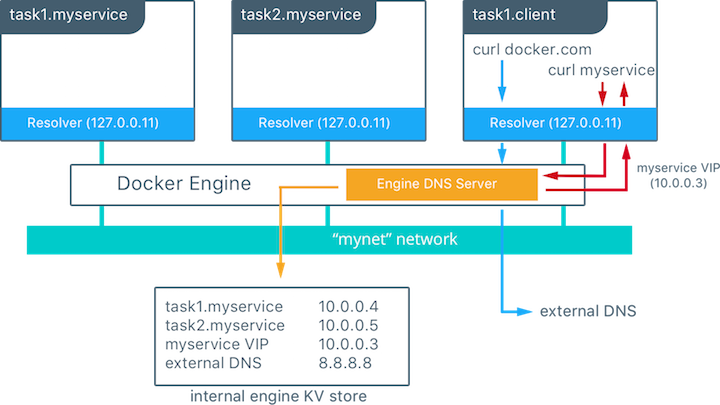

## Networking

- [Network namespace](#network-namespace)
- [Bridge Network Mode](#bridge-network-mode)
- [Host Network Mode](#host-network-mode)
- [What happens when you run a container](#what-happens-when-you-run-a-container)
- [Bridge Network Gateway](#bridge-network-gateway)
- [Virtual eth](#veths)
- [DNS](#dns)

### Network namespace

Each container has an isolated network namespace from other containers'. Therefore, run multiple containers with the same container ports cause no conflicts. So long as `HostPort:ContainerPort` combination are unique, docker is happy. Use `localhost` to reference service itself running inside the container.

### Bridge network mode

The Docker server creates and configures the host system’s **docker0** interface as an Ethernet bridge inside the Linux kernel that could be used by the docker containers to communicate with each other and with the outside world.

When docker engine is started, the default bridge network named **docker0** is created - not visible on Mac via ifconfig since it’s in VM (on OS X docker host is a linux virtual machine called docker machine). You can run `docker-machine ssh default` to ssh into docker machine.

Docker bridge network:

As shown above, **docker0** bridge is virtual interface created by docker, it randomly chooses an address and subnet from the private range that are not in use on the host machine, and assigns it to **docker0**. By default, all the docker containers will be connected to the **docker0 bridge**, the docker containers connnected to the **docker0 bridge** could use the **iptables NAT rules** created by docker to communicate with the outside world.

Bridge network provides isolations that containers sitting outside the default bridge network (custom one) cannot communicate with ones sitting inside.

By default, running containers without setting `--network` will connect them to the same default `bridge` network. They can communicate with each other via their **IP Address** and it doesn't need port mapping, unless they are linked using the `legacy--link flag`.

The Docker host’s own IP address on the bridge is used as the default gateway by which each container reaches the rest of the Internet. This IP address can also be used for container to talk to the host.

All traffic coming from and going to the container flows over the bridge to the Docker daemon, which handles routing on behalf of the container.

### Host network mode

- **The host networking driver only works on Linux hosts**.
- No containerisation for network that is container shares the host’s network namespace.
- No IP allocated for container - if you run a container which binds to port `80` and you use host networking, the container’s application is available on port `80` on the host’s IP address
- Port-mapping is no longer required. For comm between containers and comm between host & containers, use `localhost:<port>`.
- Port conflicts might happen if trying to run 2 containers on the host.

### What happens when you run a container

The `docker0` Ethernet bridge settings are used every time you create a new container. Docker selects a free IP address from the range available on the bridge each time you `docker run` a new container, and configures the container’s `eth0` interface with that IP address and the bridge’s netmask. The Docker host’s own IP address (randomly picked by docker from the private ip range that's not used on the host machine) on the bridge is used as the default gateway by which each container reaches the rest of the Internet.

### Bridge Network Gateway

It determines where traffic should go if destination ip does not match any container's ip in the network.

### veths

Docker network drivers utilize **veths** to provide explicit connections between namespaces when Docker networks are created. When a container is attached to a Docker network, one end of the veth is placed inside the container (usually seen as the ethX interface) while the other is attached to the Docker network (bridge network). See [Virtual Ethernet Devices](https://github.com/DavidHe1127/Mr.He_HandBook/blob/master/cloud/linux.md#networking)

### DNS

- By default, containers on default `bridge` network has a copy of `/etc/resolv.conf` from host.
- Containers using `user-defined` network (aka custom network) including bridge, overlay and MACVLAN use Docker's embedded DNS server addressed at `127.0.0.11`. So that running containers with `--name` can be resolved.
This DNS server provides name resolution to all of the containers on the custom network.
- If containers cannot reach any of the IP addresses you specify - i.e --dns xxx.xxx.xx.xx then it will use Google's public DNS server `8.8.8.8`.

### DNS resolution process

In this example there is a service of two containers called `myservice`. A second service (client) exists on the same network. The client executes two curl operations for `docker.com` and `myservice`. These are the resulting actions:

- DNS queries are initiated by client for `docker.com` and `myservice`.
- The container's built-in resolver intercepts the DNS queries on `127.0.0.11:53` and sends them to Docker Engine's DNS server.
- Docker Engine then checks if the DNS query belongs to a container or service on network(s) that the requesting container belongs to. If it does, then Docker Engine looks up the IP address that matches a container or service's name in its key-value store and returns that IP or service Virtual IP (VIP) back to the requester. In this example, `myservice` does exist on the network so internal DNS resolve its name and return associated IP to the client.
- `docker.com` does not exist as a service name in the `mynet` network and so the request is forwarded to the configured default DNS server.

### [Between-container communication](https://www.jianshu.com/p/710f4bb5a1a6)
