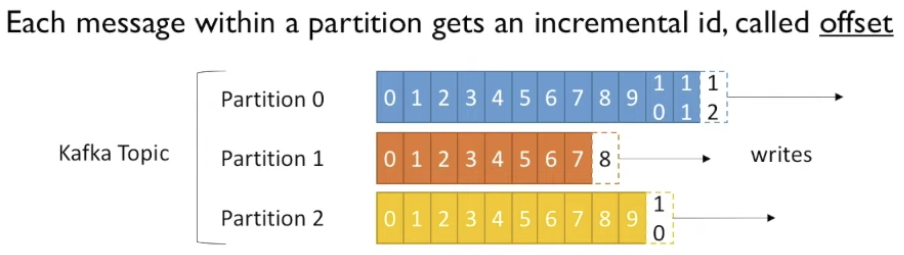

## Kafka

### Topic

- Primary component for storing events. Topics are broken down into smaller components called partitions.
- Events are distributed into different partitions according to the event key.
- Not indexed! Need to set an offset and go backward/forward from there.
- Append-only.
- Durable with configurable retention period.
- Events are immutable.
- Events are written into files on disk eventually.

### Partition

- No key? Events are round robining among partitions
- Events with the same key always land in the same partition
- Use a key to preserve the order when pulling events out

### Brokers

- A container/pod/vm that runs a kafka process
- Manage sets of partitions
- Handle read/write requests
- Handle replications
- Simple design

### Producer

- Determine which partiion it needs to write messages to based on destination calculation result. i.e round-robin vs hashing message key

### Consumer & Consumer Group

- In a single consumer scenario, it will receive all messages from all partitions of the topic it's subscribed to. Each message in each partition will come in the same order it's put by producer. But ordering of messages between different partitions is not guaranteed.
- With multiple consumers in a group (set via group_id), each consumer receives messages from **ONLY** a subset of the partitions. But multiple consumer groups could read from the same partition leading to messages being processed more than once. Therefore, making sure consumer is idempotent is important!
- Each consumer in a consumer group processes records and only one consumer in that group will get the same record. consumers in a consumer group load balance record processing.
- Number of consumers =< number of partitions. If more consumer is added, it will be idle.
- Once event is processed, consumer should commit the offset. The committed offset is stored in `topic` as `__consumer_offsets`.

### Offset

- Each message in a partition gets an ordinal/immutable id called offset.
- Each consumer group maintains its offset per topic partition.
- Current offset -> Sent Records -> This is used to avoid resending same records again to the same consumer.
- Committed offset -> Processed Records -> It is used to avoid resending same records to a new consumer in the event of partition rebalance or consumer failover so the new consumer will pick from where it's left off.

