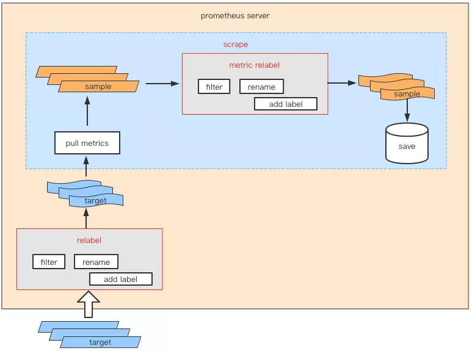
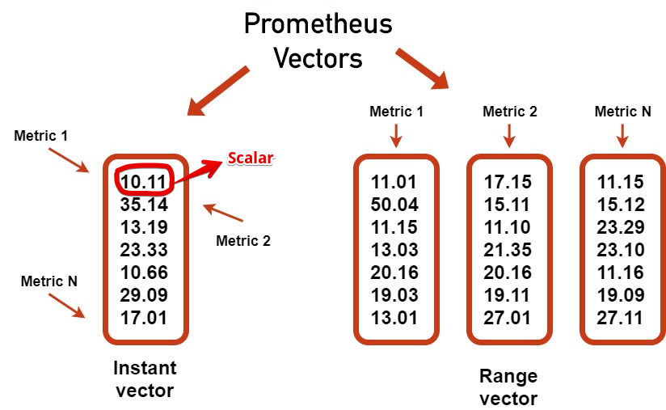
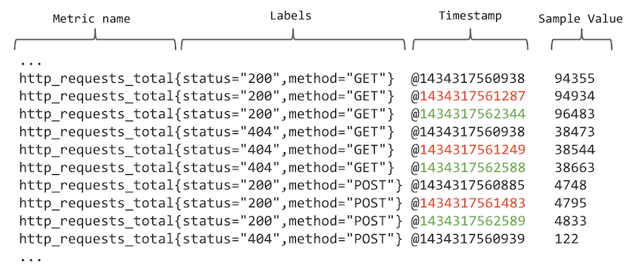
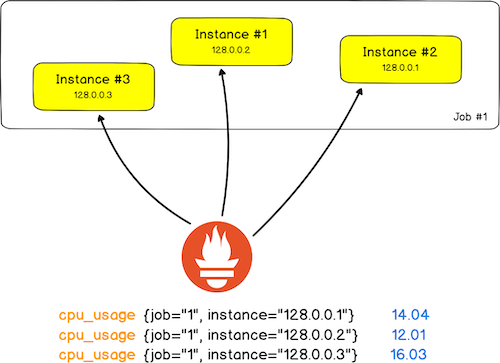
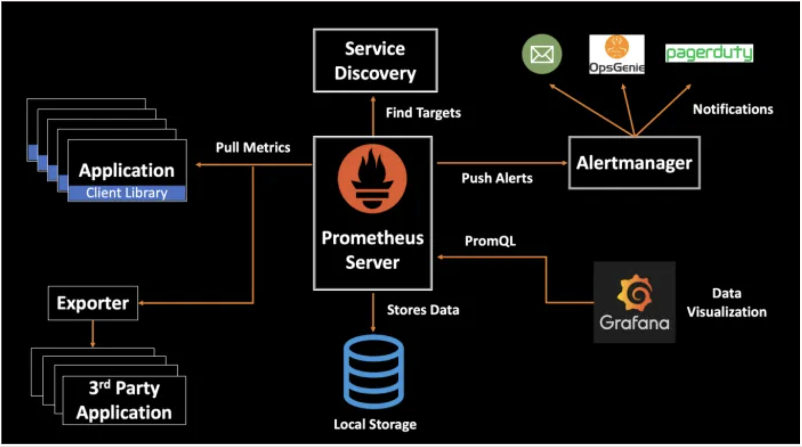

## Prometheus

- [Concepts](#concepts)
  - [Time Series](#time-series)
  - [Job vs Instance vs Target](#job-instance-target)
- [Components](#components)
- [Blackexporter](#blackexporter)
- [Query](./query.md)
- [Recording Rules](./recording-rules.md)
- [Auth](#auth)
- [CAdvisor](#cadvisor)
- [Debugging Tips](#debugging)
- [Study Notes](#study-notes)
- [Rules Analyser](https://relabeler.promlabs.com/)
- [References](#references)

### Concepts

- Metrics can be scraped by several ways including
  - `Instrument` your app. It basically means you use their out-of-box library to collect and send metrics to server during scraping
  - Use an `Exporter` that is a binary running alongside the application you want to obtain metrics from. The exporter exposes Prometheus metrics, commonly by converting metrics that are exposed in a non-Prometheus format into a format that Prometheus supports.
  - Use `Pushgateway`. Occasionally you will need to monitor components which cannot be scraped. The Prometheus `Pushgateway` allows you to push time series from short-lived service-level batch jobs to an intermediary job which Prometheus can scrape.





#### Time Series

Each time series is comprised of `metric` and `label`. Unique combination identifies an unique time series (a.k.a cardinality). Think of time series as a bucket where it stores sample data that has the same `metric/label` combination. Sample including value and associated timestamp. Sample data is stored by time series.

```
# each sample data aka data point represented as t0, v0
time series = [(t0, v0), (t1, v1), ...]

# example time series
http_requests_total(job="nginx", instance="1.2.3.4:80", path="/home", status="200")

# 4 distinct time series
temperature
temperature{city=”NY”}
temperature{city=”SF”}
temperature{city=”SF”, unit=”Celsius”}
```



#### Job vs Instance vs Target

- `Job` is a collection of instances with the same purpose.
- `instance` is a `<host>:<port>` representation.
- `target` is an object that holds information such as what labels to apply, any authentication required to connect, or other information that defines how the scrape will occur.



#### Vector

A set of related timeseries is called a vector.

```sh
# instance vector
curl 'http://localhost:9090/api/v1/query' \
  --data 'query=http_requests_total{code="200"}' \
  --data time=1608481001

{
  "metric": {"__name__": "http_requests_total", "code": "200"},
  "value": [1608481001, "881"]
}

# range vector
curl 'http://localhost:9090/api/v1/query' \
  --data 'query=http_requests_total{code="200"}[30s]' \
  --data time=1608481001

{
  "metric": {"__name__": "http_requests_total", "code": "200"},
  "values": [
    [1608480978, "863"],
    [1608480986, "874"],
    [1608480094, "881"]
  ]
}
```

### Components



#### Client Library

It allows you to instrument your apps by their methods that you put in your app.

```python
from prometheus_client import start_http_server, Summary
import random
import time

# Create a metric to track time spent and requests made.
REQUEST_TIME = Summary('request_processing_seconds', 'Time spent processing request')

# Decorate function with metric.
@REQUEST_TIME.time()
def process_request(t):
    """A dummy function that takes some time."""
    time.sleep(t)
```

#### Exporter

It takes requests from Prometheus server, gathers the required data from the apps, transforms them into the correct format and sends a response back to Prometheus server in the desired format.

#### Local Storage

By default, Prometheus stores metric records in local TSDB. But this does not accommodate clustering envrionment where you run multiple Prom nodes. In this scenario, you need to configure remote store.

When remote store is configured, queries will be sent to both local and remote stores and the searching results will be merged.

Read [Prom storage](https://www.cnblogs.com/vovlie/p/7709312.html)

### BlackExporter

- `/probe` endpoint exposed for metrics retrieval.
- Monitor network endpoints such as HTTP, HTTPS, DNS, ICMP or TCP endpoints.
- Mainly used to measure service response times.
- The main difference between the Blackbox exporter and application instrumenting is that the Blackbox exporter only focuses on availability while instrumentations can go more into details about performance.

### Auth

#### Authenticated client connections

Useful when we want only authed clients to connect to Prom. i.e Grafana. It doesn't provide auth out of box. Use reverse-proxy like nginx to enable gated traffic. Comms between nginx and Prometheus is via http.

```
server {
  listen 443 ssl http2 default_server;

  ssl_protocols TLSv1.2;

  # tls
  ssl_certificate  /etc/ssl/server.crt;
  ssl_certificate_key /etc/ssl/private/server.key;

  # specifies a file with trusted CA certs to verify client certs -
  # ssl_trusted_certificate on the other hand will not send the list
  # ssl_client_certificate in contrast will send trusted CA cert list to client which is not
  # recommended as it's consuming CPU when constructing the list at the runtime.
  ssl_trusted_certificate /etc/ssl/client_auth.crt;
  # allow client's self-signed cert
  ssl_verify_client optional_no_ca;
}
```

#### Scraping through TLS

Useful in federation where one prom is scraping another prom.

```
scrape_configs:
  - job_name: 'node'

    scheme: https
    tls_config:
        # Prometheus will check that the node_exporter presents a certificate
        # signed by this ca.
        ca_file: 'ca.crt'
        # The cert and key are presented to node_exporter to authenticate
        # Prometheus as a client. Prom is scraping node_exporter in which case Prom is considered as a client
        cert_file: 'client.crt'
        key_file: 'client.key'

    static_configs:
    - targets: ['myserver.internal.net:443']
```

See [this for more details](https://smallstep.com/hello-mtls/doc/client/prometheus)

### CAdvisor

While `node-exporter` is for hardware and OS metrics exposed by *nix kernel. `cadvisor`, on the other hand, collects, aggregates, processes, and exports information (resource usage) about running containers on the host. To summarise, `node-exporter` is for server metrics collection while `cadvisor` is for containers metrics collection.


### Debugging

- When Prometheus federation is architected, to see if federated prometheus is scraping each prometheus node correctly, curl `/metrics` endpoint inside node.
```
# total number of metric scraping reqs successfully handled by node Prometheus
promhttp_metric_handler_requests_total{code="200"} 170
promhttp_metric_handler_requests_total{code="500"} 0
promhttp_metric_handler_requests_total{code="503"} 0
```
- Try not set timestamp infor on log, or you might see error: `Error on ingesting samples that are too old or are too far into the future`. This error means metrics is too far behind the current moment to be ingested by Prometheus.

```
# don't do this
reconnects.inc(labels, 0, Date.now());

# problematic metric. it shows timestamp as well which shouldn't
# TYPE xxx_ioredis_reconnects_total counter
xxx_ioredis_reconnects_total{xxx_gitsha="8ab3a74376ab3ec8407e575aef132fbea5ccc739"} 0 1615863870257
```
- Enable debugging `--log.level=debug` to have insights into logs.
- Use `promtool` to validate config file. Install it with wget first.
```
./promtool check config prometheus.yml
```

- Check alertmanager config `amtool --alertmanager.url='http://localhost:5000' config routes`

### Study Notes

- Main monitoring targets a) Docker Daemon b) Node (node_exporter) c) Docker Container (cAdvisor) d) Application (custom exporter)
- One can use `relabel_configs` to filter certain targets based on their labels. For example, this config will skip targets with label `movies`

```
...
relabel_configs:
  - source_labels: [__name__]
    regex: movies
    action: drop
...
```

Note, `relabel_configs` works for labels on **target** not on `metric`.

- To drop certain metrics on target:

```yml
# drop node_memory_free_bytes
metric_relabel_configs:
- source_labels: [__name__]
  regex: 'node_memory_free_bytes'
  action: drop
```

`metric_relabel_configs` by contrast are applied after the scrape has happened, but before the data is ingested into TSDB. If it has been scraped prior to adding change to drop it, you will probably see it coming up in console when executing query there. But it will disappear after 14s - the default resolution. Note, resolution is the distance (in time) between points on the graph.

- To drop labels from all time series under a job:

```
- job_name: cadvisor
  metric_relabel_configs:
  - regex: 'target_label_name'
    action: labeldrop
```

- Target labels starting with `__` are available during relabelling process but will be removed afterwards. So if you need to keep some labels, make sure you relabel them.
- When there is an error with config file, Prom server will fail to load the broken config but rather use the previous working one.
- `rate/irate` functions should be used on `counter` metrics rather than `gauge` metrics.
- A time series that freshly has data points added, it's called active time series. They are stored in file/memory prior to being moved to TSDB when become inactive for longer persistence . Considerable active time series means large resources are consumed, In particular, the RAM.
- When querying historical data, wider time span means more time series is loaded into RAM from TSDB which in turn inevitably consumes larger RAM.

---

### References

[Technical terms for humans](https://valyala.medium.com/prometheus-storage-technical-terms-for-humans-4ab4de6c3d48)
[Relabelling tricks](https://medium.com/quiq-blog/prometheus-relabeling-tricks-6ae62c56cbda)
[Query](https://www.cnblogs.com/chanshuyi/p/04_quick_start_of_promql.html)
Monitoring With Prometheus Ebook.
