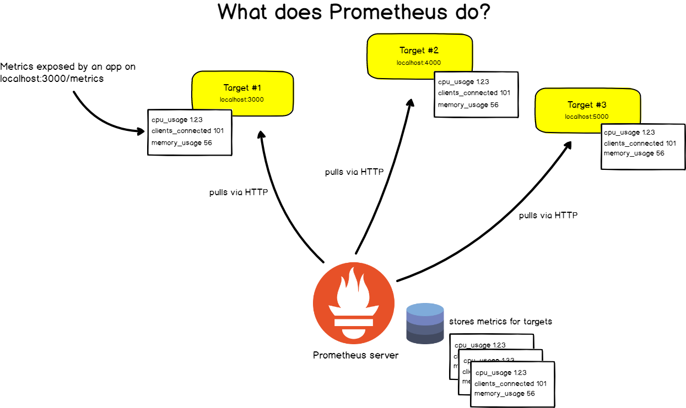

## Prometheus

- [Concepts](#concepts)
- [Time Series](#time-series)
- [Query result type](#query-result-type)
- [Job vs Instance vs Target](#job-instance-target)
- [Components](#components)
- [PromQ](#promq)
- [Blackexporter](#blackexporter)
- [Auth](#auth)
- [CAdvisor](#cadvisor)
- [Debugging Tips](#debugging)
- [Study Notes](#study-notes)
- [References](#references)

### Concepts

- `Instrumentation` in Prometheus terms means adding client libraries to your application in order for them to expose metrics to Prometheus
- Metrics can be scraped by several ways including
  - `Instrument` your app. It basically means you use their out-of-box library to collect and send metrics to server during scraping
  - Use an `Exporter` that is a binary running alongside the application you want to obtain metrics from. The exporter exposes Prometheus metrics, commonly by converting metrics that are exposed in a non-Prometheus format into a format that Prometheus supports.
  - Use `Pushgateway`. Occasionally you will need to monitor components which cannot be scraped. The Prometheus `Pushgateway` allows you to push time series from short-lived service-level batch jobs to an intermediary job which Prometheus can scrape.




### Time Series

Each time series is comprised of `metric` and `label`. Unique combination identifies an unique time series. Think of time series as a bucket where it stores sample data that has the same `metric/label` combination. Sample including value and associated timestamp. Sample data is stored by time series.

```
# each sample data represented as t0, v0
time series = [(t0, v0), (t1, v1), ...]

# example time series
http_requests_total(job="nginx", instance="1.2.3.4:80", path="/home", status="200")
```


### Query result type

- instant vector i.e `prometheus_http_requests_total` which returns a single value with same labels.
- range vector i.e `prometheus_http_requests_total{}[5m]` which returns a set of values for the specified time window.
- scalar. it doesn't have time. i.e `count(http_requests_total)`.

### Job vs Instance vs Target

`Job` is a collection of instances with the same purpose. An `instance` is a `<host>:<port>` representation. While `target` is an object that holds information such as what labels to apply, any authentication required to connect, or other information that defines how the scrape will occur.


### Components


#### Client Library

It allows you to instrument your apps by their methods that you put in your app.

```python
from prometheus_client import start_http_server, Summary
import random
import time

# Create a metric to track time spent and requests made.
REQUEST_TIME = Summary('request_processing_seconds', 'Time spent processing request')

# Decorate function with metric.
@REQUEST_TIME.time()
def process_request(t):
    """A dummy function that takes some time."""
    time.sleep(t)
```

#### Exporter

It takes requests from Prometheus server, gathers the required data from the apps, transforms them into the correct format and sends a response back to Prometheus server in the desired format

#### Service Discovery

Service Discovery plays a key role in dynamic environments. Prometheus has integrations with many popular service discovery tooling like Kubernetes, AWS EC2, Consul etc. This enables Prometheus to identify the applications it needs to monitor and pull metrics from.

#### Scraping

Prometheus regularly sends an HTTP request called a ‘scrape’ to the applications it wants to monitor & fetch metrics.

#### Local Storage

By default, Prometheus stores metric records in local TSDB. But this does not accommodate clustering envrionment where you run multiple Prom nodes. In this scenario, you need to configure remote store.

When remote store is configured, queries will be sent to both local and remote stores and the searching results will be merged.

### PromQ

```
rate(node_cpu_seconds_total{federated_via_instance="i-0da5ce26ff964522f"}[5m])

# set to 0 when vector shows null
count(expression) or on() vector(0)
```

### BlackExporter

- `/probe` endpoint exposed for metrics retrieval.
- Monitor network endpoints such as HTTP, HTTPS, DNS, ICMP or TCP endpoints.
- Mainly used to measure service response times.
- The main difference between the Blackbox exporter and application instrumenting is that the Blackbox exporter only focuses on availability while instrumentations can go more into details about performance.

### Auth

Doesn't provide auth out of box. Use reverse-proxy like nginx to enable gated traffic.

### CAdvisor

While `node-exporter` is for hardware and OS metrics exposed by *nix kernel. `cadvisor`, on the other hand, collects, aggregates, processes, and exports information (resource usage) about running containers on the host. To summarise, `node-exporter` is for server metrics collection while `cadvisor` is for containers metrics collection.


### Debugging

- When Prometheus federation is architected, to see if federated prometheus is scraping each prometheus node correctly, curl `/metrics` endpoint inside node.
```
# total number of metric scraping reqs successfully handled by node Prometheus
promhttp_metric_handler_requests_total{code="200"} 170
promhttp_metric_handler_requests_total{code="500"} 0
promhttp_metric_handler_requests_total{code="503"} 0
```
- Try not set timestamp infor on log, or you might see error: `Error on ingesting samples that are too old or are too far into the future`. This error means metrics is too far behind the current moment to be ingested by Prometheus.

```
# don't do this
reconnects.inc(labels, 0, Date.now());

# problematic metric. it shows timestamp as well which shouldn't
# TYPE xxx_ioredis_reconnects_total counter
xxx_ioredis_reconnects_total{xxx_gitsha="8ab3a74376ab3ec8407e575aef132fbea5ccc739"} 0 1615863870257
```
- Enable debugging `--log.level=debug` to have insights into logs.
- Use `promtool` to validate config file. Install it with wget first.
```
./promtool check config prometheus.yml
```

### Study Notes

- Main monitoring targets a) Docker Daemon b) Node (node_exporter) c) Docker Container (cAdvisor) d) Application (custom exporter)
- One can use `relabel_configs` to filter certain targets based on their labels. For example, this config will skip targets with label `movies`

```
...
relabel_configs:
  - source_labels: [__name__]
    regex: movies
    action: drop
...
```

Note, `relabel_configs` works for labels on **target** not on `metric`.

- To drop certain metrics on target:

```yml
# drop node_memory_free_bytes
metric_relabel_configs:
- source_labels: [__name__]
  regex: 'node_memory_free_bytes'
  action: drop
```

`metric_relabel_configs` by contrast are applied after the scrape has happened, but before the data is ingested into TSDB. If it has been scraped prior to adding change to drop it, you will probably see it coming up in console when executing query there. But it will disappear after 14s of resolution - show the latest 14s of data from TSDB.

### References

[The Definitive guide to Prometheus](https://devconnected.com/the-definitive-guide-to-prometheus-in-2019/#c_Jobs_Instances)
[Prometheus Components](https://samirbehara.com/2019/05/30/cloud-native-monitoring-with-prometheus/)
[Relabelling tricks](https://medium.com/quiq-blog/prometheus-relabeling-tricks-6ae62c56cbda)
[Query](https://www.cnblogs.com/chanshuyi/p/04_quick_start_of_promql.html)
