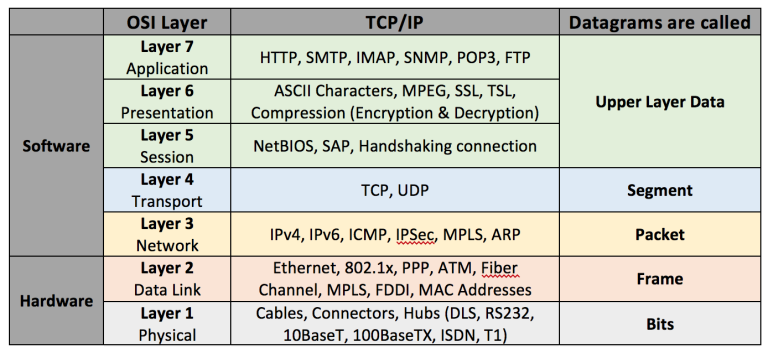
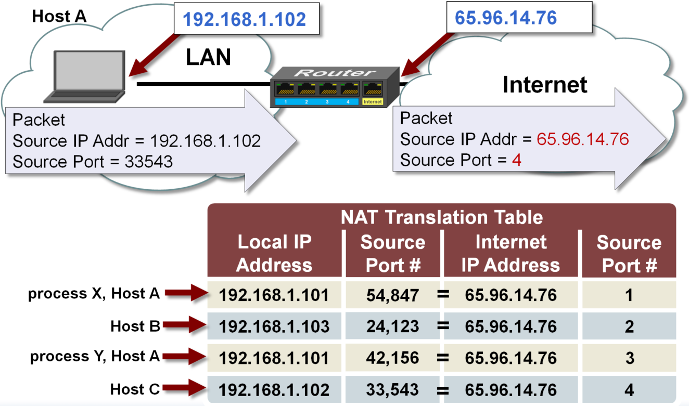
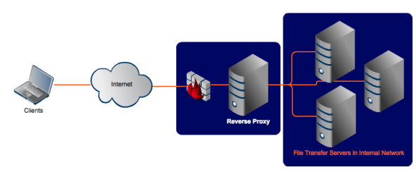
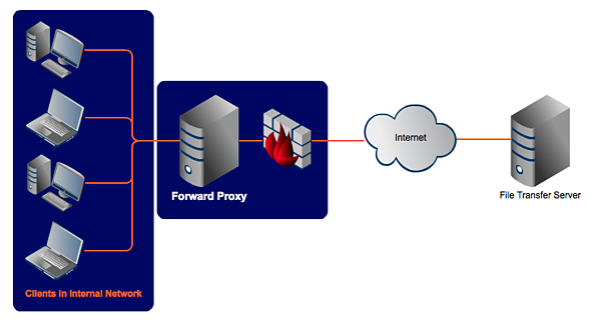
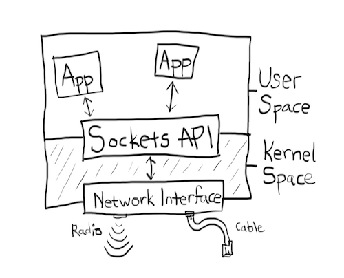

## Networking

- [Http(s)](./http(s).md)
- [OSI](#osi)
- [SSH](./ssh.md)
- [DNS](./dns.md)
- [nc(telnet) on Mac](#nc)
- [TCP Connections](#tcp-connections)
  - [Ephemeral Port](#ephemeral-port)
  - [TCP Timeout](#tcp-timeout)
- [NAT](#nat)
- [Network interface and Virtual Network Interface](#network-interface)
- [IP, CIDR, network masking](#ip-cidr-network-masking)
- [0.0.0.0](#wildcard-ip)
- [Forward Proxy and Reverse Proxy](#forward-proxy-and-reverse-proxy)
  - [Load Balancing](#load-balancing)
- [Server Name Indication](#sni)
- Tips
  - [Connection Problems](#connection-problem)
  - [Socket API](#socket-api)

- References
  - [http/tcp/conn-pool](https://developpaper.com/understanding-tcp-http-socket-socket-connection-pool/)


### OSI

- tcp/udp port is at layer 4 (transport layer)
- ping(icmp) is at network layer. It does not use port
- A socket is the combination of IP address plus port



### nc

Useful if you need to send packets of data through TCP conn.

```shell
$ echo '{"app":"fluentbit-app-test", "message": "this is a test"}' | netcat --ssl log-aggregator.ap-southeast-2.dev.david.dev 24223
```

Here are some troubleshooting tips:

if you receive `Connection refused` as the response, chances are your EC2 instance does not have a web server running.
Likewise, you will see `This site cannot be reached` when trying to access your EC2 instance from `chrome` via EC2 public ip.

### TCP Connections

```
+-------------------------------------------------------+
|     client           network            server        |
+-----------------+                +--------------------|
|    (connect)    | ---- SYN ----> |                    |
|                 | <-- SYN,ACK -- |     (accepted)     |
|   (connected)   | ---- ACK ----> |                    |
\_/\_/\_/\_/\_/\_/\_/\_/\_/\_/\_/\_/\_/\_/\_/\_/\_/\_/\_/

when client sends...
\_/\_/\_/\_/\_/\_/\_/\_/\_/\_/\_/\_/\_/\_/\_/\_/\_/\_/\_/
|                 |                |                    |
|     (send)      | ---- data ---> |                    |
|                 | <---- ACK ---- |  (data received)   |
\_/\_/\_/\_/\_/\_/\_/\_/\_/\_/\_/\_/\_/\_/\_/\_/\_/\_/\_/

when server sends...
\_/\_/\_/\_/\_/\_/\_/\_/\_/\_/\_/\_/\_/\_/\_/\_/\_/\_/\_/
|                 |                |                    |
|                 | <--- data ---- |       (send)       |
| (data received) | ---- ACK ----> |                    |
\_/\_/\_/\_/\_/\_/\_/\_/\_/\_/\_/\_/\_/\_/\_/\_/\_/\_/\_/
```

- A single listening port on server can accept more than one conn simultaneously
- A single ip/port tuple is theoretically allowed to make 64k (1024-65535) socket conns to a particular ip/port on server
- Each socket conn is a file descriptor. Total number of allowed concurrent socket conns depends on system config. i.e through sysctl
- SSL connection comes after TCP connection is established.

#### TCP Timeout

TCP is a connection-oriented protocol. That means that, unlike UDP which doesn’t really know or care whether the receiver gets anything, TCP needs to know that the packet was received. It finds out because the receiver sends an Acknowledgement (or ACK) packet. But what happens if the receiver doesn’t send an ACK, or if the ACK gets lost in transit? The session doesn’t know what to do, so the sender re-transmits the packet, and again waits for an ACK. Okay, so what happens if the connection was cut off, and the receiving machine never receives anything, or if there’s some sort of problem and it can’t send the ACK? What happens if the application hangs up? What’s the sending application supposed to do - keep re-transmitting indefinitely?

Enter the `TCP Connection Timeout`. At a certain point, the TCP session is deemed dead, and the session is closed, and no more re-transmissions are sent.

#### Ephemeral Port

It is a range of ports your clients randomly choose one from for a connection with the server. By using this, client will listen on that port for any traffic coming back from connected servers.

The range varies depending on different OS. For instance, Windows operating systems through Windows Server 2003 use ports `1025-5000`. Windows Server 2008 and later versions use ports `49152-65535`.

Let's say your client (your machine) initiates a `ssh` connection with a remote server.

`192.168.1.102:37852 ---> 233.200.177.122:22`

`37852` is the randomly-picked port number by your OS for communications. Since it's random, that's why you need to specify ephemeral port range when defining inbound/outbound traffic rules in NACL. i.e in order for your server to respond to connected client (Windows XP Client) on random ports between `1025-5000`, you must have to enable outbound traffic destined for ports `1025-5000`.

### NAT



### wildcard ip

In the context of servers, `0.0.0.0` means all IPv4 addresses on the local machine. If having a server running on a host listen for wildcard ip, it basically means the server can be accessible from any devices within the same network as the host.
i.e

```js
$ HOST=0.0.0.0 react-scripts start // make app server accessible to any devices on the network
// or another way of saying this is app server will listen on all network interfaces for coming traffic and handle them
$ HOST=localhost react-scripts start // make app server only accessible from the host
```

When considering wildcard ip in the context of security group and set `source` to wildcard ip in `inbound` rules, it means the instance is reachable by everyone or in other words instance accpets connection from everyone. Similarly, when set `destination` to wildcard ip in `outbound` rules, it means all traffic is allowed to go out.

### Network Interface

- Network interface - It allows your host to connect to the network. **eth0** is the network interface name which can also be seen as your host IP address.
- Virtual Ethernet Devices - A virtual ethernet device or veth is a Linux networking interface that acts as a connecting wire between two network namespaces. A veth is a full duplex link that has a single interface in each namespace. Traffic in one interface is directed out to the other interface.

### IP CIDR network-masking

Given `192.168.1.0/28`, it tells us the following:

- mask is `255.255.255.240` or `11111111 11111111 11111111 11110000` when represented in binary.
- 14 available ips - from `00000001` to `00001110` that is `192.168.1.1` as the first ip and `192.168.1.14` as the last ip.
  Note, `192.168.1.0` and `192.168.1.15` are reserved and cannot be used.
- Given `10.0.1.127/25` that is represented in binary as `00001010 00000000 00000001 0(1111111)`, the first ip is `10.0.1.1` and last ip is `10.0.1.126`.
- Given `10.0.1.128/25` with last range being `1(0000000)`, the first ip is `10.0.1.129` and last ip is `10.0.1.254`.

### Forward Proxy and Reverse Proxy

Both setups aim to protect your servers/clients by enforcing security rules (firewall) on proxy servers.

- Reserve Proxy is used when you want to protect your fleet of servers which respond to clients' request.


- Forward Proxy is used when clients from inside internal network need to reach out to the servers on the internet. In other words, clients initiate the connections. Note the difference compared to Reverse Proxy where clients on the internet initiate the connection request.


[Read more](https://www.jscape.com/blog/bid/87783/forward-proxy-vs-reverse-proxy)

#### Load Balancing

L7-LB
  - Implemented as software. Frequent updates
  - Packets manipulations i.e HTTP HEADERs/logging/SSL termination. they all cause overhead
  - CA can be installed on it for SSL termination
  - Sticky session capability

L4-LB
  - Little manipulation to packets
  - Fast
  - Inability to decode packets. So unable to distinguish between HTTP/HTTPS/FTP

[TCP VS HTTP(S) Load Balancing](https://medium.com/martinomburajr/distributed-computing-tcp-vs-http-s-load-balancing-7b3e9efc6167)

### SNI

SNI stands for Server Name Indication and is an extension to TLS.

The problem is, all these hostnames on one server are at the same IP address. This isn't a problem over HTTP, because as soon as a TCP connection is opened the client will indicate which website they're trying to reach in an HTTP request.

But in HTTPS, a TLS handshake takes place first, before the HTTP conversation can begin. Without SNI, then, there is no way for the client to indicate to the server which hostname they're talking to. As a result, the server may produce the SSL certificate for the wrong hostname. If the name on the SSL certificate does not match the name the client is trying to reach, the client browser returns an error and usually terminates the connection.

**SNI adds the domain name to the TLS handshake process**, so that the TLS process reaches the right domain name and receives the correct SSL certificate, enabling the rest of the TLS handshake to proceed as normal.

Specifically, SNI includes the `hostname` in the Client Hello message, or the very first step of a TLS handshake.

---

### Connection Problem

- `connection timeout` port not opened or blocked by firewall
- `connection refused` port is reachable (open) but service is down/not listening on that port

```shell
# will list what services listening on which port
$ netstat -tulpn
```

### Sockets API


