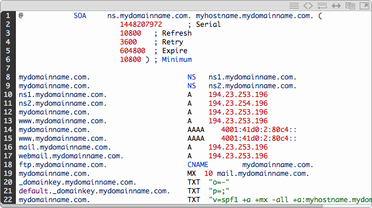

## DNS

- [DNS Zones](#dns-zones)
- [DNS Zone file](#dns-zone-file)
- [hostname vs domain](#hostname-vs-domain)
- [DNS Resolution workflow](#dns-resolution-flow)
- [DNS TTL](#dns-ttl)
- [www domain and naked domain](#www-vs-naked)
- [Route53 Alias record vs CNAME record](#alias-record-vs-cname-record)
- [DNS records](#dns-records)

2 kinds of DNS servers: recursive DNS servers aka DNS resolver AND authoritative DNS servers aka nameservers.

[DNS explained in detail](https://jvns.ca/blog/how-updating-dns-works/)

### DNS zones

It is an administrative space within the DNS. It's used to host the DNS records for a particular domain. i.e A zone called `abc.com` can host `www.abc.com` and `mydev.abc.com` two subdomains.

### DNS Zone File

- A DNS zone file is a text file stored on an authoritative DNS servers aka nameservers. It contains all the records for every domain within that zone.
- An authoritative DNS servers aka nameservers contains one or more zone files used to help respond to DNS queries i.e find ip address of a domain. It always needs to start with `SOA`.



### Hostname vs domain

- `hostname` is the name given to the end-point(machine)
- `domain` is the name given to the network
- Conventional format `hostname.domain.com`. i.e `mymachine.theuniversity.org`
- `hostname` is sometimes also called subdomain from domain perspective.

### DNS Resolution Flow

Given url `https://www.ABC.com.`:

- You query the `.` name servers (aka root name servers) to ask where the `com` DNS servers are.
- You query the `com` DNS servers (aka TLD name servers) to ask where the `ABC` DNS servers are.
- You query the `ABC` DNS servers (ask for NS records) to ask where `www` is.

One more subdomain might simply makes one more DNS server. i.e `https://www.test.ABC.com.` would mean a presence of `test` DNS server.


### DNS TTL

- 简单的说，TTL就是一条域名解析记录在DNS服务器(aka recursive DNS servers or DNS resolver)中的存留时间。当各地的DNS服务器接受到解析请求时，就会向域名指定的NS服务器发出解析请求从而获得解析记录；在获得这个记录之后，记录会在DNS服务器中保存一段时间，这段时间内如果再接到这个域名的解析请求，DNS服务器将不再向NS服务器发出请求，而是直接返回刚才获得的记录，而这个记录在DNS服务器上保留的时间，就是TTL值.
- Some recursive DNS servers definitely don’t respect TTLs, even if the major ones like 8.8.8.8 do.

### www-vs-naked

- From SEO point of view, some search engine recognize `www` and `non-www` as two different web sites and this cause to penalize the domain considering website has duplicate contents.

### alias-record-vs-cname-record

`alias` record is similar to a `CNAME` record, except you can create an alias record both for the `root domain - example.com` and for `subdomains - www.example.com` whereas you can create `CNAME` records only for subdomains.

Note, `CNAME` only points the source domain to the destination domain, which they both have the same ip address. In other words, traffic targeting source domain will now be routed to destination domain. However, you cannot see the redirection in the browser, since `DNS` itself does not provide redirection capability. You have to do that at the web server level. i.e using `nginx`.

### DNS Records

### CNAME

| (sub)Domain/Hostname | Record Type | Target/Destination |
| -------------------- | :---------: | -----------------: |
| mydomain.com         |      A      |    111.222.333.444 | mydomain.com |
| www.mydomain.com     |    CNAME    |       mydomain.com |
| ftp.mydomain.com     |    CNAME    |       mydomain.com |
| mail.mydomain.com    |    CNAME    |       mydomain.com |

Say you have several domains all want to point to `mydomain.com`. Benefit of this design allows you only need to change once when `mydomain.com` ip address is changed.

One usecase for `CNAME` is - you want domains registered in AU `mydomain.com.au` and NZ `mydomain.com.nz` both to be redirected to `mydomain.com`.

### NS Record

It tells your browser where all DNS records for your domain can be found. In other words, it shows your browser the IP address of the server that holds your DNS records. Think of it as a library assistant who you need to ask first before knowing where to find your book.

NS

```
mydomainname.com      NS      ns1.mydomainname.com
```

### MX

>>>
MX记录 MX（Mail Exchanger）记录是邮件交换记录，它指向一个邮件服务器，用于电子邮件系统发邮件时根据收信人的地址后缀来定位邮件服务器。例如，当Internet上的某用户要发一封信给user@mydomain.com 时，该用户的邮件系统通过DNS查找mydomain.com这个域名的MX记录，如果MX记录存在， 用户计算机就将邮件发送到MX记录所指定的邮件服务器上
