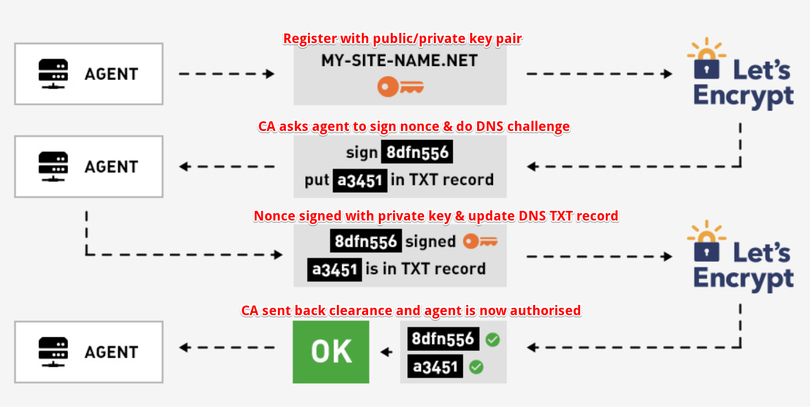

## HTTP, HTTP(S) with SSL/TLS and Cert

- [Key points](#key-points)
- [SSL Cert with Let's encrypt](#Ssl-cert-with-lets-encrypt)
- [How SSL works](#how-ssl-works)
- [Digital Signature and Digital Certificate](#digital-signature-and-digital-certificate)
- [HTTP or HTTPS](#http-or-https)
- [CA](#ca)

- [HTTP/2](#http/2)
- [Redirection](#redirection)

### Key points

- Key pair is used to encrypt/decrypt data (session key) in HTTPS context
- Certificate verifies that an entity is the owner of a particular public key
- Private key stays with owner (or server in webapp context) while public key can be distributed
- Sign means encrypt. i.e CA uses its own private key to self-sign a certificate. They also use their own private keys to sign/encrypt our supplied cert.
- Root Cert is cert issued by a trusted CA. It contains public key and is not encrypted. So client can use the public key to decrypt the cert being presented by server. Cert provided by server is signed/encrypted by CA private key.
- In client/server communication process, client needs `CA Cert` while server needs to have its `Cert` as well as `Private Key`. Private key is used to decrypt the session key being encrypted by public key enclosed in `Cert`.

### Digital Signature and Digital Certificate

- Bob creates a cert including his public key and other information to `CA`.
- `CA` uses its private key to sign(encrypt) provided cert which results in a new cert - Digital Certificate in `X.509` format - a standard format for public key cert.
- Bob sends the digital cert to Alice who then tries to decrypt it using the public key distributed by the **same** `CA`.
- If it can be decrypted with no errors, it means the cert is from Bob.
- Signature is the result of encryption. `Message - hash -> Digest - encrypt with private key -> Signature`.

### How SSL works

`SSL/TLS` connection enforces data encryption during transmission over the network:

1. `Browser` connects to a web server (website) secured with SSL (https). `Browser` requests that the `Server` identifies itself.
2. `Server` sends a copy of its `SSL Certificate` with server's public key enclosed.
3. `Browser` checks the certificate root against a list of trusted CAs (comes with Browsers) and that the certificate is unexpired, unrevoked and that its common name is valid for the website that it is connecting to. If the `Browser` trusts the certificate, it creates, encrypts and sends back a symmetric session key using the `Server's` public key.
4. `Server` decrypts the symmetric session key using its private key and sends back an acknowledgement encrypted with the session key to start the encrypted session.
5. `Server` and `Browser` now encrypt all transmitted data with the session key - (symmetric encryption).

Please note, for all above to work, `ssl cert` needs to be placed under a particular directory on `Server` side for `ssl` server to locate.

### Client certificate

Server requests clients to prove they are who they claim to be by asking for a client cert. The process is the same to server authentication but happens in a reverse way.

### Ssl cert with Let's encrypt

- The objective of Let’s Encrypt and the ACME protocol is to make it possible to set up an HTTPS server and have it automatically obtain a browser-trusted certificate, without any human intervention. This is accomplished by running a certificate management agent on the web server.
- There are two steps to this process. First, the agent proves to the CA that the web server controls a domain (DNS challenge). Then, the agent can request, renew, and revoke certificates for that domain.



Certbot is a very popular agent.


### CA

- Verify identity of servers clients trying to connect. It's done by verifying the cert servers respond with against CAs installed on clients' browsers.
- Issue cert to servers. Done through asking clients to complete DNS challenge and issuing CA signed cert upon DNS challenge success.
- CA warns clients with a message of `your connection is not private` when either servers present a self-signed cert or no cert to clients. Self-signed cert means servers use their own private key to sign and generate the cert rather than obtaining it from CAs.

### HTTP or HTTPs

If all hosts involved are running within the same network trust boundary, it's ok to have http connections between any 2 of them. If it is not the case however, HTTPS must be used to prevent man-in-the-middle attacks. i.e communication between 2 instances on the same vpc can allow http whereas browser-n-server communication must take place over HTTPS.

---

### HTTP/2

- Multiplexing
  - With HTTP/1.1, you can only download one resource at time. When your site needs two resources `a.css` and `b.js`, a needs to be downloaded first
    before connection to download b can be established. It is really inefficient since client and server don't do too much.
  - To mitigate this, browsers allow for opening multiple connections (typically 6-8) to download them simultaneously. But there is cost involved - setup/manage multiple connections which impact both client and browser.
  - With HTTP/2, it allows you to send off multiple requests on the **same** connection. The requested resources are fetched in parallel and received
    **in any order**.
  - Note, HTTP/1.1 has a concept of `pipelining` which also allows multiple requests to be sent off at once but they need to be returned **in the order they were requested**. This feature is nowhere near as good as HTTP/2 so it is hardly used.

### Redirection

`302` - tells the browsers to not cache new url at all unless response header specifies `Cache-Control` or `Expires` with particular values. It's aka `temporary redirection`.
`301` - tells the browsers to cache new url permanently. It's aka `permanent redirection`.
In case you don't want browser to cache it, modify response headers:

```
Cache-Control: no-store, no-cache, must-revalidate
Expires: Thu, 01 Jan 1970 00:00:00 GMT
```
