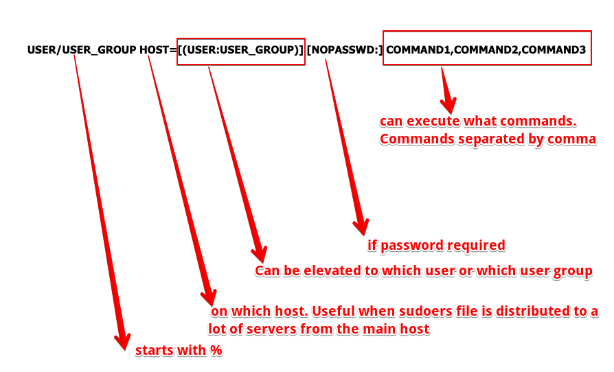

## Linux

### Key Points

- [tty](#tty)
- [Process](#process)
- [Signal](#signal)
- [File and Permissions](#file-and-permissions)
- [Host file](#host-file)
- [SSH](#ssh)
- [Add Users](https://www.tecmint.com/add-users-in-linux/)
- [sudo and sudoers File](#sudo-and-sudoers-file)
- [ssh config file](#ssh-config-file)
- [File Descriptor](#file-descriptor)
- [Commands](#commands)
  - [Tee](#tee)
  - [watch](#watch)
  - [dig](dig.md)
  - [Redirect app logs to stdout from static files](#log-redirection)
  - [Show process listening ports](#show-process-listening-ports)
  - [Scheduled tmp folder clean-up service](#scheduled-tmp-folder-cleanup)

### Shell

- [Shell](./shell.md)
- [Example script](./shell_scripting.md)

### tty

In unix terminology, the short answer is `terminal = tty = text input/output environment`

### Process

- Application stored in the disk will be loaded into memory when it's running. This process will turn the application into a running process with an id (pid). Also, process has state.
- The system `libs` are shared - i.e there is only one copy of `printf` in the memory so it can be accessed by different processes.
- When system is being booted, kernel creates a special process called `init` - the parent of all processes which is derived from the file `/sbin/init`. It is never killed until the system shuts down.

To run a process and put it in the background (using &) which then gives you prompt back:

```
$ gunzip file.gz &
```

#### What's happened when pressing `ctrl+c`?

> We ask the kernal to send the interrupt (SIGINT) to the process. Say it's a NodeJS process, then a signal event will be emitted by EventEmitter:

```js
process.on('SIGINT', () => {
  console.log('received SIGINT');
});
```

#### What's happened when running ls in a shell?

> Parent process (shell) `fork()` a child process which `exec()` to run `ls` by replacing itself with the `ls`.

#### ps

Run `ps` without any flags will return only the process running under the logged in user account from the current terminal. A more commonly-used way is to run with `aux`. i.e `ps aux|grep jenkins`.

```
a = show processes for all users
u = display the process's user/owner
x = also show processes not attached to a terminal
```

### Signal

- Signal is a notification, a message sent by either operating system or some application to our program.
- Signals are a mechanism for one-way asynchronous notifications.
- A signal may be sent from the kernel to a process, from a process to another process, or from a process to itself.
- With the exception of `SIGKILL` and `SIGSTOP` which always terminates the process or stops the process, respectively, processes may control what happens when they receive a signal. They can

1. accept the default action, which may be to terminate the process, terminate and coredump the process, stop the process, or do nothing, depending on the signal.
2. Or, processes can elect to explicitly ignore or handle signals.
   1. Ignored signals are silently dropped.
   2. Handled signals cause the execution of a user-supplied signal handler function. The program jumps to this function as soon as the signal is received, and the control of the program resumes at the previously interrupted instructions

### File and Permissions


`Group` permissions give any users in a particular group rights to perform `read/write/execute` on file or directory.

`Other` permissions give everyone else on the system.

To see which group you are in:

```
$ groups davidhe
```

To modify permissions (user: read/write & group, other: read):

```
$ chmod 644 file
```


### host-file

Hosts file is a simple txt file situated at `/etc/hosts` on Linux and Mac OS.
Given `host` file below:

```
127.0.x.x  mydomain
```

It means system will not do a DNS lookup for `mydomain` but rather direct traffic to the IP address you specified in your hosts file.
On most systems the default entry in the hosts file is:

```
127.0.0.1  localhost
```

`127.0.0.1` is always the address of the computer you're on. For example, if you run a web server on your pc, you can access it from the web browser via `http://localhost:port` instead of typing the whole IP address `http://127.0.0.1:port`.

### ssh

Example `~/.ssh/config`

```
Host remote
     HostName 13.211.224.214
     Port 22
     User ec2-user
     IdentityFile ~/.ssh/id_rsa
```

With this configuration, you ssh into another ec2 instance by typing `ssh remote`.

### sudo and sudoers file

- sudo (super user do)

  - lets you use your own password to execute commands
  - When sudoing, things below will happen:

    1. System does a look-up in `/etc/sudoers` file to find out if the user has privilege to execute `sudo`.
    2. If yes, the users will be prompted for their own password.
    3. If authed, system will execute command specified by `sudo`.

  - i.e

  ```shell
  $ sudo node               # run node command as a root user
  $ sudo node -U p782199    # run node command as user p782199
  $ sudo -l -U p782191      # list all this user can do
  $ sudo su                 # means run the command su as sudo which means as root. Here the system will ask you for your
                            # password since you are a sudoer. After you enter your password, you now have root privilege
                            # useful when you need to execute a number of commands as root. As opposed to sudo <command>
  ```

  - if you see something like this:

  ```
  Sorry, user P782199 is not allowed to execute '/Users/P782199/.nvm/versions/node/v8.16.1/bin/node -u p782199' as root on C02X1KJSJG5H (host).
  ```

  it basically means the command you are trying to run is not a whitelisted command you can run on behalf of root.

- su (switch user)

  - lets you switch to other users by entering their password. Once auth is passed, a new shell prompt will be opened with target user's privileges.

  - i.e

  ```shell
  $ su bob    # switch to user bob
  $ su        # switch to root user or aka superuser. Keeps your existing env vars
  $ su -      # Same as above but with settings of your specified user. In this case, it's root user's settings
  ```

[Further reading](https://askubuntu.com/questions/376199/sudo-su-vs-sudo-i-vs-sudo-bin-bash-when-does-it-matter-which-is-used)


Anything enclosed by [] is optional

```bash
# root user
root ALL=(ALL:ALL) ALL

# sudo group users
%sudo ALL=(ALL:ALL) ALL

# user jack can run vi,ls on behalf of root on host nginx without passwords
jack nginx=(root) NOPASSWD: vi,ls

# user peter can run all commands on behalf of all users on all hosts without password
peter ALL=(ALL) NOPASSWD: ALL

# user papi can run /bin/chown on behalf of root on all hosts without password
# user papi can run /usr/sbin/useradd on behalf of root on all hosts with password
papi ALL=(root) NOPASSWD: /bin/chown,/usr/sbin/useradd
```

[sudoers file explained](https://www.cnblogs.com/jing99/p/9323080.html)

### File descriptor

Difference between `2>&1` and `2>1` is the previous one will redirect the `stderr` to `stdout` while the latter one redirects the `stderr` to file named `1`.

As you can see, **&** here is used to distinguish `stdout (1)` or `stderr (2)` from files named `1` or `2`.


```shell
# And this will redirect `stdout` and `stderr` to null device resulting in nothing prints out to terminal. It works because `stdout` redirects to `/dev/null`, and then `stderr` redirects to the address of `stdout` by using `>&`, which has been set to `/dev/null`, consequently both `stdout` and `stderr` point to `/dev/null`.
$ CMD > /dev/null 2>&1
$ 2>/dev/null # redirect STDERR to /dev/null
$ &>/dev/null # redirect both STDERR and STDOUT to /dev/null (nothing will show up)
$ >/dev/null  # redirect STDOUT to /dev/null (only STDERR shows up)
```

---

### Commands

#### Tee

- Name after t-splitter in plumbing.
- Write output to stdout as well as one or more files.
- write to stdout and file simultaneously.

```shell
command -> tee → stdout
            ↓
           file
...
$ ls|tee file1.txt
```

#### Watch

Continuously watch a command execution and print result.

```shell
$ watch -n 1 -b "curl https://api.theparrodise.com/weather"
```

Call api server every 1 second and `b`eep when a non-zero exit code emits.

#### Show process listening ports

```shell
$ lsof -Pan -p PID -i
```

#### Scheduled tmp Folder Cleanup

Use `systemd-tmpfiles-clean` service for this purpose.

#### Log redirection

Trick below will forward logs to `stdout` rather than `access.log`.

```shell
$ ln -sf /dev/stdout /var/log/nginx/access.log
```
