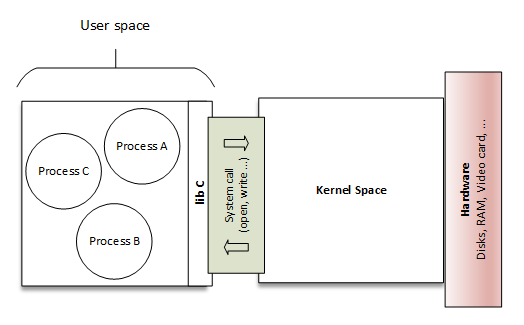

## How Linux works book notes

### Basics

- The kernal is software residing in memory that tells the CPU what to do. The kernal manages the hardware and acts primarily as an interface between
the hardware and any running program.
- Processes - the running programs that the kernal manages - collectively make up the system's upper level, called user space.
- A CPU is just an operator on memory; it reads its instructions and data from the memory and writes data back out to the memory.
- The main memory that the kernal allocates for user processes is called `user space`. User space also refers to the memory for the entire collection of running processes.
- When you run `kill pid`, you are asking the kernal to send a signal to another process



### System calls

A system call is an interaction between a process and the kernal.

- fork - When a process calls `fork()`, the kernal creates a nearly identical copy of the process
- exec - When a process calls `exec(program)`, the kernal starts `program`, replacing the current process

```
shell ---> fork() ---> shell
                  ---> copy of shell ---> exec(ls) ---> ls
```

### sh = bash?

For a long time, `/bin/sh` used to point to `/bin/bash` on most GNU/Linux systems. As a result, it had almost become safe to ignore the difference between the two. But that started to change recently.

Some popular examples of systems where `/bin/sh` does not point to `/bin/bash` (and on some of which `/bin/bash` may not even exist). i.e debian

### Linux Directories Hierachy


- `/bin` - Short for binaries. It contains ready-to-run programs aka executables
- `/dev` - Short for deivce. It contains device files
- `/etc` - Contains core system config directory
- `/home` - Holds personal directories for regular users
- `/lib` - Short for library. It contains lib files containing code that executables can use.
- `/proc` - Contains information about currently running processes as well as some parameters
- `/sys` - Similar to `proc` in that it provides a device and system interface.
- `/sbin` - System executables. Many of utilities found here will not work if you're not running them as root
- `/tmp` - A storage area for smaller, temp files that you don't care much about.
- `/usr` - No user files!! It contains a large directory hierarchy.
- `/var` - Where programs record runtime information, system logging, user tracking, cache, and other files that system programs create and manage are here. You will notice a `/var/tmp` directory here but the system doesn't wipe it on boot.
- `/opt` - Contains additional third-party software. Many systems don't use `/opt`.
