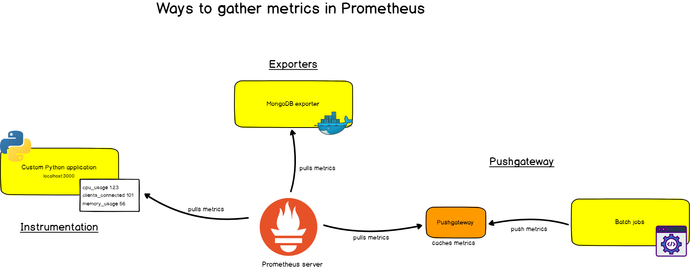

## Prometheus

### Concepts

- TSDB (Time-series DB)
- `Instrumentation` in Prometheus terms means adding client libraries to your application in order for them to expose metrics to Prometheus
- Pull metrics from targets aka metric scraping
- Metrics can be scraped by several ways including
  - `Instrument` your app. It basically means you use their out-of-box library to collect and send metrics to server during scraping
  - Use an `Exporter` that is a binary running alongside the application you want to obtain metrics from. The exporter exposes Prometheus metrics, commonly by converting metrics that are exposed in a non-Prometheus format into a format that Prometheus supports.
  - Use `Pushgateway`. Occasionally you will need to monitor components which cannot be scraped. The Prometheus `Pushgateway` allows you to push time series from short-lived service-level batch jobs to an intermediary job which Prometheus can scrape.
- `node-exporter` is for hardware and OS metrics exposed by *nix kernel. `cadvisor`, on the other hand, collects, aggregates, processes, and exports information (resource usage) about running containers on the host. To summarise, `node-exporter` is for server metrics collection while `cadvisor` is for containers metrics collection.




### Time Series

Each time series is comprised of `metric` and `label`. Think of time series as a bucket where it stores sample data that has the same `metric/label` combination. Sample including value and associated timestamp. Sample data is stored by time series.

```
# each sample data represented as t0, v0
time series = [(t0, v0), (t1, v1), ...]

# example time series
http_requests_total(job="nginx", instance="1.2.3.4:80", path="/home", status="200")
```


### Job vs Instance vs Target

`Job` is a collection of instances with the same purpose. An `instance` is a `<host>:<port>` representation. While `target` is an object that holds information such as what labels to apply, any authentication required to connect, or other information that defines how the scrape will occur.


### Tools

Use `promtool` to validate config file. Install it with wget first.

```
./promtool check config prometheus.yml
```

### Example PromQLs

```
rate(node_cpu_seconds_total{federated_via_instance="i-0da5ce26ff964522f"}[5m])
```

### Components


#### Client Library

It allows you to instrument your apps by their methods that you put in your app.

```python
from prometheus_client import start_http_server, Summary
import random
import time

# Create a metric to track time spent and requests made.
REQUEST_TIME = Summary('request_processing_seconds', 'Time spent processing request')

# Decorate function with metric.
@REQUEST_TIME.time()
def process_request(t):
    """A dummy function that takes some time."""
    time.sleep(t)
```

#### Exporter

It takes requests from Prometheus server, gathers the required data from the apps, transforms them into the correct format and sends a response back to Prometheus server in the desired format

#### Service Discovery

Service Discovery plays a key role in dynamic environments. Prometheus has integrations with many popular service discovery tooling like Kubernetes, AWS EC2, Consul etc. This enables Prometheus to identify the applications it needs to monitor and pull metrics from.

#### Scraping

Prometheus regularly sends an HTTP request called a ‘scrape’ to the applications it wants to monitor & fetch metrics.

#### Local Storage

By default, Prometheus stores metric records in local TSDB. But this does not accommodate clustering envrionment where you run multiple Prom nodes. In this scenario, you need to configure remote store.

When remote store is configured, queries will be sent to both local and remote stores and the searching results will be merged.

### References

[The Definitive guide to Prometheus](https://devconnected.com/the-definitive-guide-to-prometheus-in-2019/#c_Jobs_Instances)
[Prometheus Components](https://samirbehara.com/2019/05/30/cloud-native-monitoring-with-prometheus/)
