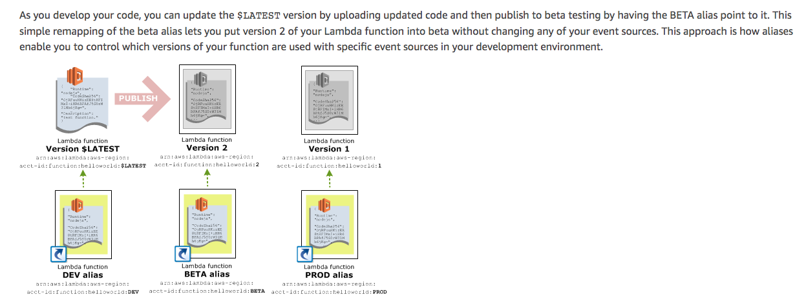

## Lambda

* [Versioning and Alias](#versioning-alias)

### versioning-alias
* Unless you publish a version, lambda creates and maintains only one version `$LATEST`. To reference it, use qualified ARN:
`arn:aws:lambda:aws-region:acct-id:function:helloworld:$LATEST`.
* Serverless framework publishes a version by default. Version starts with `1` and increments its value by 1 on each function update. Version numbers are never reused.
* Alias is like a pointer to a specific Lambda function version. Use case is say we need to invoke a lambda when a file is uploaded to a s3 bucket. To tell s3 bucket which lambda it needs to invoke, we need to specify ARN of the target lambda. Without using alias, everytime there is a new lambda version, we will need to update the ARN value since versioning in lambda is immutable - you cannot change it! With alias's help, we can alias the desired version to `PROD` for instance that way whenever a new version is released you can just re-point `PROD` to the new version without touching ARN anymore.
* 
