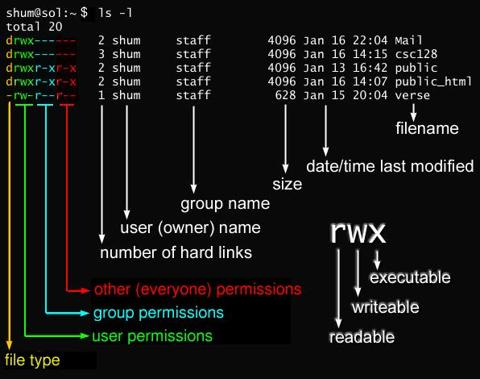

* [Shell Definition](#shell-def)
* [Make a dir and cd into it with one liner](#mkdir-cdinto-it)
* [ctrl+d vs ctrl+c](#ctrld-ctrlc)
* [Environment Variable](#env-var)
* [ls output explained](#ls)
* [Stdout file content](#stdout-file-content)
* [Dot files](#dotfiles)
* [Man page/help](#manpage-help)
* [Input and Output](#input-output)
* [Process](#process)
* [File](#file)
* [chmod explained in simple english](#chmod)
* [host file under etc](#host-file-purpose)
* [ssh config file](#ssh-config-file)

### shell-def
Located in `/bin/sh`. A shell is a program that runs commands. The shell also serves as a small programming environment. There is an enhanced version of shell called `bash` or `Bourne-again shell`.
We open a shell window via terminal.

### mkdir-cdinto-it
```js
mkdir /home/foo/doc/bar && cd $_
```

### ctrld-ctrlc
* `ctrl+d` on an empty line stops the current standard input entry from terminal. 
* `ctrl+c` terminates a program regardless of ites input or output.

### env-var
$PATH说简单点就是一个字符串变量，当输入命令的时候LINUX会去查找$PATH里面记录的路径。比如在根目录/下可以输入命令ls,在/usr目录下也可以输入ls,但其实ls这个命令根本不在这个两个目录下，事实上当你输入命令的时候LINUX会去/bin,/usr/bin,/sbin等目录下面去找你此时输入的命令，而$PATH的值恰恰就是/bin:/sbin:/usr/bin:……。其中的冒号使目录与目录之间隔开.

To edit it
```js
sudo vi /etc/paths
```

### ls


### stdout-file-content
Use `less` rather than `cat` to output large file content since the former allows to scroll **up/down** contents.
If `less` is not supported out of box then try `more`.
```Shell
less file1.txt
```
You can also search for text inside `less`. forward search `/word` and backward search `?word`.

### dotfiles
Dot files such as `.babelrc` is a configuration file that is not displayed when you run `ls` unless with `-a`. Similarly, shell globs don't match dot files.

### manpage
```js
$ man ls
$ man -k <KEYWORD>
```
Sometimes, you might need to run:
```
$ ls --help
```

### input-output
To send output of a command to a file rather than terminal:
```
$ command > file
```
Command above will overwrite the existing file content. To append it use `>>`.

To send the standard output of a command to the standard input of another command:
```
$ command | another_command
```

To send the standard output to `f` and standard error to `e`:
```
$ ls /fffffffffffffffff > f 2> e
```

### process
A process is a running program and each process on the system has a numeric process ID(PID). 
To kill a process:
```
$ kill pid
```
When we run `kill`, we're asking the kernal to send a signal to another process. 

To run a process and put it in the background (using &) which then gives you prompt back:
```
$ gunzip file.gz &
```

### file
`Group` permissions give any users in a particular group rights to perform `read/write/execute` on file or directory.

`Other` permissions give everyone else on the system. 

To see which group you are in:
```
$ groups davidhe
```

To modify permissions (user: read/write & group, other: read):
```
$ chmod 644 file
```

### chmod


### host-file-purpose
Given `host` file below
```
127.0.x.x  mydomain
```
It means system will not do a DNS lookup for `mydomain`, it will be automatically redirected to the IP address you specified in your hosts file.
On most systems the default entry in the hosts file is:
```
127.0.0.1  localhost
```
127.0.0.1 is always the address of the computer you're on. For example, if you run a web server on your pc, you can access it from the web browser via `http://localhost:port` instead of typing the whole IP address `http://127.0.0.1:port`.

### ssh-config-file
Example `ssh config`

```
Host remote
     HostName 13.211.224.214
     Port 22
     User ec2-user
     IdentityFile ~/.ssh/id_rsa
```
With this configuration, you ssh into another ec2 instance by typing `ssh remote`.
