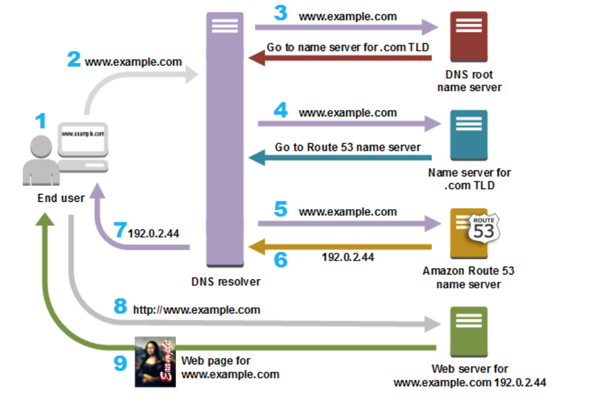

## Networking
* [Route53 AWS DNS](#dns)
  * [DNS Resolution workflow](#dns-resolution-flow)
  * [www domain and naked domain](#www-vs-naked)
  * [Route53 Alias record vs CNAME record](#alias-record-vs-cname-record)
* [nc(telnet) on Mac](#nc)
* [Ephemeral Ports](#ephemeral-ports)


### dns-resolution-flow
* 
* 
* [DNS Resolution explained in Chinese](https://blog.csdn.net/crazw/article/details/8986504)

### www-vs-naked
* From SEO point of view, some search engine recognize `www` and `non-www` as two different web sites and this cause to penalize the domain considering website has duplicate contents.

### alias-record-vs-cname-record
`alias` record is similar to a `CNAME` record, except you can create an alias record both for the `root domain - example.com` and for `subdomains - www.example.com` whereas you can create `CNAME` records only for subdomains.

Note, `CNAME` only points the source domain to the destination domain, which they both have the same ip address. In other words, traffic targeting source domain will now be routed to destination domain. However, you cannot see the redirection in the browser, since `DNS` itself does not provide redirection capability. You have to do that at the web server level. i.e using `nginx`.

### nc
Use `nc` as you would with `telnet:
```js
$ nc -v https://xyz.com 443
```
Here are some troubleshooting tips:

if you receive `Connection refused` as the response, chances are your EC2 instance does not have a web server running.
Likewise, you will see `This site cannot be reached` when trying to access your EC2 instance from `chrome` via EC2 public ip.

### ephemeral-ports
It is a range of ports your client randomly chooses one from for a connection with the server. By using this, client will listen on that port for any traffic coming back from connected servers.

The range varies depending on different OS. For instance, Windows operating systems through Windows Server 2003 use ports 1025-5000. Windows Server 2008 and later versions use ports 49152-65535.

Let's our client (your machine) initiates a `ssh` connection with a remote server. 

`192.168.1.102:37852 ---> 233.200.177.122:22`

`37852` is the randomly-picked port number by your OS for communications. Since it's random, that's why you need to specify ephemeral port range when defining inbound/outbound traffic rules in NACL. i.e in order for your server to respond to connected client (Windows XP Client) on random ports between `1025-5000`, you must have to enable outbound traffic destined for ports `1025-5000`.


