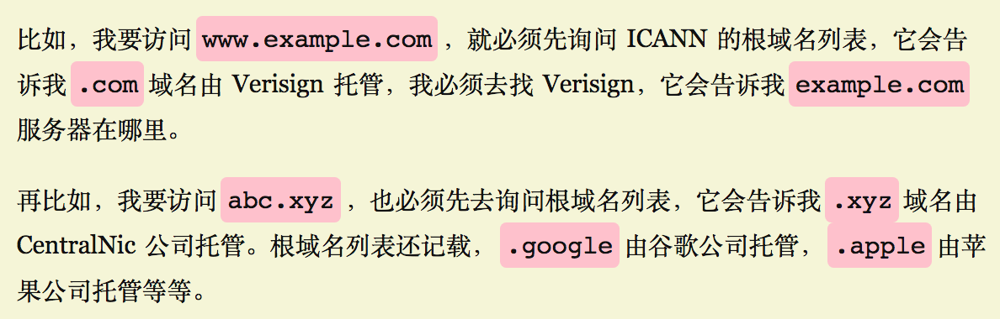

## Networking
* [Route53 AWS DNS](#dns)
  * [DNS Resolution workflow](#dns-resolution-flow)
  * [www domain and naked domain](#www-vs-naked)
  * [Route53 Alias record vs CNAME record](#alias-record-vs-cname-record)

### dns-resolution-flow
* 
* 
* [DNS Resolution explained in Chinese](https://blog.csdn.net/crazw/article/details/8986504)

### www-vs-naked
* From SEO point of view, some search engine recognize `www` and `non-www` as two different web sites and this cause to penalize the domain considering website has duplicate contents.

### alias-record-vs-cname-record
`alias` record is similar to a `CNAME` record, except you can create an alias record both for the `root domain - example.com` and for `subdomains - www.example.com` whereas you can create `CNAME` records only for subdomains.

Note, `CNAME` only points the source domain to the destination domain, which they both have the same ip address. In other words, traffic targeting source domain will now be routed to destination domain. However, you cannot see the redirection in the browser, since `DNS` itself does not provide redirection capability. You have to do that at the web server level. i.e using `nginx`.
