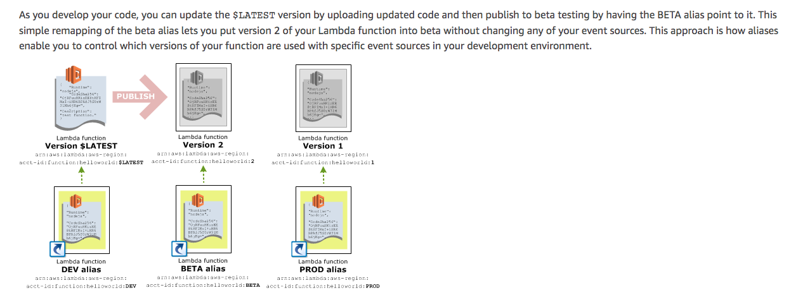
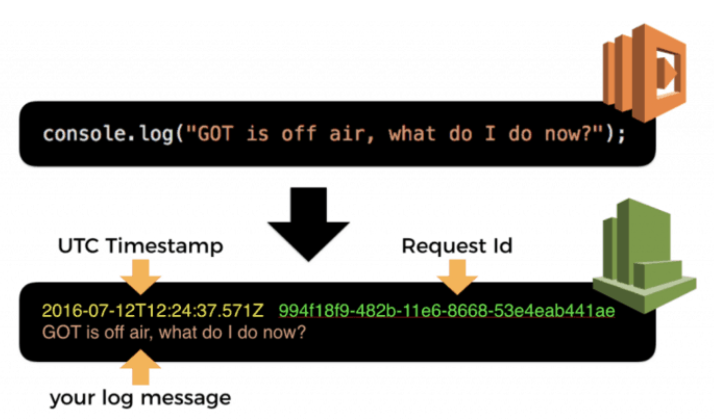

## Lambda/APIG

- [Versioning and Alias](#versioning-alias)
- [cold vs warm start](#cold-vs-warm-start)
- [Concurrency](#concurrency)
- [Logging with CloudWatch](#logging-with-cloudwatch)
- [Put lambdas inside a VPC](#put-lambdas-inside-vpc)

### versioning-alias

- Unless you publish a version, lambda creates and maintains only one version `$LATEST`. To reference it, use either qualified ARN or unqualified ARN:

```js
// qualified
arn:aws:lambda:aws-region:acct-id:function:helloworld:$LATEST

// unqualified cannot use it for alias
arn:aws:lambda:aws-region:acct-id:function:helloworld
```

- When you publish a version, what it happens is:

  - Lambda makes a snapshot copy of `$LATEST` version lambda code + config.
  - Suffix ARN with version number. i.e `arn:aws:lambda:aws-region:acct-id:function:helloworld:1`
  - Version numbers are never used. If you want to reuse a qualifier, use aliases with your versions. Aliases can be deleted and re-created with the same name.
  - Lambda only publishes a new version if the code hasn't yet been published or if the code has changed when compared against the $LATEST version. If there is no change, the $LATEST published version is returned.
  - AWS Lambda maintains your latest function code in the $LATEST version. When you update your function code, AWS Lambda replaces the code in the $LATEST version of the Lambda function
  - [See delete versions section for how to delete lambda versions](https://docs.aws.amazon.com/lambda/latest/dg/versioning-intro.html)

- Serverless framework publishes a version by default. Version starts with `1` and increments its value by 1 on each function update. Version numbers are never reused.
- Alias is like a pointer to a specific Lambda function version. Use case is say we need to invoke a lambda when a file is uploaded to a s3 bucket. To tell s3 bucket which lambda it needs to invoke, we need to specify ARN of the target lambda. Without using alias, everytime there is a new lambda, we will need to update the ARN value since versioning in lambda is immutable - you cannot change it! With alias's help, we can alias the desired version to `PROD` for instance that way whenever a new version is released you can just re-point `PROD` to the new version without touching ARN anymore.
- 

### Cold vs warm start

AWS Lambda functions are stored as zip files in an S3 bucket. They are loaded up onto a container when the function is invoked. The time it takes to do this is called the cold start time. If a function has been recently invoked, the container is kept around. In this case, your functions get invoked a lot quicker and this delay is referred to as the warm start time. One of the factors that affects cold starts, is the size of your Lambda function package. The larger the package, the longer it takes to invoke your Lambda function.

[Package Lambdas with serverless-bundle
](https://serverless-stack.com/chapters/package-lambdas-with-serverless-bundle.html)

### Concurrency

The first time you invoke your function, AWS Lambda creates an instance of the function and runs its handler method to process the event. When the function returns a response, it sticks around to process additional events. If you invoke the function again while the first event is being processed, Lambda creates another instance.

As more events come in, Lambda routes them to available instances and creates new instances as needed. Your function's concurrency is the number of instances serving requests at a given time.

### Logging with CloudWatch

Whenever you write to `stdout`, those outputs are captured by the Lambda services and sent to `CloudWatch` Logs as logs.



One log group per function and one log stream for each concurrent invocation. Another entry of log stream will be created when a new instance is created and sends output to `stdout`. This occurs when all concurrent instance(s) are busy with processing requests - see `Concurrency` as above.

Since it's not easy to search for log messages in CloudWatch Logs, log aggregation services emerge such as `datadog`, `papertrail` and `sentry`. This is achieved by [CloudWatch Logs Subscription](https://docs.aws.amazon.com/AmazonCloudWatch/latest/logs/Subscriptions.html)

1. logs captured by lambda and pushed to CloudWatch logs asynchronously
2. CloudWatch forwards logs to another service (lambda) via subscription
3. Lambda ships logs to log aggregation service

### Put lambdas inside vpc

Think carefully before putting your lambdas inside a vpc because:

- Each time a lambda function is executed, it uses a proportion of your ENI(Elastic Network Interface) capacity from the subnet. You must have sufficient ENI capacity to support your lambda scaling requirement. If you run out of ENI capacity this will cause your lambda functions to fail.
- Increased cold start time!

[AWS lambdas in VPC](https://levelup.gitconnected.com/lambda-vpc-cold-starts-a-latency-killer-5408323278dd)
