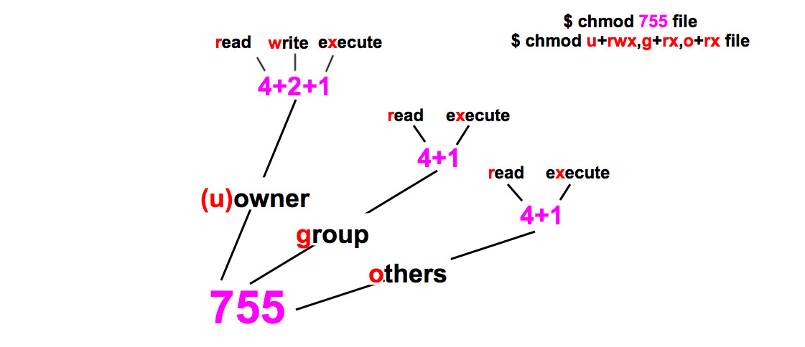
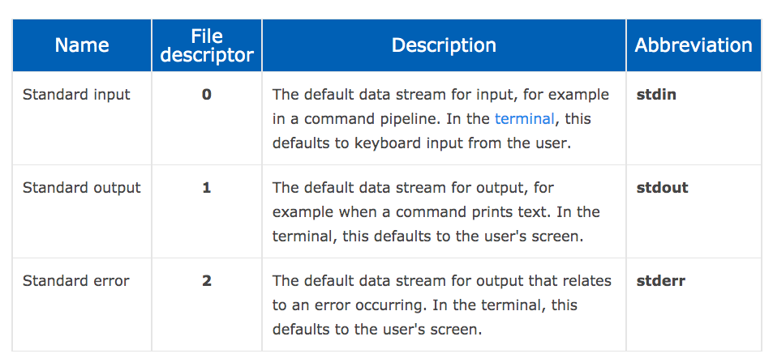

## Linux

* [Shell Definition](#shell-def)
* [ctrl+d vs ctrl+c](#ctrld-ctrlc)
* [Environment Variable](#env-var)
* [ls output explained](#ls)
* [Stdout file content](#stdout-file-content)
* [Dot files](#dotfiles)
* [Man page/help](#manpage-help)
* [Input and Output](#input-output)
* [Process](#process)
* [File](#file)
* [chmod explained in simple english](#chmod)
* [host file under etc](#host-file-purpose)
* [ssh config file](#ssh-config-file)
* [scp file to EC2](#scp)
* [double dash in command](#double-dash)
* [Find and kill process](#find-kill-process)
* [File Descriptor](#find-kill-process)
* [Reset var value to empty](#reset-var-value)
* [Define and use Variables](#define-n-use-variables)
* [Command evaluation & param sub](#command-eval-param-sub)
* [Networking](#networking)

### shell-def
Located in `/bin/sh`. A shell is a program that runs commands. The shell also serves as a small programming environment. There is an enhanced version of shell called `bash` or `Bourne-again shell`.
We open a shell window via terminal.

### ctrld-ctrlc
* `ctrl+d` on an empty line stops the current standard input entry from terminal.
* `ctrl+c` terminates a program regardless of ites input or output.

### env-var
$PATH说简单点就是一个字符串变量，当输入命令的时候LINUX会去查找$PATH里面记录的路径。比如在根目录/下可以输入命令ls,在/usr目录下也可以输入ls,但其实ls这个命令根本不在这个两个目录下，事实上当你输入命令的时候LINUX会去/bin,/usr/bin,/sbin等目录下面去找你此时输入的命令，而$PATH的值恰恰就是/bin:/sbin:/usr/bin:……。其中的冒号使目录与目录之间隔开.

To edit it
```js
sudo vi /etc/paths
```

### ls


### stdout-file-content
Use `less` rather than `cat` to output large file content since the former allows to scroll **up/down** contents.
If `less` is not supported out of box then try `more`.
```Shell
less file1.txt
```
You can also search for text inside `less`. forward search `/word` and backward search `?word`.

### dotfiles
Dot files such as `.babelrc` is a configuration file that is not displayed when you run `ls` unless with `-a`. Similarly, shell globs don't match dot files.

### manpage
```js
$ man ls
$ man -k <KEYWORD>
```
Sometimes, you might need to run:
```
$ ls --help
```

### input-output
To send output of a command to a **file** rather than terminal:
```
$ command > file
```
Command above will overwrite the existing file content. To append it use `>>`.

To send the standard output of a command to the standard input of another command:
```
$ command | another_command
```

To send the standard output to `f` and standard error to `e`:
```
$ ls /fffffffffffffffff > f 2> e
```

### process
A process is a running program and each process on the system has a numeric process ID(PID).
To kill a process:
```
$ kill pid
```
When we run `kill`, we're asking the kernal to send a signal to another process.

To run a process and put it in the background (using &) which then gives you prompt back:
```
$ gunzip file.gz &
```

### file
`Group` permissions give any users in a particular group rights to perform `read/write/execute` on file or directory.

`Other` permissions give everyone else on the system.

To see which group you are in:
```
$ groups davidhe
```

To modify permissions (user: read/write & group, other: read):
```
$ chmod 644 file
```

### chmod


### host-file-purpose
Hosts file is a simple txt file situated at `/etc/hosts` on Linux and Mac OS.
Given `host` file below
```
127.0.x.x  mydomain
```
It means system will not do a DNS lookup for `mydomain`, it will be automatically redirected to the IP address you specified in your hosts file.
On most systems the default entry in the hosts file is:
```
127.0.0.1  localhost
```
`127.0.0.1` is always the address of the computer you're on. For example, if you run a web server on your pc, you can access it from the web browser via `http://localhost:port` instead of typing the whole IP address `http://127.0.0.1:port`.

### ssh-config-file
Example `ssh config`

```
Host remote
     HostName 13.211.224.214
     Port 22
     User ec2-user
     IdentityFile ~/.ssh/id_rsa
```
With this configuration, you ssh into another ec2 instance by typing `ssh remote`.

### scp
```
scp -i path/to/key file/to/copy ec2-user@<EC2_IP>:path/to/file
```

### double-dash
`--` means the end of command options i.e `-v, -i, -s` etc. So `-v` here is considered to be a string rather than a command option. In this example, we simply grep string `-v` inside file `xxx`.
```bash
grep -- -v xxx
```

### find-kill-process
Works on OS X

```bash
> lsof -i:8000
> kill PID
```

### find-kill-process

Difference between `2>&1` and `2>1` is the previous one will redirect the `stderr` to `stdout` while the latter one redirects the `stderr` to file named `1`.



### reset-var-value
`HTTP_PROXY= ` will set `HTTP_PROXY` to an empty string.

### define-n-use-variables
Variables can be defined in two ways - with and without `export`:
```shell
$ VAR=foo // or export VAR=foo
```
The difference between these two is `export` will make variables available to (inherited by) other programs run by the shell that exports them.

```shell
$ VAR=foo node // process.env.VAR is foo
$ VAR=foo && node // process.env.VAR is undefined
$ export VAR=foo && node // process.env.VAR is foo
$ http_proxy=123 && node // process.env.http_proxy is 123 why? because http_proxy is an env var
```
But, consider the npm script below:
```shell
// run yarn go and print process.env.VAR

"go": "export VAR=foo",
"no": "yarn go && node", // but node is launched by 'no' not 'go'

"go": "yarn no",
"no": "export VAR=foo && node",

// first one is undefined while second one is foo
```
As stated above, we export `VAR` from inside `go` script and its value is only available to program `node` being launched by `no`. As thus, the second case does the thing right.

### command-eval-param-sub
```shell
LAMBDA_PORT=3000
LAMBDA_SERVICE=`lsof -t -i :"$LAMBDA_PORT"`
```

### Networking
* Network interface
  * It allows your host to connect to the network. **eth0** is the network interface name which can also be seen as your host IP address.
* Virtual Ethernet Devices
  * A virtual ethernet device or veth is a Linux networking interface that acts as a connecting wire between two network namespaces. A veth is a full duplex link that has a single interface in each namespace. Traffic in one interface is directed out to the other interface.

