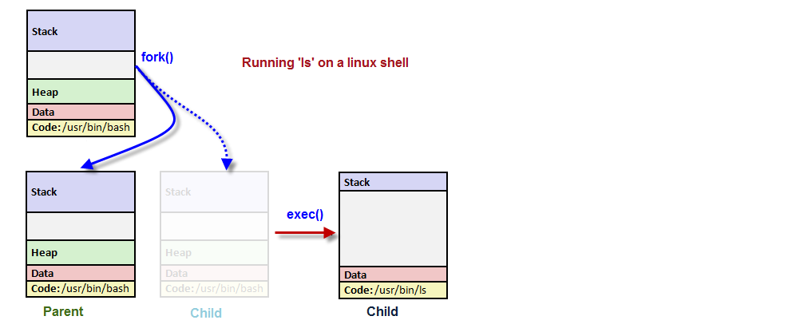

## Linux


* [What does tty refer to today](#tty)
* [Environment Variable](#env-var)
* [Process](#process)
* [Signal](#signal)
* [File](#file)
* [host file under etc](#host-file-purpose)
* [ssh config file](#ssh-config-file)
* [File Descriptor](#file-descriptor)
* [Networking](#networking)

### tty
In unix terminology, the short answer is `terminal = tty = text input/output environment`

### env-var
$PATH说简单点就是一个字符串变量，当输入命令的时候LINUX会去查找$PATH里面记录的路径。比如在根目录/下可以输入命令ls,在/usr目录下也可以输入ls,但其实ls这个命令根本不在这个两个目录下，事实上当你输入命令的时候LINUX会去/bin,/usr/bin,/sbin等目录下面去找你此时输入的命令，而$PATH的值恰恰就是/bin:/sbin:/usr/bin:……。其中的冒号使目录与目录之间隔开.

To edit it
```js
sudo vi /etc/paths
```

### Process
* Application stored in the disk will be loaded into memory when it's running. This process will turn the application into a running process with an id (pid). Also, process has state.
* The system libs are shared - i.e there is only one copy of `printf` in the memory so it can be accessed by different processes.
* When system is being booted, kernel creates a special process called `init` - the parent of all processes which is derived from the file `/sbin/init`. It is never killed until the system shuts down.


To run a process and put it in the background (using &) which then gives you prompt back:
```
$ gunzip file.gz &
```

What's happened when pressing `ctrl+c`?

> We ask the kernal to send the interrupt (SIGINT) to the process. Say it's a NodeJS process, then a signal event will be emitted by EventEmitter:

```js
process.on('SIGINT', () => {
  console.log('received SIGINT');
});
```

What's happened when running ls in a shell?

> Parent process (shell) `fork()` a child process which `exec()` to run `ls` by replacing itself with the `ls`.
> 

### Signal
* Signal is a notification, a message sent by either operating system or some application to our program.
* Signals are a mechanism for one-way asynchronous notifications.
* A signal may be sent from the kernel to a process, from a process to another process, or from a process to itself.
* With the exception of `SIGKILL` and `SIGSTOP` which always terminates the process or stops the process, respectively, processes may control what happens when they receive a signal. They can
1. accept the default action, which may be to terminate the process, terminate and coredump the process, stop the process, or do nothing, depending on the signal.
2. Or, processes can elect to explicitly ignore or handle signals.
    1. Ignored signals are silently dropped.
    2. Handled signals cause the execution of a user-supplied signal handler function. The program jumps to this function as soon as the signal is received, and the control of the program resumes at the previously interrupted instructions

### file
`Group` permissions give any users in a particular group rights to perform `read/write/execute` on file or directory.

`Other` permissions give everyone else on the system.

To see which group you are in:
```
$ groups davidhe
```

To modify permissions (user: read/write & group, other: read):
```
$ chmod 644 file
```

### chmod


### host-file-purpose
Hosts file is a simple txt file situated at `/etc/hosts` on Linux and Mac OS.
Given `host` file below
```
127.0.x.x  mydomain
```
It means system will not do a DNS lookup for `mydomain`, it will be automatically redirected to the IP address you specified in your hosts file.
On most systems the default entry in the hosts file is:
```
127.0.0.1  localhost
```
`127.0.0.1` is always the address of the computer you're on. For example, if you run a web server on your pc, you can access it from the web browser via `http://localhost:port` instead of typing the whole IP address `http://127.0.0.1:port`.

### ssh-config-file
Example `ssh config`

```
Host remote
     HostName 13.211.224.214
     Port 22
     User ec2-user
     IdentityFile ~/.ssh/id_rsa
```
With this configuration, you ssh into another ec2 instance by typing `ssh remote`.

### file-descriptor

Difference between `2>&1` and `2>1` is the previous one will redirect the `stderr` to `stdout` while the latter one redirects the `stderr` to file named `1`.


### Networking
* Network interface
  * It allows your host to connect to the network. **eth0** is the network interface name which can also be seen as your host IP address.
* Virtual Ethernet Devices
  * A virtual ethernet device or veth is a Linux networking interface that acts as a connecting wire between two network namespaces. A veth is a full duplex link that has a single interface in each namespace. Traffic in one interface is directed out to the other interface.

