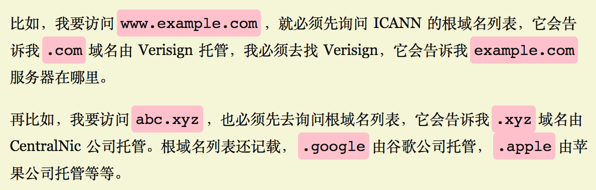

## Networking

- [Route53 AWS DNS](#dns)
  - [DNS Resolution workflow](#dns-resolution-flow)
  - [www domain and naked domain](#www-vs-naked)
  - [Route53 Alias record vs CNAME record](#alias-record-vs-cname-record)
- [nc(telnet) on Mac](#nc)
- [Ephemeral Ports](#ephemeral-ports)
- [SSL/TLS](#ssl-tls)
  - [Port](#ssl-tls-port)
  - [ssh connection](#ssh-connection)
- [CNAME record](#cname)

### dns-resolution-flow

- 
- 
- [DNS Resolution explained in Chinese](https://blog.csdn.net/crazw/article/details/8986504)
- Given url `https://www.ABC.com`:
  - `com` is Top-level Domain aka (TLD)
  - `ABC` is Second-level Domain aka (SLD)
  - `www` is Subdomain(third-level domain)
  - `http` is the protocol with TLS/SSL

### www-vs-naked

- From SEO point of view, some search engine recognize `www` and `non-www` as two different web sites and this cause to penalize the domain considering website has duplicate contents.

### alias-record-vs-cname-record

`alias` record is similar to a `CNAME` record, except you can create an alias record both for the `root domain - example.com` and for `subdomains - www.example.com` whereas you can create `CNAME` records only for subdomains.

Note, `CNAME` only points the source domain to the destination domain, which they both have the same ip address. In other words, traffic targeting source domain will now be routed to destination domain. However, you cannot see the redirection in the browser, since `DNS` itself does not provide redirection capability. You have to do that at the web server level. i.e using `nginx`.

### nc

Use `nc` as you would with `telnet:

```js
$ nc -v https://xyz.com 443
```

Here are some troubleshooting tips:

if you receive `Connection refused` as the response, chances are your EC2 instance does not have a web server running.
Likewise, you will see `This site cannot be reached` when trying to access your EC2 instance from `chrome` via EC2 public ip.

### ephemeral-ports

It is a range of ports your clients randomly choose one from for a connection with the server. By using this, client will listen on that port for any traffic coming back from connected servers.

The range varies depending on different OS. For instance, Windows operating systems through Windows Server 2003 use ports `1025-5000`. Windows Server 2008 and later versions use ports `49152-65535`.

Let's say your client (your machine) initiates a `ssh` connection with a remote server.

`192.168.1.102:37852 ---> 233.200.177.122:22`

`37852` is the randomly-picked port number by your OS for communications. Since it's random, that's why you need to specify ephemeral port range when defining inbound/outbound traffic rules in NACL. i.e in order for your server to respond to connected client (Windows XP Client) on random ports between `1025-5000`, you must have to enable outbound traffic destined for ports `1025-5000`.

### ssl-tls

`SSL/TLS` enforces data encryption during transmission over the network:

1. `Browser` connects to a web server (website) secured with SSL (https). `Browser` requests that the `Server` identifies itself.
2. `Server` sends a copy of its `SSL Certificate`, including the `Server's` public key.
3. `Browser` checks the certificate root against a list of trusted CAs (comes with Browsers) and that the certificate is unexpired, unrevoked and that its common name is valid for the website that it is connecting to. If the `Browser` trusts the certificate, it creates, encrypts and sends back a symmetric session key using the `Server's` public key.
4. `Server` decrypts the symmetric session key using its private key and sends back an acknowledgement encrypted with the session key to start the encrypted session.
5. `Server` and `Browser` now encrypt all transmitted data with the session key.

Please note, for all above to work, `ssl cert` needs to be placed under a particular directory on `Server` side for `ssl` server to locate.

### ssl-tls-port

In a web context, a custom port can be specified for `https` other than conventional one `443` like:
`https://www.example.com:7342/foobar.html`. If omitted, `443` will be used as default.

### SSH connection

2 important files - `known_hosts` and `authorized_keys` under `~/.ssh/`.

**known_hosts**

- A client should know that the server it's trying to connect is indeed the server it claims to be.
- It maintains a list of known hosts in the format of `hostname,ip algo public_key` or `hostname algo public_key`.

```sh
192.168.1.20 ecdsa-sha2-nistp256 public_key
gerardnico.com ssh-rsa AAAAB3NzaC1yc2EAAAADAQABAAABA............
```

- Its purpose is to prevent man-in-the-middle attacks by ensuring that you are connecting to the same server that you were connected to last time (it hasn't been sneakily swapped out by a DNS hack).
- Host Key Verification process:
  - When an SSH server is initialized, it creates a host key, which is a public/private keypair. The SSH server gives out the public key to anyone who wants to connect to it.
  - Your SSH client checks if the host you are trying to connect to has an entry in the `known_hosts` file.
  - If the entry does not exist, adds it in.
  - If the entry exists, use the host key (which is a public key) to encrypt a message, and expect the server to decrypt it. If the server has successfully decrypted the message, then it means that the server holds the private key which matches the given host key, meaning that it is who it claims to be

When similar warning message is presented, it means host identity is changed since last connection, you can simply find the entry and remove it. That way, you can connect afresh.

```
@@@@@@@@@@@@@@@@@@@@@@@@@@@@@@@@@@@@@@@@@@@@@@@@@@@@@@@@@@@
@       WARNING: POSSIBLE DNS SPOOFING DETECTED!          @
@@@@@@@@@@@@@@@@@@@@@@@@@@@@@@@@@@@@@@@@@@@@@@@@@@@@@@@@@@@
The ECDSA host key for jenkins.lz002.awsnp.national.com.au has chan
ged,
and the key for the corresponding IP address 10.156.61.79
is unknown. This could either mean that
DNS SPOOFING is happening or the IP address for the host
and its host key have changed at the same time.
@@@@@@@@@@@@@@@@@@@@@@@@@@@@@@@@@@@@@@@@@@@@@@@@@@@@@@@@@@@
@    WARNING: REMOTE HOST IDENTIFICATION HAS CHANGED!     @
@@@@@@@@@@@@@@@@@@@@@@@@@@@@@@@@@@@@@@@@@@@@@@@@@@@@@@@@@@@
IT IS POSSIBLE THAT SOMEONE IS DOING SOMETHING NASTY!
Someone could be eavesdropping on you right now (man-in-the-middle
attack)!
It is also possible that a host key has just been changed.
The fingerprint for the ECDSA key sent by the remote host is
SHA256:heOIATWHJC/Vfy6IHNG3BjFhFlQnl6UqwKi1mTsHpsw.
Please contact your system administrator.
Add correct host key in /Users/P782199/.ssh/known_hosts to get rid
of this message.
Offending ECDSA key in /Users/P782199/.ssh/known_hosts:11
ECDSA host key for jenkins.lz002.awsnp.national.com.au has changed
and you have requested strict checking.
Host key verification failed.
```

**authorized_keys**

- Just like the client wants to know if the host is who it really claims to be, the server wants to know if the user that is connecting is in fact the user it claims to be.
- Client generates a public/private key pair and then appends public key to `authorized_keys` file. Server admin can help client with key addition.
- Key-based Authentication process
  - Client user `david` connects to `ssh.foo.com` and goes through the previously discussed host-key verification process.
  - Server asks for a user name and the client responds with `david`.
  - Client offers the public key for `/Users/david/.ssh/id_rsa` (which is stored in `/Users/david/.ssh/id_rsa.pub`)
  - Server checks to see if that public key is in the list of authorized keys that would allow us to connect to the user’s account on client server (the authorized keys are in `/home/david/.ssh/authorized_keys`)
  - If the key exists, server will encrypt a message using the public key from the authorized keys list and expect the client to be able to decrypt it, since it should have the private key
  - Client will get the encrypted token from the server, decrypt it, and send it back (it actually sends back a hash of the token and a session key, but this is not important for the sake of this explanation)
  - Server will see that the token was decrypted successfully, and will allow the user to log in as `david` by impersonating the user.

### cname

| (sub)Domain/Hostname | Record Type | Target/Destination |
| -------------------- | :---------: | -----------------: |
| mydomain.com         |      A      |    111.222.333.444 | mydomain.com |
| www.mydomain.com     |    CNAME    |       mydomain.com |
| ftp.mydomain.com     |    CNAME    |       mydomain.com |
| mail.mydomain.com    |    CNAME    |       mydomain.com |

Say you have several domains all want to point to `mydomain.com`. Benefit of this design allows you only need to change once when `mydomain.com` ip address is changed.

One usecase for `CNAME` is - you want domains registered in AU `mydomain.com.au` and NZ `mydomain.com.nz` both to be redirected to `mydomain.com`.
